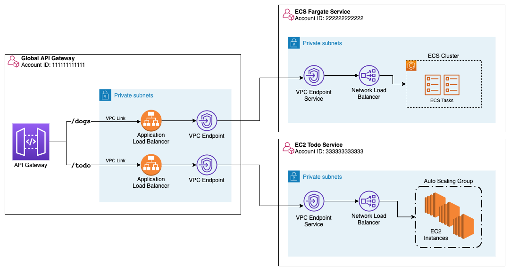
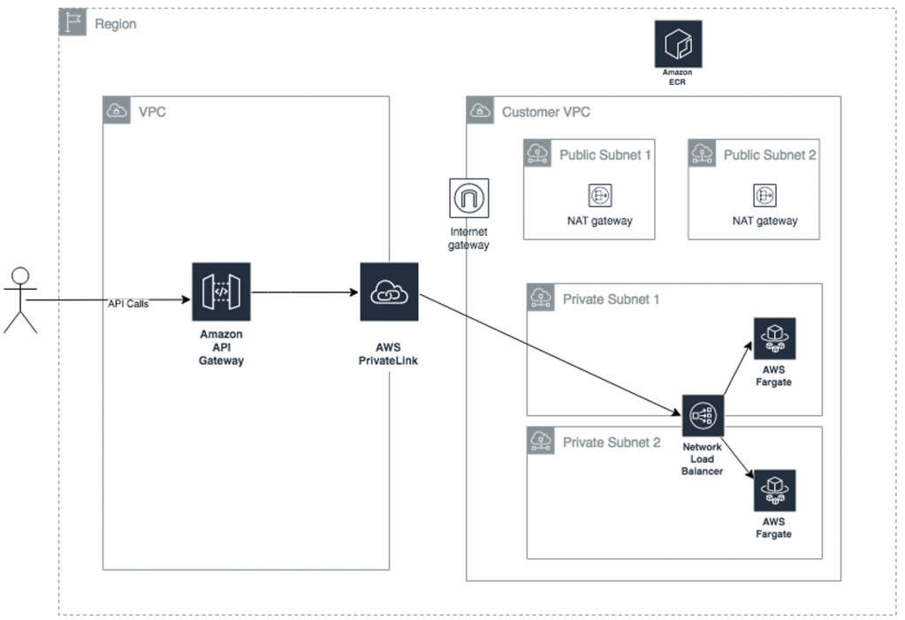

<H1> API Gateway Backlog<H1>

REDO THIS PAGE

<!-- TOC -->

- [1. Dashboard/My WishList](#1-dashboardmy-wishlist)
- [2. APIs](#2-apis)
  - [2.1. Open API](#21-open-api)
  - [2.2. HTTP API vs REST API](#22-http-api-vs-rest-api)
- [3. Authorization](#3-authorization)
  - [3.1. JWT Authorizers](#31-jwt-authorizers)
  - [3.2. Cognito](#32-cognito)
  - [3.3. Custom Authorizers](#33-custom-authorizers)
- [4. Best Practices](#4-best-practices)
- [5. Cognito Integration](#5-cognito-integration)
- [6. Custom Domains](#6-custom-domains)
- [7. Features](#7-features)
- [8. Integrations](#8-integrations)
  - [8.1. Mock Integration](#81-mock-integration)
  - [8.2. Private Integration](#82-private-integration)
  - [8.3. Service Proxy](#83-service-proxy)
  - [8.4. Step functions](#84-step-functions)
- [9. Load Testing](#9-load-testing)
- [10. Mapping Templates (VTL - Velocity Template Language)](#10-mapping-templates-vtl---velocity-template-language)
- [12. Proxy](#12-proxy)
  - [12.1. Proxy Resources ({/proxy+})](#121-proxy-resources-proxy)
- [13. Throttling](#13-throttling)
- [14. Websockets](#14-websockets)
- [15. Usage Plans](#15-usage-plans)
- [16. Use Cases](#16-use-cases)
  - [16.1. URL Shortner](#161-url-shortner)
- [17. Workshops and Hands-On](#17-workshops-and-hands-on)
- [18. Curate](#18-curate)

<!-- /TOC -->

# 1. Dashboard/My WishList

1. [find examples for features](https://docs.aws.amazon.com/apigateway/latest/developerguide/http-api-vs-rest.html)
1. [Amazon API Gateway tutorials and workshops](https://docs.aws.amazon.com/apigateway/latest/developerguide/api-gateway-tutorials.html)
1. [A Detailed Overview of AWS API Gateway By Alex Debrie](https://www.alexdebrie.com/posts/api-gateway-elements/)
1. [The Complete Guide to Custom Authorizers with AWS Lambda and API Gateway By Alex Debrie](https://www.alexdebrie.com/posts/lambda-custom-authorizers/)
1. [[Service Proxy] Connect AWS API Gateway directly to SNS using a service integration By Alex DeBrie](https://www.alexdebrie.com/posts/aws-api-gateway-service-proxy/)
1. [The Missing Guide to AWS API Gateway Access Logs](https://www.alexdebrie.com/posts/page/2/)
1. [[**MY NEXT**] Handling arbitrary HTTP requests in Amazon API Gateway by Steve Engledow](https://aws.amazon.com/blogs/developer/handling-arbitrary-http-requests-in-amazon-api-gateway/)
1. [Private Endpoints](#10-private-integrations-using-aws-privatelink)

# 2. APIs

## 2.1. Open API

1. [Create RESTful APIs on AWS with OpenAPI Specification (With No Coding) by Samuel Baruffi, Radhika Gupta, and Anthony Watson](https://aws.amazon.com/blogs/opensource/create-restful-apis-on-aws-with-openapi-specification-with-no-coding/)
1. [Building storage-first serverless applications with HTTP APIs service integrations by Eric Johnson](https://aws.amazon.com/blogs/compute/building-storage-first-applications-with-http-apis-service-integrations/)
    - https://github.com/aws-samples/sessions-with-aws-sam/tree/master/http-api-integrations-blog-example
    - https://www.youtube.com/watch?v=qa3lkaz7pnI

## 2.2. HTTP API vs REST API

1. [What’s the Difference Between AWS REST API & HTTP API? by Jonathan Davies](https://www.youtube.com/watch?v=O8RKpHQt6l4)

# 3. Authorization

## 3.1. JWT Authorizers

1. [How to secure API Gateway HTTP endpoints with JWT authorizer by Siva Rajamani, Rajat Mathur, and Sudhanshu Malhotra](https://aws.amazon.com/blogs/security/how-to-secure-api-gateway-http-endpoints-with-jwt-authorizer/)

## 3.2. Cognito

1. [Building fine-grained authorization using Amazon Cognito, API Gateway, and IAM by Artem Lovan](https://aws.amazon.com/blogs/security/building-fine-grained-authorization-using-amazon-cognito-api-gateway-and-iam/)
1. [Authorizing Access Through a Proxy Resource to Amazon API Gateway and AWS Lambda Using Amazon Cognito User Pools by Bryan Liston](https://aws.amazon.com/blogs/compute/authorizing-access-through-a-proxy-resource-to-amazon-api-gateway-and-aws-lambda-using-amazon-cognito-user-pools/)

## 3.3. Custom Authorizers

1. [The Complete Guide to Custom Authorizers with AWS Lambda and API Gateway BY Alex DeBrie](https://www.alexdebrie.com/posts/lambda-custom-authorizers/)
1. [Introducing IAM and Lambda authorizers for Amazon API Gateway **HTTP APIs** by Julian Wood](https://aws.amazon.com/blogs/compute/introducing-iam-and-lambda-authorizers-for-amazon-api-gateway-http-apis/)
1. [Introducing custom authorizers in Amazon API Gateway by Stefano Buliani](https://aws.amazon.com/blogs/compute/introducing-custom-authorizers-in-amazon-api-gateway/)
1. [Use AWS Lambda authorizers with a third-party identity provider to secure Amazon API Gateway REST APIs by Bryant Bost](https://aws.amazon.com/blogs/security/use-aws-lambda-authorizers-with-a-third-party-identity-provider-to-secure-amazon-api-gateway-rest-apis/)
1. [Restricting access on HTTP API Gateway Endpoint with Lambda Authorizer by Pratik Jain and Shirin Bano](https://aws.amazon.com/blogs/networking-and-content-delivery/restricting-access-http-api-gateway-lambda-authorizer/)
1. [[**SERVERLESS LAND**] Amazon API Gateway REST API with AWS Lambda token authorizer](https://serverlessland.com/patterns/apigw-lambda-authorizer-custom-header)
1. [[**SERVERLESS LAND**] API Gateway REST API with Lambda authorizer](https://serverlessland.com/patterns/apigw-lambda-authorizer-sam-nodejs)

# 4. Best Practices

1. [Things to Consider When You Build REST APIs with Amazon API Gateway by George Mao](https://aws.amazon.com/blogs/architecture/things-to-consider-when-you-build-rest-apis-with-amazon-api-gateway/)

# 5. Cognito Integration

1. [ALB, Amazon Cognito and Lambda integration](https://serverlessland.com/patterns/alb-cognito-lambda)
1. [Building fine-grained authorization using Amazon Cognito, API Gateway, and IAM by Artem Lovan](https://aws.amazon.com/blogs/security/building-fine-grained-authorization-using-amazon-cognito-api-gateway-and-iam/)

# 6. Custom Domains

1. [Custom Domain Name with AWS API Gateway | Step by Step Tutorial By Be A Better Dev](https://www.youtube.com/watch?v=ESei6XQ7dMg)

# 7. Features

1. [Building faster, lower cost, better APIs – HTTP APIs now generally available by Eric Johnson](https://aws.amazon.com/blogs/compute/building-better-apis-http-apis-now-generally-available/)

# 8. Integrations

## 8.1. Mock Integration

1. [Mocking API endpoints with Amazon API Gateway Mock Integration By Wojciech Matuszewski](https://dev.to/wojciechmatuszewski/mocking-api-endpoints-with-amazon-api-gateway-mock-integration-1h65)
1. [Amazon API Gateway with a mock integration](https://serverlessland.com/patterns/apigateway-rest-mock-sam)
1. [Mini Project - Learn to use API Gateway with Lambda, AWS Service and Mock Integrations By LearnCantrill](https://www.youtube.com/watch?v=sDxsTPbUiik)

## 8.2. Private Integration

1. [[**MAKE NOTES**] Understanding VPC links in Amazon API Gateway private integrations by Jose Eduardo Montilla Lugo](https://aws.amazon.com/blogs/compute/understanding-vpc-links-in-amazon-api-gateway-private-integrations/)
1. [[**ACROSS ACCOUNTS**] Building private cross-account APIs using Amazon API Gateway and AWS PrivateLink by Brian Zambrano](https://aws.amazon.com/blogs/compute/building-private-cross-account-apis-using-amazon-api-gateway-and-aws-privatelink/)
  
1. [[**ACROSS REGIONS**] Access Private applications on AWS Fargate using Amazon API Gateway PrivateLink by Mani Chandrasekaran](https://aws.amazon.com/blogs/compute/access-private-applications-on-aws-fargate-using-amazon-api-gateway-privatelink/)
  
1. [Serverless Private APIs — Part 1 By Serverless Advocate](https://levelup.gitconnected.com/serverless-private-apis-60749934b161)
1. [Mini Project - Learn to use API Gateway with Lambda, AWS Service and Mock Integrations By LearnCantrill](https://www.youtube.com/watch?v=sDxsTPbUiik)

## 8.3. Service Proxy

1. [Connect AWS API Gateway directly to SNS using a service integration By Alex DeBrie](https://www.alexdebrie.com/posts/aws-api-gateway-service-proxy/)
1. [API Gateway: Why you should use Service Proxies By Yan Cui](https://www.youtube.com/watch?v=_NnO2JiPTEw)
1. [Mini Project - Learn to use API Gateway with Lambda, AWS Service and Mock Integrations By LearnCantrill](https://www.youtube.com/watch?v=sDxsTPbUiik)

## 8.4. Step functions

1. [Introducing Amazon API Gateway service integration for AWS Step Functions by Benjamin Smith](https://aws.amazon.com/blogs/compute/introducing-amazon-api-gateway-service-integration-for-aws-step-functions/)

# 9. Load Testing

1. [Using serverless to load test Amazon API Gateway with authorization by Ashish Mehra](https://aws.amazon.com/blogs/compute/using-serverless-to-load-test-amazon-api-gateway-with-authorization/)
1. [Building well-architected serverless applications: Regulating inbound request rates – part 1 by Julian Wood](https://aws.amazon.com/blogs/compute/building-well-architected-serverless-applications-regulating-inbound-request-rates-part-1/)

# 10. Mapping Templates (VTL - Velocity Template Language)

1. [Using API Gateway mapping templates to handle changes in your back-end APIs by Stefano Buliani](https://aws.amazon.com/blogs/compute/using-api-gateway-mapping-templates-to-handle-changes-in-your-back-end-apis/)
1. [Sales invoice example (API Gateway models and mapping templates)](https://docs.aws.amazon.com/apigateway/latest/developerguide/example-invoice.html#example-invoice-input-mapping#example-invoice-input-mapping)

# 12. Proxy

## 12.1. Proxy Resources ({/proxy+})

1. [Vocabulary time: Service proxies vs. proxy integrations vs. proxy resources By Alex Debrie](https://www.alexdebrie.com/posts/api-gateway-elements/#vocabulary-time-service-proxies-vs-proxy-integrations-vs-proxy-resources)
1. [API Gateway Update – New Features Simplify API Development by Jeff Barr](https://aws.amazon.com/blogs/aws/api-gateway-update-new-features-simplify-api-development/)
1. [Tutorial: Build a REST API with HTTP proxy integration](https://docs.aws.amazon.com/apigateway/latest/developerguide/api-gateway-create-api-as-simple-proxy-for-http.html)
1. [Serving Content Using a Fully Managed Reverse Proxy Architecture in AWS by Leonardo Machado and Kilian Ruess](https://aws.amazon.com/blogs/architecture/serving-content-using-fully-managed-reverse-proxy-architecture/)
1. [[**MUST SEE**] Handling arbitrary HTTP requests in Amazon API Gateway by Steve Engledow](https://aws.amazon.com/blogs/developer/handling-arbitrary-http-requests-in-amazon-api-gateway/)

# 13. Throttling

1. [AWS re:Invent 2019: [REPEAT 2] I didn’t know Amazon API Gateway did that (SVS212-R2)](https://www.youtube.com/watch?v=yfJZc3sJZ8E)
2. [How To: Use SNS and SQS to Distribute and Throttle Events](https://www.jeremydaly.com/how-to-use-sns-and-sqs-to-distribute-and-throttle-events/)

# 14. Websockets

1. [Announcing WebSocket APIs in Amazon API Gateway by Chris Munns](https://aws.amazon.com/blogs/compute/announcing-websocket-apis-in-amazon-api-gateway/)
4. [Building Real-Time Applications using WebSocket APIs Supported by Amazon API Gateway webinar](https://aws.amazon.com/blogs/compute/announcing-websocket-apis-in-amazon-api-gateway/)
3. [Building Real Time Applications using WebSocket APIs Supported by Amazon API Gateway By George Mao](https://pages.awscloud.com/Building-Real-Time-Applications-using-WebSocket-APIs-Supported-by-Amazon-API-Gateway_1211-SRV_OD.html)

# 15. Usage Plans

1. [Creating Usage Plans in console](https://aws.amazon.com/blogs/aws/new-usage-plans-for-amazon-api-gateway/)
2. [Visualizing Amazon API Gateway usage plans using Amazon QuickSight by Roberto Iturralde](https://aws.amazon.com/blogs/compute/visualizing-amazon-api-gateway-usage-plans-using-amazon-quicksight/)
    - [./templates/api-gateway-access-logs-visualization-core.yaml](api-gateway-access-logs-visualization-core.template)

# 16. Use Cases

## 16.1. URL Shortner

1. [Building Serverless URL Shortener Service on AWS Using API Gateway and Dynamodb](https://dev.to/aws-builders/building-serverless-url-shortener-service-on-aws-1895)

# 17. Workshops and Hands-On

1. [Amazon API Gateway tutorials and workshops](https://docs.aws.amazon.com/apigateway/latest/developerguide/api-gateway-tutorials.html)

# 18. Curate

1. https://www.alexdebrie.com/posts/api-gateway-elements
1. https://aws.amazon.com/blogs/compute/implementing-reactive-progress-tracking-for-aws-step-functions/
1. https://aws.amazon.com/blogs/compute/running-cross-account-workflows-with-aws-step-functions-and-amazon-api-gateway/