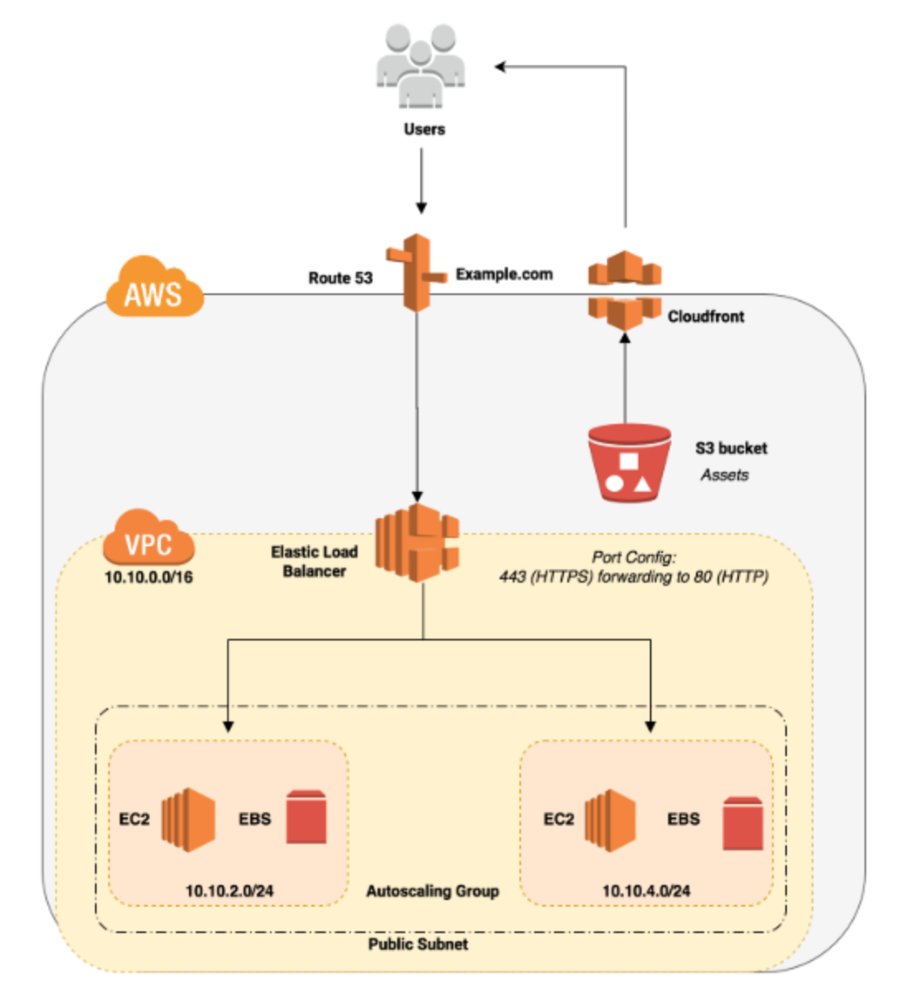
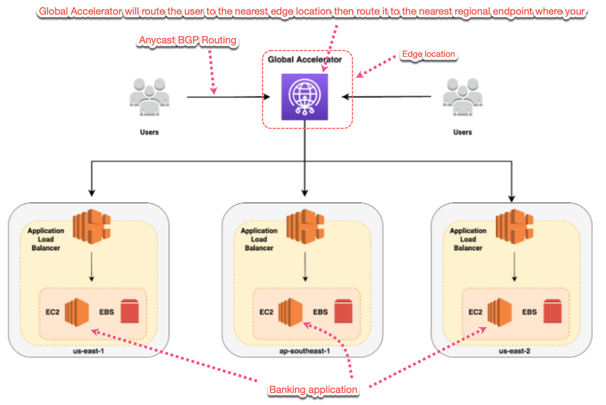

# 1. Edge Location

1. **Edge locations** are physical locations that host Global Accelerator or Cloudfront. There are currently over 200 Edge Locations in the world that are situated strategically in major cities.

# 2. Amazon Cloudfront

1. **Amazon CloudFront** is a Content Delivery Network (CDN) like Cloudflare and Akamai. CloudFront is used to deliver static assets (such as videos, images, and files) securely to various devices around the globe with low latency.

2. Instead of hosting the static content in your website you offload the videos, thumbnails, and any static assets from your server to Amazon S3, and using CloudFront to serve and cache these assets.

# 3. Global Accelerator

AWS Global Accelerator is a service that uses edge locations to look for the optimal pathway from your users to your applications.

# 4. Differences

The differences between CloudFront and Global Accelerator are:

* CloudFront uses **multiple sets of dynamically changing IP addresses** while Global Accelerator will provide you a **set of static IP addresses** as a fixed entry point to your applications.
* **CloudFront pricing** is mainly based on data transfer out and HTTP requests while Global Accelerator charges a fixed hourly fee and an incremental charge over your standard Data Transfer rates, also called a Data Transfer-Premium fee (DT-Premium).
* CloudFront uses Edge Locations to **cache content** while Global Accelerator uses Edge Locations to **find an optimal pathway** to the nearest regional endpoint.
* CloudFront is designed to **handle HTTP protocol** meanwhile Global Accelerator is best used for **both HTTP and non-HTTP protocols such as TCP and UDP**.