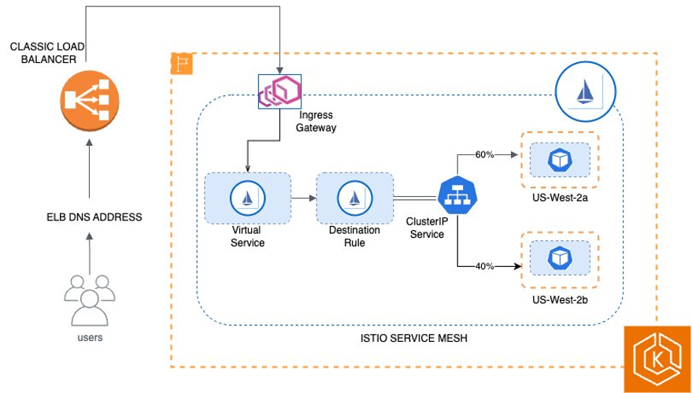
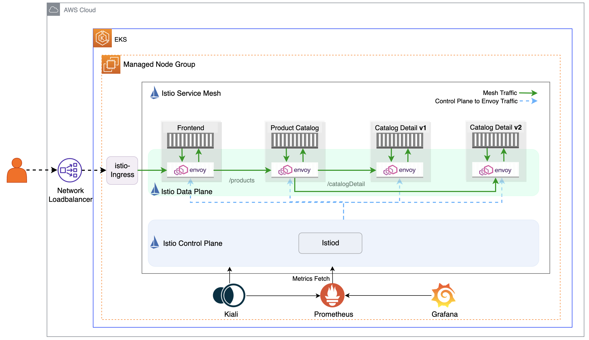

<!-- TOC -->

- [1. Istio Introduction](#1-istio-introduction)
- [2. Getting started](#2-getting-started)
- [3. BluePrints](#3-blueprints)
- [4. Installation](#4-installation)
- [5. Kiali](#5-kiali)
- [6. Jaegar](#6-jaegar)
- [7. Workshop](#7-workshop)
- [8. ALB + ACM + Route53](#8-alb--acm--route53)
- [9. Path based routing](#9-path-based-routing)
- [10. Traffic Management](#10-traffic-management)
- [11. Kiali](#11-kiali)
- [12. Jaeger](#12-jaeger)
- [13. Benchmarks](#13-benchmarks)
- [14. BookInfo example on EKS](#14-bookinfo-example-on-eks)

<!-- /TOC -->

# 1. Istio Introduction

1. [Istio & Service Mesh - simply explained in 15 mins](https://www.youtube.com/watch?v=16fgzklcF7Y&t=0s)
1. [[**MUST-SEE**] Service Mesh Architecture with Istio](https://www.baeldung.com/ops/istio-service-mesh)
1. [[**MUST-SEE**] Managing Apps on Kubernetes with Istio by Elton Stoneman](https://app.pluralsight.com/ilx/video-courses/4658fd9a-6cde-4398-955e-c09a364cf7be/7c4b197f-595a-4a03-a6a5-d0ddabaf3cdc/f6c8a8e5-43b6-4da1-ab3f-0309d1844063)
1. [[**START-HERE]** Istio Setup in Kubernetes By Nana | Step by Step Guide to install Istio Service Mesh](https://www.youtube.com/watch?v=voAyroDb6xk)

# 2. Getting started

1. [[**START-HERE**] Mastering Istio on AWS EKS for Seamless Microservices Management By harsh](https://aws.plainenglish.io/unlocking-synergy-mastering-istio-on-aws-eks-for-seamless-microservices-management-b9ac7e1863b7)
1. [Optimize AZ traffic costs using Amazon EKS, Karpenter, and Istio by Sanjeev Ganjihal, Goutham Annem, and Lukonde Mwila ](https://aws.amazon.com/blogs/containers/optimize-az-traffic-costs-using-amazon-eks-karpenter-and-istio/)
  
1. [Getting Started with Istio on Amazon EKS by Praseeda Sathaye and Vijay Chintalapati](https://aws.amazon.com/blogs/opensource/getting-started-with-istio-on-amazon-eks/)
  
1. [Using Istio Traffic Management on Amazon EKS to Enhance User Experience by Praseeda Sathaye, Sourav Paul, and Tiago Reichert](https://aws.amazon.com/blogs/opensource/using-istio-traffic-management-to-enhance-user-experience/)
1. [Getting Started with Istio on Amazon EKS by Arun Gupta](https://aws.amazon.com/blogs/opensource/getting-started-istio-eks/)
1. [[**START-HERE**] Istio with Kubernetes on AWS](https://github.com/aws-samples/istio-on-amazon-eks)
1. https://aws.plainenglish.io/istio-kiali-and-jaeger-integration-in-amazon-eks-cluster-94e6574382b6

# 3. BluePrints

1. [[Amazon EKS Blueprints for Terraform ]Amazon EKS Cluster w/ Istio](https://aws-ia.github.io/terraform-aws-eks-blueprints/patterns/istio/)

# 4. Installation

1. [Getting Started with Istio in AWS EKS for multicluster setup By DEBASREE PANDA](https://imesh.ai/blog/getting-started-with-istio-in-aws-eks-for-multicluster-setup/)

# 5. Kiali

1. [Istio, Kiali and Jaeger Integration on Amazon EKS Cluster](https://aws.plainenglish.io/istio-kiali-and-jaeger-integration-in-amazon-eks-cluster-94e6574382b6)

# 6. Jaegar

1. [Istio, Kiali and Jaeger Integration on Amazon EKS Cluster](https://aws.plainenglish.io/istio-kiali-and-jaeger-integration-in-amazon-eks-cluster-94e6574382b6)

# 7. Workshop

1. [Amazon EKS Workshop > Advanced > Service Mesh with Istio](https://archive.eksworkshop.com/advanced/310_servicemesh_with_istio/)

# 8. ALB + ACM + Route53

1. [Secure end-to-end traffic on Amazon EKS using TLS certificate in ACM, ALB, and Istio  by Muhammad Mirza](https://aws.amazon.com/blogs/containers/secure-end-to-end-traffic-on-amazon-eks-using-tls-certificate-in-acm-alb-and-istio/)

# 9. Path based routing

1. [How to Implement Path-Based Routing Using Istio Ingress Gateway on AWS Elastic Kubernetes Service By Ronie Horca](https://hxhronies.medium.com/how-to-implement-path-based-routing-using-istio-ingress-gateway-on-aws-elastic-kubernetes-service-a15ce34eae3f)

# 10. Traffic Management

1. [Using Istio Traffic Management on Amazon EKS to Enhance User Experience by Praseeda Sathaye, Sourav Paul, and Tiago Reichert](https://aws.amazon.com/blogs/opensource/using-istio-traffic-management-to-enhance-user-experience/)

# 11. Kiali

1. [Istio, Kiali and Jaeger Integration on Amazon EKS Cluster By Cloudoholic](https://aws.plainenglish.io/istio-kiali-and-jaeger-integration-in-amazon-eks-cluster-94e6574382b6)

# 12. Jaeger

1. [Istio, Kiali and Jaeger Integration on Amazon EKS Cluster By Cloudoholic](https://aws.plainenglish.io/istio-kiali-and-jaeger-integration-in-amazon-eks-cluster-94e6574382b6)

# 13. Benchmarks

1. [Benchmarking Istio & Linkerd CPU](https://medium.com/@michael_87395/benchmarking-istio-linkerd-cpu-c36287e32781)

# 14. BookInfo example on EKS

1. [AWS ALB Ingress Controller with Istio Service Mesh By Manish Sharma](https://mycloudjourney.medium.com/aws-alb-ingress-controller-with-istio-service-mesh-7893e7109bab)