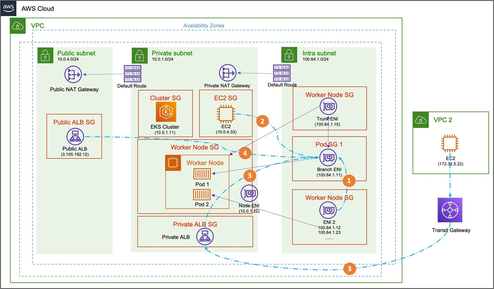
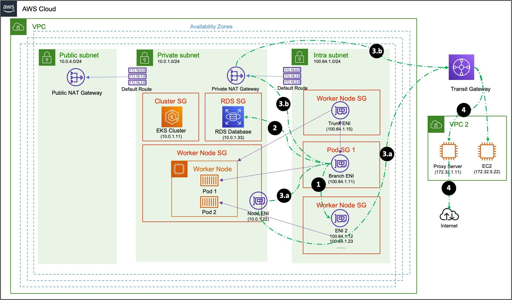

<h1>Amazon EKS Networking</h1>

<!-- TOC -->

- [1. VPC Lattice](#1-vpc-lattice)
- [2. Custom Networking](#2-custom-networking)
- [3. How Data Plane connects to Control Plane](#3-how-data-plane-connects-to-control-plane)
- [4. Private Links](#4-private-links)
- [5. Prefix delegation](#5-prefix-delegation)

<!-- /TOC -->

# 1. VPC Lattice

1. [EKS Application Networking with Amazon VPC Lattice](https://www.youtube.com/watch?v=AdO0bx3N3fs)
2. [Application Networking with Amazon VPC Lattice and Amazon EKS by Viji Sarathy and Sheetal Joshi ](https://aws.amazon.com/blogs/containers/application-networking-with-amazon-vpc-lattice-and-amazon-eks/)

# 2. Custom Networking

1. [Hands on with EKS Networking (2023) | Amazon EKS Workshop BY Sheetal Joshi](https://www.youtube.com/watch?v=EAZnXII9NTY)
1. [Deep dive on the AWS CNI Plug-in for Kubernetes - Mitch Beaumont (AWS)](https://www.youtube.com/watch?v=ezcnPcRcJdc)
1. [Leveraging CNI custom networking alongside security groups for pods in Amazon EKS by Bin Liu and Haofei Feng](https://aws.amazon.com/blogs/containers/leveraging-cni-custom-networking-alongside-security-groups-for-pods-in-amazon-eks/)

  - Ingress

  

  - Egress

  

# 3. How Data Plane connects to Control Plane

1. [De-mystifying cluster networking for Amazon EKS worker nodes by Nathan Taber](https://aws.amazon.com/blogs/containers/de-mystifying-cluster-networking-for-amazon-eks-worker-nodes/)
1. [Upcoming Changes to IP Assignment for EKS Managed Node Groups by Nathan Taber](https://aws.amazon.com/blogs/containers/upcoming-changes-to-ip-assignment-for-eks-managed-node-groups/)

# 4. Private Links

1. [Enable Private Access to the Amazon EKS Kubernetes API with AWS PrivateLink by Aaron Miller, Praseeda Sathaye, and Vijay Chintalapati](https://aws.amazon.com/blogs/containers/enable-private-access-to-the-amazon-eks-kubernetes-api-with-aws-privatelink/)

# 5. Prefix delegation

1. [[BEST-EXPLANATION] Prefix Mode for Linux](https://aws.github.io/aws-eks-best-practices/networking/prefix-mode/index_linux/)
1. [Amazon VPC CNI plugin increases pods per node limits by Sheetal Joshi, Mike Stefaniak, and Jayanth Varavani ](https://aws.amazon.com/blogs/containers/amazon-vpc-cni-increases-pods-per-node-limits/)
1. [AWS EKS — Increasing Pods numbers per node using aws-vpc CNI and IP prefix and save money! by Giorgio Cerruti](https://medium.com/@giorgiodevops/increasing-pods-numbers-running-in-an-eks-nodeusing-aws-vpc-cni-and-ip-prefix-22b1d381014)
1. [Increase the amount of available IP addresses for your Amazon EC2 nodes](https://docs.aws.amazon.com/eks/latest/userguide/cni-increase-ip-addresses.html)
1. [Increasing pod density for Windows nodes on Amazon EKS by Harsh Rawat, Purvi Goyal, and Jie Chen](https://aws.amazon.com/blogs/containers/increasing-pod-density-for-windows-nodes-on-amazon-eks/)
1. [AWS Workshops DIY — EKS Workshop — 15. Amazon VPC CNI Prefix Mode to Increase Node IPs, Pod Density by John David Luther](https://medium.com/the-aws-way/aws-workshops-diy-eks-workshop-15-amazon-vpc-cni-prefix-mode-to-increase-node-ips-pod-density-e3b90c7a6d54)

