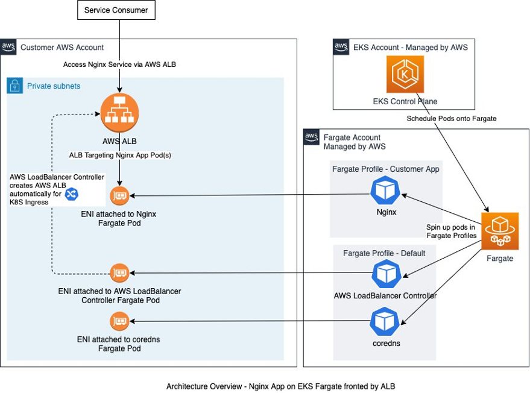

<H1>EKS Blog Posts</H1>

<!-- TOC -->

- [1. Curate](#1-curate)
- [2. AWS Controllers for Kubernetes (ACK)](#2-aws-controllers-for-kubernetes-ack)
- [3. Managed Node Groups](#3-managed-node-groups)
- [4. ALBs](#4-albs)
- [5. Best Practices](#5-best-practices)
- [6. Blueprints](#6-blueprints)
- [7. CDK](#7-cdk)
  - [7.1. Cluster Creation](#71-cluster-creation)
- [8. CI/CD](#8-cicd)
  - [8.1. ArgoCD](#81-argocd)
  - [8.2. Spinnaker](#82-spinnaker)
  - [8.3. Kustomize with Spinnaker](#83-kustomize-with-spinnaker)
- [9. Crossplane](#9-crossplane)
- [10. Integrations](#10-integrations)
- [11. Istio](#11-istio)
- [12. Lambda](#12-lambda)
- [13. OpenID conenct](#13-openid-conenct)
- [14. Observability](#14-observability)
- [15. Kubernetes on AWS](#15-kubernetes-on-aws)
- [16. Samples](#16-samples)
- [17. Terraform](#17-terraform)
- [18. Videos](#18-videos)
- [19. Workshop](#19-workshop)
  - [19.1. Crossplane workshop](#191-crossplane-workshop)

<!-- /TOC -->

# 1. Curate

1. [Use CloudFormation to automate management of the Fargate profile in Amazon EKS by Gaurav Acharya](https://aws.amazon.com/blogs/containers/use-cloudformation-to-automate-management-of-the-fargate-profile-in-amazon-eks/)
1. [8 best practices when automating your deployments with AWS CloudFormation by Dave May](https://aws.amazon.com/blogs/infrastructure-and-automation/best-practices-automating-deployments-with-aws-cloudformation/)
1. https://eksctl.io/usage/vpc-configuration/
1. https://aws.github.io/aws-eks-best-practices/networking/vpc-cni/

# 2. AWS Controllers for Kubernetes (ACK)

A tool that lets you directly manage AWS services from Kubernetes

1. [Introducing the AWS Controllers for Kubernetes (ACK) by Jay Pipes, Michael Hausenblas, and Nathan Taber](https://aws.amazon.com/blogs/containers/aws-controllers-for-kubernetes-ack/)

# 3. Managed Node Groups

1. [What are Managed Node Groups By Raghav Tripathi, Michael Hausenblas, and Nathan Taber](https://aws.amazon.com/blogs/containers/eks-managed-node-groups/)

# 4. ALBs

1. [Deploying AWS Load Balancer Controller on Amazon EKS by Karthik Chemudupati, Scott Chang, and James Wenzel](https://aws.amazon.com/blogs/networking-and-content-delivery/deploying-aws-load-balancer-controller-on-amazon-eks/)
- [CODE / Cloudformation](https://github.com/aws-samples/eks-single-button-aws-alb-addon-installation/tree/main)

# 5. Best Practices

1. [EKS Best Practices Guides](https://aws.github.io/aws-eks-best-practices/networking/vpc-cni/)

# 6. Blueprints

1. [Amazon EKS Blueprints Quick Start](https://aws-quickstart.github.io/cdk-eks-blueprints/pipelines/)
2. [Amazon EKS Blueprints for Terraform](https://aws-ia.github.io/terraform-aws-eks-blueprints/v4.32.1/)
3. [[WORKSHOP] EKS Blueprints for Terraform](https://catalog.us-east-1.prod.workshops.aws/workshops/d2b662ae-e9d7-4b31-b68b-64ade19d5dcc/en-US)

# 7. CDK

## 7.1. Cluster Creation

1. [Simplify integration of your Amazon EKS cluster with Amazon EKS Blueprints for CDK by Mikhail Shapirov and Elamaran Shanmugam](https://aws.amazon.com/blogs/infrastructure-and-automation/simplify-integration-of-your-amazon-eks-cluster-with-amazon-eks-blueprints-for-cdk/)

# 8. CI/CD

1. [Configure Continuous Deployment Using Kustomize Components and Spinnaker Operator in Amazon EKS by Praseeda Sathaye, Fernando Freire, and Puneet Singh](https://aws.amazon.com/blogs/opensource/configure-continuous-deployment-using-kustomize-components-and-spinnaker-operator-in-amazon-eks/)

## 8.1. ArgoCD

1. [Amazon EKS Workshop > Intermediate > Continuous Deployment with ArgoCD](https://archive.eksworkshop.com/intermediate/290_argocd/)
2. [EKSWorkshop (NEW) > GitOps > Argo CD](https://www.eksworkshop.com/docs/automation/gitops/argocd/)
3. [**[MY NEXT]** Continuous Deployment and GitOps delivery with Amazon EKS Blueprints and ArgoCD by Tsahi Duek and Dima Breydo](https://aws.amazon.com/blogs/containers/continuous-deployment-and-gitops-delivery-with-amazon-eks-blueprints-and-argocd/)
4. [Amazon EKS Blueprints Quick Start > Argo CD Add-on](https://aws-quickstart.github.io/cdk-eks-blueprints/addons/argo-cd/)
5. [How to Deploy ArgoCD in EKS cluster For Continuous Deployment](https://blog.devgenius.io/how-to-deploy-argocd-in-eks-cluster-for-continuous-deployment-6ebbb3009024)

## 8.2. Spinnaker

1. [Configure Continuous Deployment Using Kustomize Components and Spinnaker Operator in Amazon EKS by Praseeda Sathaye, Fernando Freire, and Puneet Singh](https://aws.amazon.com/blogs/opensource/configure-continuous-deployment-using-kustomize-components-and-spinnaker-operator-in-amazon-eks/)

## 8.3. Kustomize with Spinnaker

1. [Configure Continuous Deployment Using Kustomize Components and Spinnaker Operator in Amazon EKS by Praseeda Sathaye, Fernando Freire, and Puneet Singh](https://aws.amazon.com/blogs/opensource/configure-continuous-deployment-using-kustomize-components-and-spinnaker-operator-in-amazon-eks/)

# 9. Crossplane

[see amazon-eks-crossplane.md](./amazon-eks-crossplane.md)

# 10. Integrations

1. [Integrating an EKS Cluster with Other AWS Services by Rushabh Doshi](https://app.pluralsight.com/library/courses/eks-cluster-aws-services-integrating/table-of-contents)

# 11. Istio

1. [Getting Started with Istio on Amazon EKS by Praseeda Sathaye and Vijay Chintalapati](https://aws.amazon.com/blogs/opensource/getting-started-with-istio-on-amazon-eks/)
- [Code](https://github.com/aws-ia/terraform-aws-eks-blueprints.git)

# 12. Lambda

1. [Deploying AWS Lambda functions using AWS Controllers for Kubernetes (ACK) By rajdeep saha](https://aws.amazon.com/blogs/compute/deploying-aws-lambda-functions-using-aws-controllers-for-kubernetes-ack/)

# 13. OpenID conenct

1. [Introducing OIDC identity provider authentication for Amazon EKS by Rashmi Dwaraka, Mike Stefaniak, and Paavan Mistry ](https://aws.amazon.com/blogs/containers/introducing-oidc-identity-provider-authentication-amazon-eks/)

# 14. Observability

1. [Hands on with EKS Observability (2023) | Amazon EKS Workshop](https://www.youtube.com/watch?v=ajPe7HVypxg)

# 15. Kubernetes on AWS

1. [12 steps to setup Kubernetes Cluster on AWS EC2](https://www.golinuxcloud.com/setup-kubernetes-cluster-on-aws-ec2/)

# 16. Samples

1. [Blueprints for Crossplane on Amazon EKS](https://github.com/awslabs/crossplane-on-eks)
1. [[_**CDK,EKS,Fargate,Typescript**_] Building and deploying Fargate with EKS in an enterprise context using the AWS Cloud Development Kit and cdk8s+ by Jasper Wang and Van Vo Thanh](https://aws.amazon.com/blogs/containers/building-and-deploying-fargate-with-eks-in-an-enterprise-context-using-the-aws-cloud-development-kit-and-cdk8s/)

# 17. Terraform

1. [Amazon EKS Blueprints for Terraform](https://aws-ia.github.io/terraform-aws-eks-blueprints/v4.1.0/)

# 18. Videos

1. [Deploying Lambda with EKS and Crossplane | Serverless Office Hours](https://www.youtube.com/watch?v=8CdyxX7eGkA)

# 19. Workshop

1. [Welcome to the EKS Developers Workshop](https://developers.eksworkshop.com/docs/introduction)
1. [Discover application refactoring with the EKS Developers Workshop by Leah Tucker](https://aws.amazon.com/blogs/containers/discover-application-refactoring-with-the-eks-developers-workshop/)
1. [EKS Blueprints for CDK Workshop](https://catalog.workshops.aws/eks-blueprints-for-cdk/en-US)
1. [Running batch workloads on Amazon EKS with AWS Batch](https://catalog.workshops.aws/running-batch-on-eks/en-US)
1. [EKS Immersion Workshop](https://catalog.workshops.aws/eks-immersionday/en-US)
1. [EKS Workshop - Practical exercises to learn about Amazon Elastic Kubernetes Service](https://www.eksworkshop.com/)
1. [Manage your EKS cluster in Full-stack with CDK](https://catalog.us-east-1.prod.workshops.aws/workshops/c15012ac-d05d-46b1-8a4a-205e7c9d93c9/en-US/10-intro)
1. [Kubernetes hands on introduction (2023) | Amazon EKS Workshop](https://www.youtube.com/watch?v=_TFk5jQr2lk&list=PLehXSATXjcQGIctop3ok3xIMB1cUCPYEK)
1. [How to navigate EKS workshop](https://aws.plainenglish.io/hands-on-labs-for-amazon-eks-a-great-intro-to-learning-amazon-eks-8be386de483b)

## 19.1. Crossplane workshop

1. [Crossplane workshop](https://www.eksworkshop.com/docs/automation/controlplanes/crossplane/)
