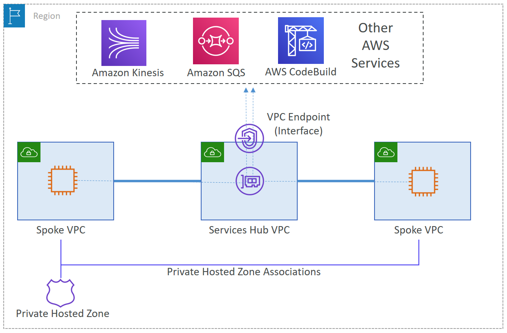

<h1>My favorite Amazon Articles</h1>

<!-- TOC -->

- [1. Organizations](#1-organizations)
  - [1.1. Centralized Logging](#11-centralized-logging)
- [2. R53](#2-r53)
- [3. Networking](#3-networking)
- [7. Centralized / Shared VPC](#7-centralized--shared-vpc)
- [4. S3](#4-s3)
- [5. IAM](#5-iam)
- [6. EKS](#6-eks)
- [7. DNS](#7-dns)

<!-- /TOC -->

# 1. Organizations

1. [[_**DEMO**_] How to Use AWS Organizations to Automate End-to-End Account Creation by David Schonbrun](https://aws.amazon.com/blogs/security/how-to-use-aws-organizations-to-automate-end-to-end-account-creation/)

## 1.1. Centralized Logging

1. [[_**MUST SEE]**_ Stream Amazon CloudWatch Logs to a Centralized Account for Audit and Analysis by David Bailey](https://aws.amazon.com/blogs/architecture/stream-amazon-cloudwatch-logs-to-a-centralized-account-for-audit-and-analysis/)
    - Uses Firehouse
    - cross account logging without OU

# 2. R53

1. [Traffic management with AWS Global Accelerator by Tino Tran](https://aws.amazon.com/blogs/networking-and-content-delivery/traffic-management-with-aws-global-accelerator/)
1. [[_**MAKE_NOTES**_] A Case Study in Global Fault Isolation by Lee-Ming Zen](https://aws.amazon.com/blogs/architecture/a-case-study-in-global-fault-isolation/)

# 3. Networking

1. [One to Many: Evolving VPC Design by Androski Spicer ](https://aws.amazon.com/blogs/architecture/one-to-many-evolving-vpc-design/)
# 7. Centralized / Shared VPC

1. [[_**CDK**_] Centralize access using VPC interface endpoints to access AWS services across multiple VPCs by Chetan Agrawal](https://aws.amazon.com/blogs/networking-and-content-delivery/centralize-access-using-vpc-interface-endpoints/)

&nbsp;

  This post walks through using AWS Cloud Development Kit (CDK) to create a centralized VPC with VPC endpoints, and then sharing those endpoints with other VPCs in the same AWS Organization.

&nbsp;

  

# 4. S3

1. [Building a difference checker with Amazon S3 and AWS Lambda by James Beswick](https://aws.amazon.com/blogs/compute/building-a-difference-checker-with-amazon-s3-and-aws-lambda/)
1. [Authorization@Edge – How to Use Lambda@Edge and JSON Web Tokens to Enhance Web Application Security by Alex Tomic and Cameron Worrell](https://aws.amazon.com/blogs/networking-and-content-delivery/authorizationedge-how-to-use-lambdaedge-and-json-web-tokens-to-enhance-web-application-security/)

# 5. IAM

1. [[_**BUCKET_POLICY_EXAMPLES**_] IAM Policies and Bucket Policies and ACLs! Oh, My! (Controlling Access to S3 Resources) by Kai Zhao, Gautam Kumar, and Laura Verghote](https://aws.amazon.com/blogs/security/iam-policies-and-bucket-policies-and-acls-oh-my-controlling-access-to-s3-resources/)
1. [[_**MAKE_NOTES**_][DIFF BETWEEN SCP AND PERMISSIONS BOUNDARY] IAM policy types: How and when to use them by Matt Luttrell and Josh Joy](https://aws.amazon.com/blogs/security/iam-policy-types-how-and-when-to-use-them/)
1. [[_**MAKE_NOTES**_] How to use trust policies with IAM roles by Jonathan Jenkyn and Liam Wadman](https://aws.amazon.com/blogs/security/how-to-use-trust-policies-with-iam-roles/)

# 6. EKS

1. [GitOps model for provisioning and bootstrapping Amazon EKS clusters using Crossplane and Argo CD by Viji Sarathy](https://aws.amazon.com/blogs/containers/gitops-model-for-provisioning-and-bootstrapping-amazon-eks-clusters-using-crossplane-and-argo-cd/)

# 7. DNS

1. [DNS best practices for Amazon Route 53 by Renato Gentil and Scott Morrison](https://aws.amazon.com/blogs/networking-and-content-delivery/dns-best-practices-for-amazon-route-53/)

2. [How to achieve DNS high availability with Route 53 Resolver endpoints by Kartik Bheemisetty and Randy Weinstein](https://aws.amazon.com/blogs/networking-and-content-delivery/how-to-achieve-dns-high-availability-with-route-53-resolver-endpoints/)