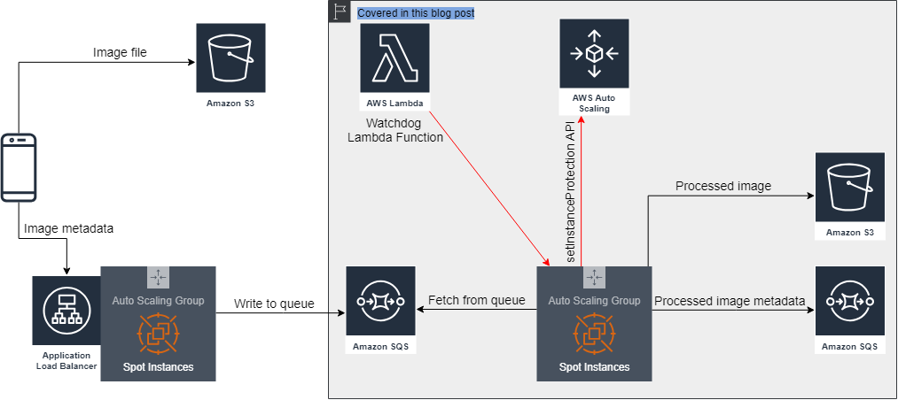
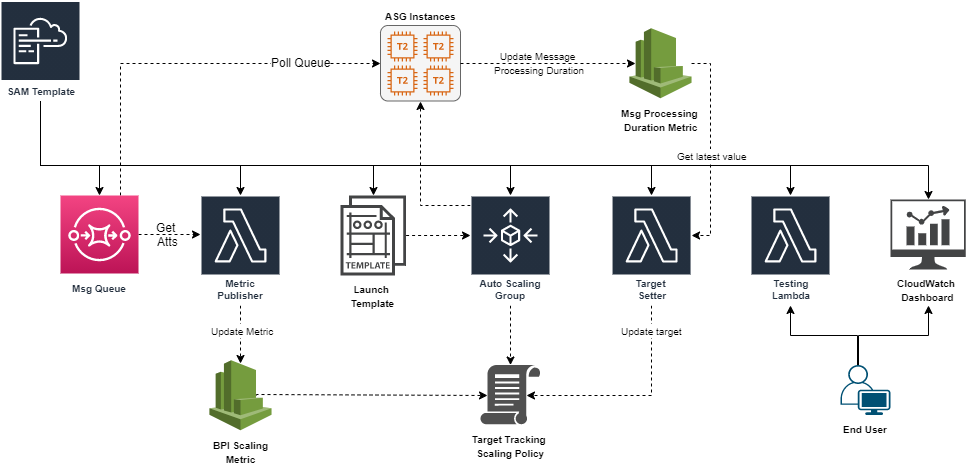

<!-- TOC -->

- [1. Basics](#1-basics)
- [2. Capacity-optimized allocation strategy](#2-capacity-optimized-allocation-strategy)
- [3. SQS](#3-sqs)
- [Spot Instances](#spot-instances)
- [Multiple Instance Types](#multiple-instance-types)
- [4. Tutorials](#4-tutorials)
- [5. Videos](#5-videos)
- [6. Warm Pools](#6-warm-pools)

<!-- /TOC -->

# 1. Basics

1. [Understanding EC2 Auto Scaling Groups](https://spot.io/resources/aws-autoscaling/understanding-ec2-auto-scaling-groups/)

# 2. Capacity-optimized allocation strategy

1. [Introducing the capacity-optimized allocation strategy for Amazon EC2 Spot Instancesby Chad Schmutzer ](https://aws.amazon.com/blogs/compute/introducing-the-capacity-optimized-allocation-strategy-for-amazon-ec2-spot-instances/)

# 3. SQS

1. [[_**VISIT**_] Running Cost-effective queue workers with Amazon SQS and Amazon EC2 Spot Instances by Ben Peven](https://aws.amazon.com/blogs/compute/running-cost-effective-queue-workers-with-amazon-sqs-and-amazon-ec2-spot-instances/)

    - my-pet-projects/ec2-scaling/sqs-ec2-spot-asg/sqs-ec2-spot-asg.yaml

    

1. [Scaling an ASG using target tracking with a dynamic SQS target by Sheila Busser](https://aws.amazon.com/blogs/compute/scaling-an-asg-using-target-tracking-with-a-dynamic-sqs-target/)

    - my-pet-projects/ec2-scaling/sqs-ec2-spot-fleet-autoscaling

    

# Spot Instances

1. [Running high-scale web applications on Amazon EC2 Spot Instances  by Roshni Pary](https://aws.amazon.com/blogs/compute/running-high-scale-web-on-spot-instances/)

# Multiple Instance Types

1. [New – EC2 Auto Scaling Groups With Multiple Instance Types & Purchase Options by Jeff Barr ](https://aws.amazon.com/blogs/aws/new-ec2-auto-scaling-groups-with-multiple-instance-types-purchase-options/)

# 4. Tutorials

1. [Get started with Amazon EC2 Auto Scaling](https://docs.aws.amazon.com/autoscaling/ec2/userguide/get-started-with-ec2-auto-scaling.html)

# 5. Videos

1. [Automating Management of Amazon EC2 Instances - March 2017 AWS Online Tech Talks](https://www.youtube.com/watch?v=bSRTAMPqS3E)

# 6. Warm Pools

1. [Scaling your applications faster with EC2 Auto Scaling Warm Pools by Chad Schmutzer](https://aws.amazon.com/blogs/compute/scaling-your-applications-faster-with-ec2-auto-scaling-warm-pools/)