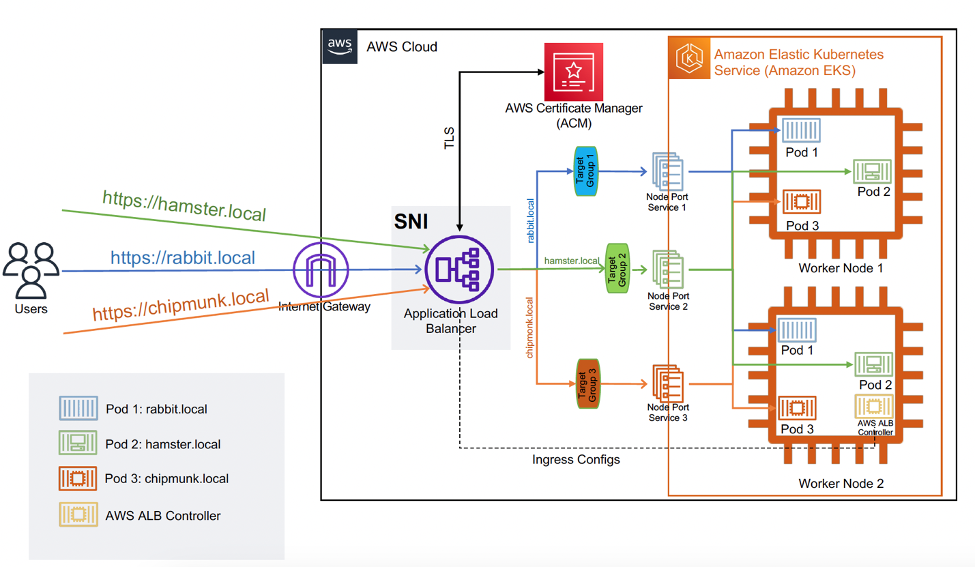

<h1>amazon-eks-alb-ingress</h1>

1. [Kubernetes Ingress with AWS ALB Ingress Controller by Yang Yang and Michael Hausenblas](https://aws.amazon.com/blogs/opensource/kubernetes-ingress-aws-alb-ingress-controller/)
1. [Using ALB Ingress Controller with Amazon EKS on Fargate by Bruno Emer and Nathan Taber](https://aws.amazon.com/blogs/containers/using-alb-ingress-controller-with-amazon-eks-on-fargate/)
1. [AWS Load Balancer Controller @ GITHub](https://github.com/kubernetes-sigs/aws-load-balancer-controller)
1. [AWS Load Balancer Controller](https://kubernetes-sigs.github.io/aws-load-balancer-controller/v2.7/deploy/installation/)
1. [How to rapidly scale your application with ALB on EKS (without losing traffic) by Yahav Biran, Sheetal Joshi, and Yuval Dovrat](https://aws.amazon.com/blogs/containers/how-to-rapidly-scale-your-application-with-alb-on-eks-without-losing-traffic/)

# 1. Encryption

1. [Enabling mTLS with ALB in Amazon EKS by Olawale Olaleye](https://aws.amazon.com/blogs/containers/enabling-mtls-with-alb-in-amazon-eks/)

# 2. [_**VISIT**_] How to access EKS privately

1. [Access container applications privately on Amazon EKS using AWS PrivateLink and a Network Load Balancer](https://docs.aws.amazon.com/prescriptive-guidance/latest/patterns/access-container-applications-privately-on-amazon-eks-using-aws-privatelink-and-a-network-load-balancer.html)
1. [[_**ADVANCED**_] Implement a central ingress Application Load Balancer supporting private Amazon Elastic Kubernetes Service VPCs by Michael Stein, Ahmed Khattab, and Omer Ahmed Hussain ](https://aws.amazon.com/blogs/networking-and-content-delivery/implement-a-central-ingress-application-load-balancer-supporting-private-amazon-elastic-kubernetes-service-vpcs/)

# Certs

1. [Serve distinct domains with TLS powered by ACM on Amazon EKS by Samir Khan, Insoo Jang, and Umair Ishaq](https://aws.amazon.com/blogs/containers/serve-distinct-domains-with-tls-powered-by-acm-on-amazon-eks/)

# 3. Workshop

1. [Building Web Applications based on Amazon EKS > Create Ingress Controller > Create AWS Load Balancer Controller](https://catalog.us-east-1.prod.workshops.aws/workshops/9c0aa9ab-90a9-44a6-abe1-8dff360ae428/en-US/60-ingress-controller/100-launch-alb)