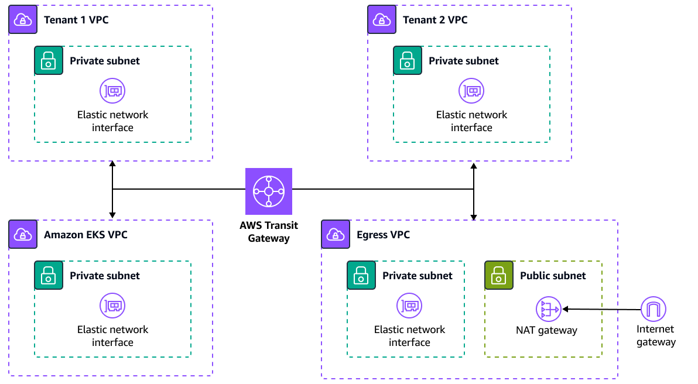
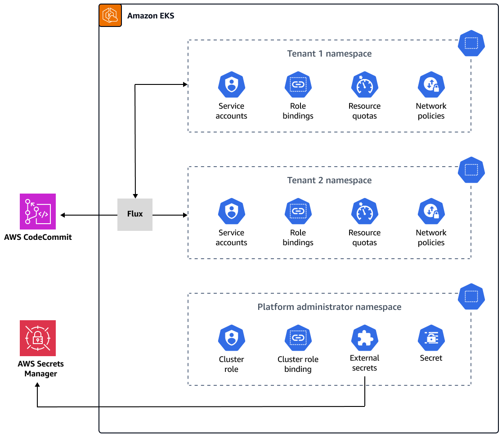

# Multi-tenancy

1. [[DOCS]Kubernetes Documentation / Concepts / Security / Multi-tenancy](https://kubernetes.io/docs/concepts/security/multi-tenancy/)
1. [How to manage only specific namespaces with IAM users in Amazon EKS by Alejandro Millan Frias](https://medium.com/@alejandro.millan.frias/assigning-iam-users-or-groups-to-manage-a-kubernetes-namespace-with-eks-38d10b1c9d93)
1. [Leveraging RBAC configurations in Kubernetes by Israel Aminu](https://aws.plainenglish.io/organizing-eks-permissions-for-users-and-roles-on-aws-09f8454a5bf5)
1. [Multi-tenant design considerations for Amazon EKS clusters by Roberto Migli](https://aws.amazon.com/blogs/containers/multi-tenant-design-considerations-for-amazon-eks-clusters/)
1. [Kubernetes: One Cluster or Many?](https://tanzu.vmware.com/content/blog/kubernetes-one-cluster-or-many)
1. [[MUST_SEE] Multi-Tenancy in Kubernetes : Three Different Ways](https://loft.sh/blog/kubernetes-multi-tenancy-10-essential-considerations/)
1. [Kubernetes Multi tenancy with Amazon EKS: Best practices and considerations](https://www.clickittech.com/saas/kubernetes-multi-tenancy)
1. [Building a Multi-Tenant SaaS Solution Using Amazon EKS by Toby Buckley and Ranjith Raman](https://aws.amazon.com/blogs/apn/building-a-multi-tenant-saas-solution-using-amazon-eks/)
1. [Tenant Isolation @ EKS Best Practices](https://aws.github.io/aws-eks-best-practices/security/docs/multitenancy/)
1. [[VISIT] EKS Multi Cluster Strategy](https://repost.aws/questions/QUT6l_QH08TZa1s-p5TVi8Mw/eks-multi-cluster-strategy)
1. [Multi Account Strategy](https://aws.github.io/aws-eks-best-practices/security/docs/multiaccount/)

# AWS Solutions

1. [Guidance for Multi-Tenant Architectures on AWS](https://aws.amazon.com/solutions/guidance/multi-tenant-architectures-on-aws)
1. [Simplify Amazon EKS multi-tenant application deployment by using Flux](https://docs.aws.amazon.com/prescriptive-guidance/latest/patterns/simplify-amazon-eks-multi-tenant-application-deployment-by-using-flux.html)

- Network architecture:

    

- Compute architecture:

    

# Repost
1. [How do I manage permissions across namespaces for IAM users in an Amazon EKS cluster?](https://repost.aws/knowledge-center/eks-iam-permissions-namespaces)

# Videos

1. [AWS re:Invent 2019: Architecting multi-tenant PaaS offerings with Amazon EKS (GPSTEC337)](https://www.youtube.com/watch?v=P29eL_51iYU)