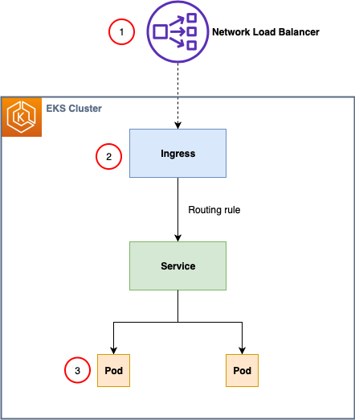

1. [Setting up end-to-end TLS encryption on Amazon EKS with the new AWS Load Balancer Controller by Petro Kashlikov](https://aws.amazon.com/blogs/containers/setting-up-end-to-end-tls-encryption-on-amazon-eks-with-the-new-aws-load-balancer-controller/)

    

1. [Enabling mTLS with ALB in Amazon EKS by Olawale Olaleye](https://aws.amazon.com/blogs/containers/enabling-mtls-with-alb-in-amazon-eks/)
1. [Setting up end-to-end TLS encryption on Amazon EKS with the new AWS Load Balancer Controller by Petro Kashlikov](https://aws.amazon.com/blogs/containers/setting-up-end-to-end-tls-encryption-on-amazon-eks-with-the-new-aws-load-balancer-controller/)
1. [[VIDEO] Introducing mTLS for the Application Load Balancer](https://www.twitch.tv/videos/2097281319)

