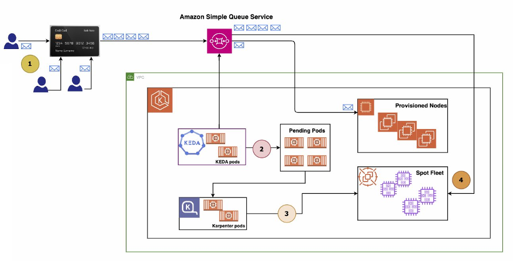

<h1>EKS and KEDA</h1>

1. [[**_START_HERE_**] Scalable and Cost-Effective Event-Driven Workloads with KEDA and Karpenter on Amazon EKS by Sanjeev Ganjihal and Asif Khan](https://aws.amazon.com/blogs/containers/scalable-and-cost-effective-event-driven-workloads-with-keda-and-karpenter-on-amazon-eks/)

  

**Project:** my-projects/amazon-eks-scaling-with-keda-and-karpenter
**Video:** [AWS EKS scaling with KEDA and Karpenter](https://www.youtube.com/watch?v=yOzyXY97CrI)

1. [Proactive autoscaling of Kubernetes workloads with KEDA and Amazon CloudWatch by Elamaran Shanmugam, Munish Dabra, and Vikram Venkataraman ](https://aws.amazon.com/blogs/mt/proactive-autoscaling-of-kubernetes-workloads-with-keda-using-metrics-ingested-into-amazon-cloudwatch/)
1. [How to Level Up Your Kubernetes Workload Autoscaling by Carlo Columna](https://medium.com/@carlocolumna/eda-in-amazon-eks-install-keda-82849cf31f01)
1. [KEDA in Amazon EKS Part 1: Why and How to Install KEDA by Carlo Columna](https://dev.to/carlocolumna/keda-in-amazon-eks-why-and-how-to-install-keda-44pa)
1. [KEDA in Amazon EKS Part 2: Scale Based On AWS SQS Queue by Carlo Columna](https://dev.to/carlocolumna/keda-in-amazon-eks-part-2-scale-based-on-aws-sqs-queue-5g4d)
1. [Proactive autoscaling of Kubernetes workloads with KEDA using metrics ingested into Amazon Managed Service for Prometheus by Vikram Venkataraman and Imaya Kumar Jagannathan](https://aws.amazon.com/blogs/mt/proactive-autoscaling-kubernetes-workloads-keda-metrics-ingested-into-aws-amp/)

# Samples

1. [EKS with KEDA HPA & Karpenter cluster autoscaler](https://github.com/aws-samples/amazon-eks-scaling-with-keda-and-karpenter)

# Documentation

1. [Keda home page](https://keda.sh/)