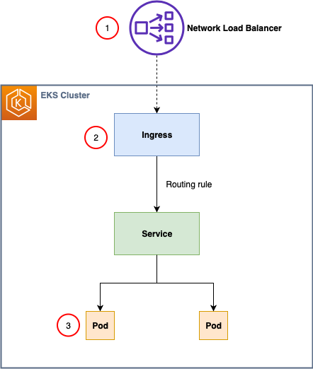

1. [Setting up end-to-end TLS encryption on Amazon EKS with the new AWS Load Balancer Controller by Petro Kashlikov](https://aws.amazon.com/blogs/containers/setting-up-end-to-end-tls-encryption-on-amazon-eks-with-the-new-aws-load-balancer-controller/)

1. https://github.com/cert-manager/cert-manager?tab=readme-ov-file

1. [Use private certificates to enable a container repository in Amazon EKS by Bappaditya Datta, Arnab Ghosh, Dom Bavaro, and Eugene Kim](https://aws.amazon.com/blogs/containers/use-private-certificates-to-enable-a-container-repository-in-amazon-eks/)