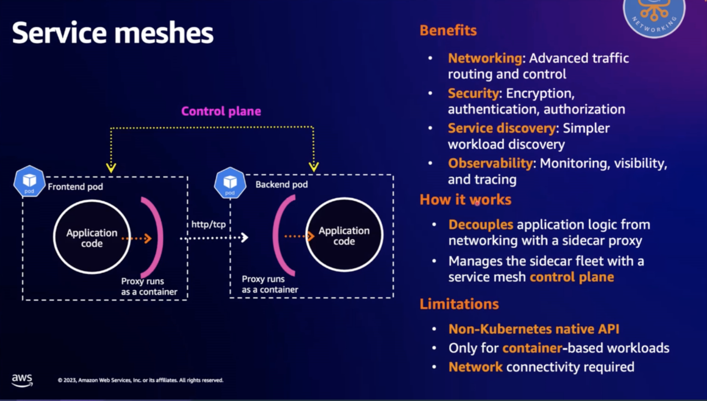
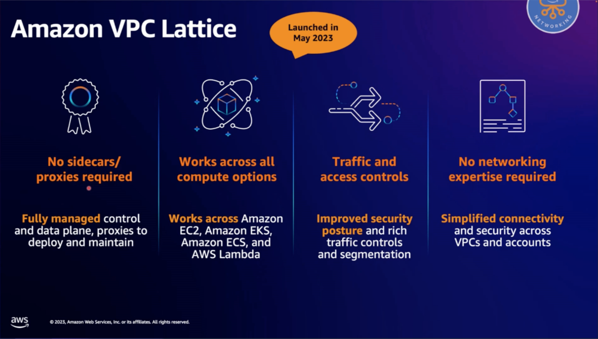

<H1>VPC Lattice</h1>

# Why VPC Lattice

Service Mesh is complex to manage

Instead use VPC Lattice

# How it works

1. [Build secure multi-account multi-VPC connectivity for your applications with Amazon VPC Lattice by Alexandra Huides and Ankit Chadha](https://aws.amazon.com/blogs/networking-and-content-delivery/build-secure-multi-account-multi-vpc-connectivity-for-your-applications-with-amazon-vpc-lattice/)

# EKS and VPC Lattice

1. [Application Networking with Amazon VPC Lattice and Amazon EKS by Viji Sarathy and Sheetal Joshi](https://aws.amazon.com/blogs/containers/application-networking-with-amazon-vpc-lattice-and-amazon-eks/)

# Workshop

1. [Amazon VPC Lattice](https://www.eksworkshop.com/docs/networking/vpc-lattice/)
1. [[VIDEO] Hands on with VPC Lattice | Amazon EKS Workshop](https://www.youtube.com/watch?v=l-FKi7eCb7k)
1. [[VIDEO] EKS Application Networking with Amazon VPC Lattice](https://www.youtube.com/watch?v=AdO0bx3N3fs)
