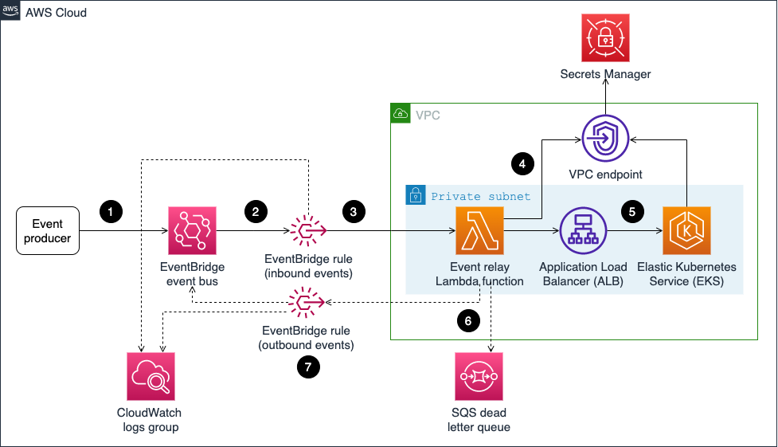

1. [[_**XPOST**_] Sending Amazon EventBridge events to private endpoints in a VPC by Emily Shea](https://aws.amazon.com/blogs/compute/sending-amazon-eventbridge-events-to-private-endpoints-in-a-vpc/)

    1. An event is sent to the EventBridge bus.
    2. If the event matches a certain pattern (ex, if ‘detail-type’ is ‘inbound-event-sent’), an EventBridge rule uses EventBridge’s input transformer to format the event as an HTTP call.
    3. The EventBridge rule pushes the event to a Lambda function connected to the VPC and a CloudWatch Logs group for debugging.
    4. The Lambda function calls Secrets Manager and retrieves a secret key. It appends the secret key to the event headers and then makes an HTTP call to the ALB URL endpoint.
    5. ALB routes this HTTP call to a node group in the EKS cluster. The Flask application running on the EKS cluster calls Secret Manager, confirms that the secret key is valid, and then processes the event.
    6. The Lambda function receives a response from ALB.
    7. If the Flask application fails to process the event for any reason, the Lambda function raises an error. The function’s failure destination is configured to send the event and the error message to an SQS dead letter queue.
    8. If the Flask application successfully processes the event and the ‘return-response-event’ flag in the event was set to ‘true’, then the Lambda function publishes a new ‘outbound-event-sent’ event to the same EventBridge bus.
    9. Another EventBridge rule matches detail-type ‘outbound-event-sent’ events and routes these to the CloudWatch Logs group for debugging.