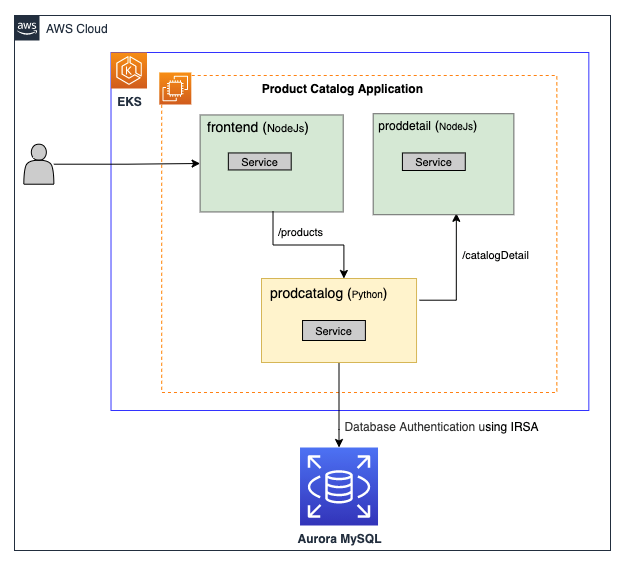

1. [Using IAM database authentication with workloads running on Amazon EKS by Praseeda Sathaye](https://aws.amazon.com/blogs/containers/using-iam-database-authentication-with-workloads-running-on-amazon-eks/)

