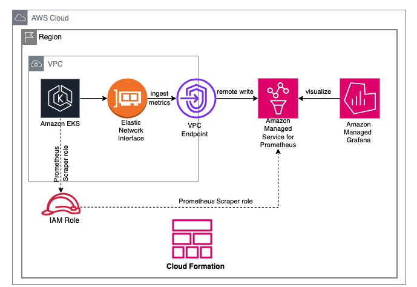

1. [Kubernetes: tracing requests with AWS X-Ray, and Grafana data source](https://rtfm.co.ua/en/kubernetes-tracing-requests-with-aws-x-ray-and-grafana-data-source/)
1. [Application Tracing on Kubernetes with AWS X-Ray by Nathan Taber](https://aws.amazon.com/blogs/compute/application-tracing-on-kubernetes-with-aws-x-ray/)

1. [[**VISIT**] Enhancing observability with a managed monitoring solution for Amazon EKS by Siva Guruvareddiar and Michael Hausenblas](https://aws.amazon.com/blogs/mt/enhancing-observability-with-a-managed-monitoring-solution-for-amazon-eks/)
- eks-cluster-config.yaml
- eks-monitoring-cfn-template.json
- sparse github checkouts

# 1. Samples

1. [application-signals-demo/pet clinic project](https://github.com/aws-observability/application-signals-demo#eks-demo)

# 2. Container insights

1. [Announcing Amazon CloudWatch Container Insights with Enhanced Observability for Amazon EKS on EC2 by Siva Guruvareddiar, Imaya Kumar Jagannathan, and Omur Kirikci ](https://aws.amazon.com/blogs/mt/new-container-insights-with-enhanced-observability-for-amazon-eks/)
1. [Automate monitoring for your Amazon EKS cluster using CloudWatch Container Insights by Manish Garg, Navdeep Pareek, and Sushant Jagdale](https://aws.amazon.com/blogs/infrastructure-and-automation/automate-monitoring-for-your-amazon-eks-cluster-using-cloudwatch-container-insights/)