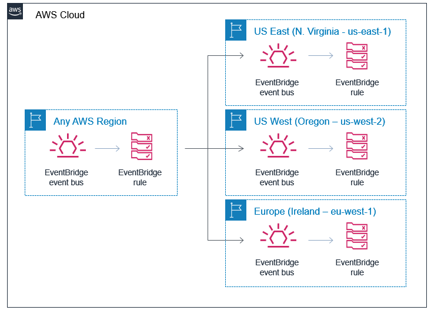

<!-- TOC -->

- [1. Topics To explore](#1-topics-to-explore)
- [2. Dashboard](#2-dashboard)
- [3. Curate](#3-curate)
- [4. Event Routing](#4-event-routing)
- [5. Standardizing Event Structures](#5-standardizing-event-structures)
- [6. Targets](#6-targets)
  - [6.1. Http Targets (API Destinations)](#61-http-targets-api-destinations)
- [7. Design](#7-design)
- [8. Event Bridge Patterns](#8-event-bridge-patterns)
  - [8.1. How to test event bridge patterns](#81-how-to-test-event-bridge-patterns)
- [9. Integration Patterns](#9-integration-patterns)
  - [9.1. ECS](#91-ecs)
  - [9.2. Glue](#92-glue)
  - [9.3. DynamoDBStreams](#93-dynamodbstreams)
  - [9.4. Webhooks](#94-webhooks)
  - [9.5. Orchestrator](#95-orchestrator)
  - [9.6. Transactional outbox pattern](#96-transactional-outbox-pattern)
  - [9.7. Content enrichment pattern](#97-content-enrichment-pattern)
  - [9.8. Claim Check Pattern](#98-claim-check-pattern)
- [10. SkillBuilder Course](#10-skillbuilder-course)
- [11. Schema registry](#11-schema-registry)
- [12. Scheduling](#12-scheduling)
- [13. Workshops](#13-workshops)

<!-- /TOC -->

# 1. Topics To explore

1. Many Targets
1. Dead Letter queues
1. Content-based filtering
1. Input Transformation
1. Event archive
1. Event replay
1. Schema registry
1. Schema discovery
1. Cross-account delivery
1. API (http) Destinations
1. Automated Event pattenr testing
1. Router

# 2. Dashboard

1. [Using Patterns to route messages](#5-event-bridge-patterns)
1. [[Automated Event pattern testing] Testing Amazon EventBridge events using AWS Step Functions By by Siarhei Kazhura](https://aws.amazon.com/blogs/compute/testing-amazon-eventbridge-events-using-aws-step-functions/)
1. [Amazon EventBridge: API Destinations Demystified-Part I By Sheen Brisals](https://sbrisals.medium.com/amazon-eventbridge-api-destinations-demystified-part-i-23fa70d9a04d)
1. [Amazon EventBridge: How To Manage API Connection Credentials With AWS Secrets Manager By Sheen Brisals](https://sbrisals.medium.com/amazon-eventbridge-how-to-manage-api-connection-credentials-with-aws-secrets-manager-f773f7d2aac5)
1. [EventBridge API Destinations configuration](https://serverlessland.com/patterns/eventbridge-api-destinations)

# 3. Curate

1. [Event Driven Architecture using Amazon EventBridge – Part 1 by Saurabh Sharma and Jordan Rosenbloom](https://aws.amazon.com/blogs/mt/event-driven-architecture-using-amazon-eventbridge/)
1. [Event Driven Architecture using Amazon EventBridge – Part 2 by Saurabh Sharma and Jordan Rosenbloom](https://aws.amazon.com/blogs/mt/event-driven-architecture-using-amazon-eventbridge-part-2/)
1. [Building an event-driven application with Amazon EventBridge by Talia Nassi](https://aws.amazon.com/blogs/compute/building-an-event-driven-application-with-amazon-eventbridge/)

# 4. Event Routing

1. [Introducing cross-Region event routing with Amazon EventBridge by James Beswick ](https://aws.amazon.com/blogs/compute/introducing-cross-region-event-routing-with-amazon-eventbridge/)

    - Creating a cross-Region routing rule in AWS CloudFormation

    

1. [Expanding cross-Region event routing with Amazon EventBridge by James Beswick](https://aws.amazon.com/blogs/compute/expanding-cross-region-event-routing-with-amazon-eventbridge/)

1. [How do I set up centralized bus-to-bus routing with EventBridge?](https://repost.aws/knowledge-center/eventbridge-centralized-bus-to-bus)

1. [[**VIDEO**] Amazon EventBridge - Routing events to buses in other AWS accounts By James Beswick](https://www.youtube.com/watch?v=pX_xIW_EuCE)

# 5. Standardizing Event Structures

1. [Sending and receiving CloudEvents with Amazon EventBridge by David Boyne](https://aws.amazon.com/blogs/compute/sending-and-receiving-cloudevents-with-amazon-eventbridge/)

# 6. Targets

## 6.1. Http Targets (API Destinations)

1. [Using API destinations with Amazon EventBridge by James Beswick](https://aws.amazon.com/blogs/compute/using-api-destinations-with-amazon-eventbridge/)
1. [Dev Guide - API destinations](https://docs.aws.amazon.com/eventbridge/latest/userguide/eb-api-destinations.html)
1. [Amazon EventBridge - Using API destinations with Amazon EventBridge](https://www.youtube.com/watch?v=2ayxa3AdiK0)
1. [Amazon EventBridge: API Destinations Demystified-Part I By Sheen Brisals](https://sbrisals.medium.com/amazon-eventbridge-api-destinations-demystified-part-i-23fa70d9a04d)
1. [Amazon EventBridge: How To Manage API Connection Credentials With AWS Secrets Manager By Sheen Brisals](https://sbrisals.medium.com/amazon-eventbridge-how-to-manage-api-connection-credentials-with-aws-secrets-manager-f773f7d2aac5)
1. [[EXAMPLE] EventBridge API Destinations configuration](https://serverlessland.com/patterns/eventbridge-api-destinations)

# 7. Design

1.[Icons for Eventbridge, Eventbridge event and Eventbridge Rule](https://aws.amazon.com/blogs/industries/building-a-modern-event-driven-application-for-insurance-claims-processing-part-2/)

# 8. Event Bridge Patterns

1. [[**MUST_SEE**] Content-based Filtering By Tim Bray](https://www.tbray.org/ongoing/When/201x/2019/12/18/Content-based-filtering)
1. [[**USER_GUIDE**] Amazon EventBridge event patterns](https://docs.aws.amazon.com/eventbridge/latest/userguide/eb-event-patterns.html)
1. [[WildCard Pattern] Filtering events in Amazon EventBridge with wildcard pattern matching](https://aws.amazon.com/blogs/compute/filtering-events-in-amazon-eventbridge-with-wildcard-pattern-matching/)
1. [Integrating Amazon EventBridge into your serverless applications by James Beswick](https://aws.amazon.com/blogs/compute/integrating-amazon-eventbridge-into-your-serverless-applications/)
1. [Reducing custom code by using advanced rules in Amazon EventBridge by James Beswick](https://aws.amazon.com/blogs/compute/reducing-custom-code-by-using-advanced-rules-in-amazon-eventbridge/)
1. [Reducing custom code by using advanced rules in Amazon EventBridge by James Beswick ](https://aws.amazon.com/blogs/compute/reducing-custom-code-by-using-advanced-rules-in-amazon-eventbridge/)
1. [[**MUST_SEE**] Implementing architectural patterns with Amazon EventBridge Pipes by David Boyne](https://aws.amazon.com/blogs/compute/implementing-architectural-patterns-with-amazon-eventbridge-pipes/)
1. [AWS re:Invent 2021 - Building next-gen applications with event-driven architectures By Sam Dengler](https://youtu.be/U5GZNt0iMZY?t=805)
1. [Building a modern, event-driven application for insurance claims processing – Part 1 by Emily Shea and Dhiraj Mahapatro](https://aws.amazon.com/blogs/industries/building-a-modern-event-driven-application-for-insurance-claims-processing-part-1/)
1. [Building a modern, event-driven application for insurance claims processing – Part 2 by Emily Shea, Vaibhav Jain, and Dhiraj Mahapatro](https://aws.amazon.com/blogs/industries/building-a-modern-event-driven-application-for-insurance-claims-processing-part-2/)
1. [Extending a serverless, event-driven architecture to existing container workloads by Dhiraj Mahapatro and Sascha Moellering](https://aws.amazon.com/blogs/compute/extending-a-serverless-event-driven-architecture-to-existing-container-workloads/)

## 8.1. How to test event bridge patterns

1. [Testing Amazon EventBridge events using AWS Step Functions by Siarhei Kazhura](https://aws.amazon.com/blogs/compute/testing-amazon-eventbridge-events-using-aws-step-functions/)

# 9. Integration Patterns

## 9.1. ECS

1. [Integrating Amazon EventBridge and Amazon ECS By Jakub Narloch](https://aws.amazon.com/blogs/compute/integrating-amazon-eventbridge-and-amazon-ecs/)

## 9.2. Glue

1. [Build a serverless event-driven workflow with AWS Glue and Amazon EventBridge by Noritaka Sekiyama, Keerthi Chadalavada, and Karan Vishwanathan](https://aws.amazon.com/blogs/big-data/build-a-serverless-event-driven-workflow-with-aws-glue-and-amazon-eventbridge/)
- /Volumes/Lexar/git-repos/aws-repo/my-aws-samples/eventbridge/event-driven-workflow-tutorial
- [event_driven_workflow_tutorial.yaml](./templates/event_driven_workflow_tutorial.yaml)]

## 9.3. DynamoDBStreams
1. [Implementing the transactional outbox pattern with Amazon EventBridge Pipes By Sayan Moitra](https://aws.amazon.com/blogs/compute/implementing-the-transactional-outbox-pattern-with-amazon-eventbridge-pipes/)

## 9.4. Webhooks

1. [[WebHooks] Amazon Aurora & Amazon EventBridge Webhooks Sample](https://github.com/aws-samples/amazon-aurora-eventbridge-webhooks)

## 9.5. Orchestrator

1. [{Orchestrator] Insurance Claims Processing using Serverless and Event-Driven Architecture](https://github.com/aws-samples/serverless-eda-insurance-claims-processing)

## 9.6. Transactional outbox pattern

1. [[Transactional outbox pattern ] Implementing the transactional outbox pattern with Amazon EventBridge Pipes By Sayan Moitra](https://aws.amazon.com/blogs/compute/implementing-the-transactional-outbox-pattern-with-amazon-eventbridge-pipes/)

## 9.7. Content enrichment pattern

1. [Enriching events with Amazon EventBridge and AWS Lambda](https://www.boyney.io/blog/2022-11-01-eventbridge-enrichment-with-lambda)

## 9.8. Claim Check Pattern

1. [S3 to EventBridge claim check with presigned urls](https://serverlessland.com/patterns/s3-to-eventbridge-claim-check-pattern)
1. [How to publish large events with Amazon EventBridge using the claim check pattern](https://www.boyney.io/blog/2022-11-01-eventbridge-claim-check)
1. [Claim Check Pattern by David Boyne](https://serverlessland.com/event-driven-architecture/visuals/claim-check-pattern)

# 10. SkillBuilder Course

1. [Building Event-Driven Applications With Amazon EventBridge](https://explore.skillbuilder.aws/learn/course/15008/building-event-driven-applications-with-amazon-eventbridge)

# 11. Schema registry

1. [Working with events and the Amazon EventBridge schema registry by Talia Nassi ](https://aws.amazon.com/blogs/compute/working-with-events-and-amazon-eventbridge-schema-registry/)
1. [Introducing Amazon EventBridge schema registry and discovery – In preview by Julian Wood](https://aws.amazon.com/blogs/compute/introducing-amazon-eventbridge-schema-registry-and-discovery-in-preview/)
1. [Event Bridge by Lumigo](https://lumigo.io/aws-serverless-ecosystem/amazon-eventbridge/#eventbridge_schema_registry)
1. [Sending and Receiving Custom Events with AWS EventBridge Schema Registry By Dunith Dhanushka](https://medium.com/event-driven-utopia/sending-and-receiving-custom-events-with-aws-eventbridge-schema-registry-b73198b7a140)

# 12. Scheduling

1. [Introducing Amazon EventBridge Scheduler by Marcia Villalba](https://aws.amazon.com/blogs/compute/introducing-amazon-eventbridge-scheduler/)
2. [Serverless Scheduling with Amazon EventBridge, AWS Lambda, and Amazon DynamoDB by Peter Grman](https://aws.amazon.com/blogs/architecture/serverless-scheduling-with-amazon-eventbridge-aws-lambda-and-amazon-dynamodb/)
- see /Volumes/Lexar/git-repos/aws-repo/my-aws-samples/event-bridge/scheduling

# 13. Workshops

1. [Building event-driven architectures on AWS](https://catalog.us-east-1.prod.workshops.aws/workshops/63320e83-6abc-493d-83d8-f822584fb3cb/en-US)
    - [EventBridge] First event bus and targets
    - [EventBridge] Working with EventBridge rules for API Destination Target
    - [EventBridge] Working with EventBridge rules for Step Functions
    - [EventBridge] Working with EventBridge rules for SNS Target
    - [LAMBDA] AWS Lambda destinations
    - [LAMBDA] Error handling
    - [SNS] Simple pub/sub
    - [SNS] Message filtering
    - [SNS] Advanced message filtering
    - [SNS] Error handling

    - cfns/master-v2.yaml
    - cfns/cognito-user-pool-v2.yaml
    - cfns/event-bridge-v2.yaml
    - cfns/lambda-v2.yaml
    - cfns/sns-v2.yaml

1. [[JAVA] AWS Serverless Developer Experience](https://catalog.workshops.aws/serverless-developer-experience/en-US)
- https://github.com/aws-samples/aws-serverless-developer-experience-workshop-java?tab=readme-ov-file