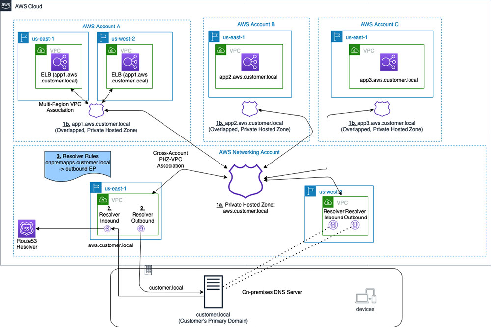

<h1>Amazon Route53</h1>

<!-- TOC -->

- [1. Anycast - How does R53 use Anycast?](#1-anycast---how-does-r53-use-anycast)
- [2. DNS](#2-dns)
- [3. Disaster Recovery](#3-disaster-recovery)
- [4. Hosted Zones](#4-hosted-zones)
- [5. Multi-Region](#5-multi-region)
- [6. Private Hosted Zones](#6-private-hosted-zones)
- [7. Routing Policies](#7-routing-policies)
- [8. Split-View DNS](#8-split-view-dns)
- [9. Validating domain using certificates](#9-validating-domain-using-certificates)
- [10. Videos](#10-videos)
- [11. Zone delegation](#11-zone-delegation)
- [12. Zone Apex](#12-zone-apex)
- [13. How to prevent DDos attacks using WAF and Cloudfront](#13-how-to-prevent-ddos-attacks-using-waf-and-cloudfront)

<!-- /TOC -->

# 1. Anycast - How does R53 use Anycast?

1. [Low-Latency DNS Resolution via AWS Route 53 and Anycast](https://www.bizety.com/2016/09/22/aws-route-53-anycast/)
1. [[VISIT] A Case Study in Global Fault Isolation by Lee-Ming Zen](https://aws.amazon.com/blogs/architecture/a-case-study-in-global-fault-isolation/)

# 2. DNS

see my-github/study-guide-repo/amazon/aws-networking-dns.md

1. [A Case Study in Global Fault Isolation by Lee-Ming Zen](https://aws.amazon.com/blogs/architecture/a-case-study-in-global-fault-isolation/)

# 3. Disaster Recovery

1. [[WORSHOP] Disaster Recovery with Amazon Route 53 Application Recovery Controller (ARC)](https://catalog.us-east-1.prod.workshops.aws/workshops/4d9ab448-5083-4db7-bee8-85b58cd53158/en-US/)
1. [Managing Application Traffic Using Route53 Application Recovery Controller](https://awstip.com/managing-application-traffic-using-route53-application-recovery-controller-96c948fb6710)
1. [Creating Disaster Recovery Mechanisms Using Amazon Route 53 by Joe Chapman and Gavin McCullagh](https://aws.amazon.com/blogs/networking-and-content-delivery/creating-disaster-recovery-mechanisms-using-amazon-route-53/)

# 4. Hosted Zones

1. [How to manage Route53 hosted zones in a multi-account environment](https://theburningmonk.com/2021/05/how-to-manage-route53-hosted-zones-in-a-multi-account-environment/)

# 5. Multi-Region

1. [Getting started with Route53 for multi-region applications](https://www.youtube.com/watch?v=IM1xSBqBgIo)

# 6. Private Hosted Zones

1. [Handling Private Hosted Zones in R53 By Crishantha Nanayakkara](https://crishantha.medium.com/handling-private-hosted-zones-in-r53-3fbcdcd047e1)

# 7. Routing Policies

1. [How to register a Domain and creating a Record Set By Crishantha Nanayakkara](https://crishantha.medium.com/aws-route-53-and-routing-scenarios-671d12991260)
2. [Routing Policies By Crishantha Nanayakkara](https://crishantha.medium.com/aws-route-53-and-routing-policies-b7dc67e74516)
1. [What is the Difference between Geoproximity vs Geolocation?](https://www.abstractapi.com/guides/geoproximity-vs-geolocation)

# 8. Split-View DNS

1. [Configuring Split-view DNS With AWS Route53 by FAUN — Developer Community Vinayak Pandey](https://faun.pub/configuring-split-view-dns-with-aws-route53-22c708a9960c)
2. [Reviewing DNS Mechanisms for Routing Traffic and Enabling Failover for AWS PrivateLink Deployments by Anuj Dewangan](https://aws.amazon.com/blogs/apn/reviewing-dns-mechanisms-for-routing-traffic-and-enabling-failover-for-aws-privatelink-deployments/)

# 9. Validating domain using certificates

1. [Easier Certificate Validation Using DNS with AWS Certificate Manager by Todd Cignetti](https://aws.amazon.com/blogs/security/easier-certificate-validation-using-dns-with-aws-certificate-manager/)

# 10. Videos

> 1. [[**MAKE-NOTES**] DNS Design Using Amazon Route 53 - AWS Online Tech Talks By James Devine](https://www.youtube.com/watch?v=2y_RBjDkRgY)

# 11. Zone delegation

1. [How to Share a Domain among AWS Accounts? By Enlear Academy](https://www.youtube.com/watch?v=MSIxbWz3qdo)
1. [How to manage Route53 hosted zones in a multi-account environment](https://theburningmonk.com/2021/05/how-to-manage-route53-hosted-zones-in-a-multi-account-environment/)
1. [Workshop AWS Account Setup > Shared Services Account > Setting up a DNS zone in Route53](https://workshop-aws-account-setup.fstehle.com/shared-services-account/route53/)
1. https://repost.aws/knowledge-center/route53-private-hosted-zone
1. [Using Route 53 Private Hosted Zones for Cross-account Multi-region Architectures by Anandprasanna Gaitonde and John Bickle](https://aws.amazon.com/blogs/architecture/using-route-53-private-hosted-zones-for-cross-account-multi-region-architectures/)

# 12. Zone Apex

1. [Solving DNS zone apex challenges with third-party DNS providers using AWS by Chris Carter and Sohaib Tahir](https://aws.amazon.com/blogs/networking-and-content-delivery/solving-dns-zone-apex-challenges-with-third-party-dns-providers-using-aws)

# 13. How to prevent DDos attacks using WAF and Cloudfront

1. [How to Help Protect Dynamic Web Applications Against DDoS Attacks by Using Amazon CloudFront and Amazon Route 53 by Holly Willey |](https://aws.amazon.com/blogs/security/how-to-protect-dynamic-web-applications-against-ddos-attacks-by-using-amazon-cloudfront-and-amazon-route-53/#:~:text=Route%2053%20is%20also%20designed,the%20availability%20of%20the%20service.)