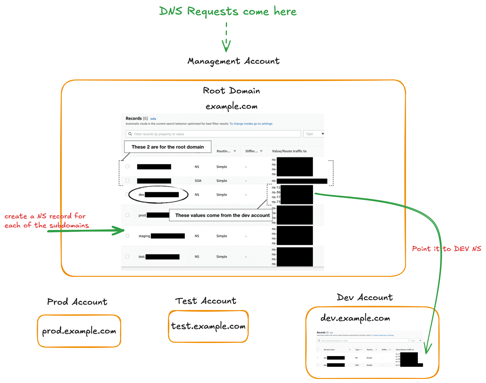
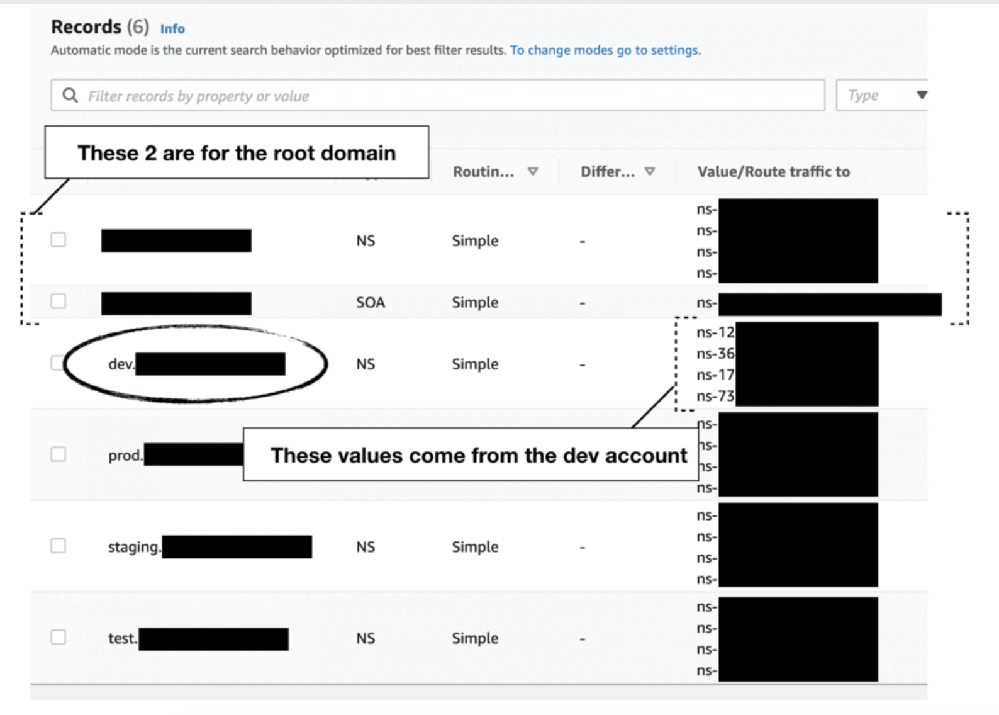

1. [Demystifying DNS Records – A, CNAME, ALIAS, MX & AAAA](https://www.whizlabs.com/blog/dns-records/)

2. Bring `my-github/study-guide-repo/amazon/aws-networking-dns.md` here or classify as `amazon-route53-DNS.md`

3. [DNS best practices for Amazon Route 53 by Renato Gentil and Scott Morrison](https://aws.amazon.com/blogs/networking-and-content-delivery/dns-best-practices-for-amazon-route-53/)

https://adil.medium.com/why-use-dns-alias-record-instead-of-cname-in-the-cloud-ca995b7a364d

# 1. Route 53 DNS in an Organization

  

- This is sharing is across accounts

1. [How to manage Route53 hosted zones in a multi-account environment by Yan Cui](https://theburningmonk.com/2021/05/how-to-manage-route53-hosted-zones-in-a-multi-account-environment/)

1. [[_**DEMO**_] How to Share a Domain among AWS Accounts? By Enlear Academy](https://www.youtube.com/watch?v=MSIxbWz3qdo)
- Shows a demo of what was discussed by Yan Cui in https://theburningmonk.com/2021/05/how-to-manage-route53-hosted-zones-in-a-multi-account-environment/

# Zone delegation

1. [How to Share a Domain among AWS Accounts? By Enlear Academy](https://www.youtube.com/watch?v=MSIxbWz3qdo)
1. [How to manage Route53 hosted zones in a multi-account environment](https://theburningmonk.com/2021/05/how-to-manage-route53-hosted-zones-in-a-multi-account-environment/)
1. [Workshop AWS Account Setup > Shared Services Account > Setting up a DNS zone in Route53](https://workshop-aws-account-setup.fstehle.com/shared-services-account/route53/)
1. https://repost.aws/knowledge-center/route53-private-hosted-zone
1. [Using Route 53 Private Hosted Zones for Cross-account Multi-region Architectures by Anandprasanna Gaitonde and John Bickle](https://aws.amazon.com/blogs/architecture/using-route-53-private-hosted-zones-for-cross-account-multi-region-architectures/)
&nbsp;
  
&nbsp;

# DNSSEC

1. [DNSSEC Miniseries - Why do we need DNSSEC By Cantrill](https://www.youtube.com/watch?v=zEmUuNFBgN8&list=PLTk5ZYSbd9MhMmOiPhfRJNW7bhxHo4q-K)