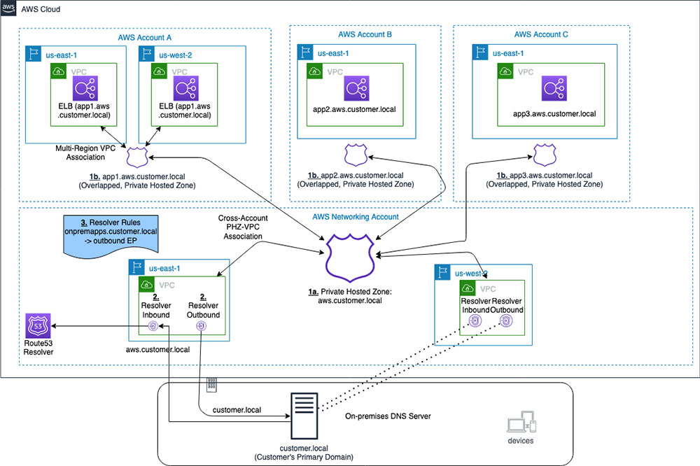

<h1>Amazon Route53</h1>

<!-- TOC -->

- [1. DNS](#1-dns)
- [2. Disaster Recovery](#2-disaster-recovery)
- [3. Hosted Zones](#3-hosted-zones)
- [4. Private Hosted Zones](#4-private-hosted-zones)
- [5. Routing Policies](#5-routing-policies)
- [6. Split-View DNS](#6-split-view-dns)
- [7. Validating domain using certificates](#7-validating-domain-using-certificates)
- [8. Videos](#8-videos)
- [9. Zone delegation](#9-zone-delegation)
- [10. Zone Apex](#10-zone-apex)

<!-- /TOC -->

# 1. DNS

1. [Powering Secondary DNS in a VPC using AWS Lambda and Amazon Route 53 Private Hosted Zones by Bryan Liston](https://aws.amazon.com/blogs/compute/powering-secondary-dns-in-a-vpc-using-aws-lambda-and-amazon-route-53-private-hosted-zones/)
2. [Building a Dynamic DNS for Route 53 using CloudWatch Events and Lambda by Bryan Liston](https://aws.amazon.com/blogs/compute/building-a-dynamic-dns-for-route-53-using-cloudwatch-events-and-lambda/)

# 2. Disaster Recovery

1. [[WORSHOP] Disaster Recovery with Amazon Route 53 Application Recovery Controller (ARC)](https://catalog.us-east-1.prod.workshops.aws/workshops/4d9ab448-5083-4db7-bee8-85b58cd53158/en-US/)
1. [Managing Application Traffic Using Route53 Application Recovery Controller](https://awstip.com/managing-application-traffic-using-route53-application-recovery-controller-96c948fb6710)

# 3. Hosted Zones

1. [How to manage Route53 hosted zones in a multi-account environment](https://theburningmonk.com/2021/05/how-to-manage-route53-hosted-zones-in-a-multi-account-environment/)

# 4. Private Hosted Zones

1. [Handling Private Hosted Zones in R53 By Crishantha Nanayakkara](https://crishantha.medium.com/handling-private-hosted-zones-in-r53-3fbcdcd047e1)

# 5. Routing Policies

1. [How to register a Domain and creating a Record Set By Crishantha Nanayakkara](https://crishantha.medium.com/aws-route-53-and-routing-scenarios-671d12991260)
2. [Routing Policies By Crishantha Nanayakkara](https://crishantha.medium.com/aws-route-53-and-routing-policies-b7dc67e74516)

# 6. Split-View DNS

1. [Configuring Split-view DNS With AWS Route53 by FAUN — Developer Community Vinayak Pandey](https://faun.pub/configuring-split-view-dns-with-aws-route53-22c708a9960c)
2. [Reviewing DNS Mechanisms for Routing Traffic and Enabling Failover for AWS PrivateLink Deployments by Anuj Dewangan](https://aws.amazon.com/blogs/apn/reviewing-dns-mechanisms-for-routing-traffic-and-enabling-failover-for-aws-privatelink-deployments/)

# 7. Validating domain using certificates

1. [Easier Certificate Validation Using DNS with AWS Certificate Manager by Todd Cignetti](https://aws.amazon.com/blogs/security/easier-certificate-validation-using-dns-with-aws-certificate-manager/)

# 8. Videos

> 1. [[**MAKE-NOTES**] DNS Design Using Amazon Route 53 - AWS Online Tech Talks By James Devine](https://www.youtube.com/watch?v=2y_RBjDkRgY)

# 9. Zone delegation

1. [How to Share a Domain among AWS Accounts? By Enlear Academy](https://www.youtube.com/watch?v=MSIxbWz3qdo)
1. [How to manage Route53 hosted zones in a multi-account environment](https://theburningmonk.com/2021/05/how-to-manage-route53-hosted-zones-in-a-multi-account-environment/)
1. [Workshop AWS Account Setup > Shared Services Account > Setting up a DNS zone in Route53](https://workshop-aws-account-setup.fstehle.com/shared-services-account/route53/)
1. https://repost.aws/knowledge-center/route53-private-hosted-zone
1. [Using Route 53 Private Hosted Zones for Cross-account Multi-region Architectures by Anandprasanna Gaitonde and John Bickle](https://aws.amazon.com/blogs/architecture/using-route-53-private-hosted-zones-for-cross-account-multi-region-architectures/)

# 10. Zone Apex

1. [Solving DNS zone apex challenges with third-party DNS providers using AWS by Chris Carter and Sohaib Tahir](https://aws.amazon.com/blogs/networking-and-content-delivery/solving-dns-zone-apex-challenges-with-third-party-dns-providers-using-aws)
s