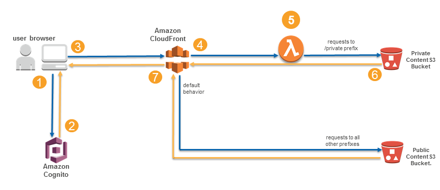

<h1>[RECATEGORIZE] Amazon S3</H1>

<!-- TOC -->

- [1. How to analyze if my bucket is public or not](#1-how-to-analyze-if-my-bucket-is-public-or-not)
- [2. Bucket Policy examples](#2-bucket-policy-examples)
- [3. Deleting objects](#3-deleting-objects)
  - [3.1. Delete Markers](#31-delete-markers)
  - [3.2. Cross-Region Deletion](#32-cross-region-deletion)
- [4. Encryption](#4-encryption)
- [5. Object Locks](#5-object-locks)
- [6. Bucket policies](#6-bucket-policies)
- [7. Cross Account Access](#7-cross-account-access)
- [8. Querying S3](#8-querying-s3)
- [9. Pre-Signed URLs](#9-pre-signed-urls)
- [10. Replication](#10-replication)
- [11. Java examples](#11-java-examples)
- [12. S3 endpoints](#12-s3-endpoints)
- [13. Storage Classes](#13-storage-classes)
  - [13.1. Intelligent Tiering](#131-intelligent-tiering)
  - [13.2. Glacier](#132-glacier)
    - [13.2.1. deletion in Glacier](#1321-deletion-in-glacier)
- [14. Tools](#14-tools)
- [15. Multi-part Uploads](#15-multi-part-uploads)
- [16. Static websites](#16-static-websites)
- [17. Object versioning](#17-object-versioning)
  - [17.1. Lifecycle management for versioned objects](#171-lifecycle-management-for-versioned-objects)
- [18. Checking for non-compliant buckets using config Rules](#18-checking-for-non-compliant-buckets-using-config-rules)
- [19. Difference checker](#19-difference-checker)
- [20. S3 Object Lambda](#20-s3-object-lambda)
- [21. Restricting bucket access](#21-restricting-bucket-access)
- [22. Lifecycle](#22-lifecycle)
- [23. Transfer Acceleration](#23-transfer-acceleration)

<!-- /TOC -->

# 1. How to analyze if my bucket is public or not

1. [Understanding Amazon S3 Block Public Access by Andrew Gacek](https://aws.amazon.com/blogs/storage/understanding-s3-block-public-access/)
1. [How AWS uses automated reasoning to help you achieve security at scale by Andrew Gacek ](https://aws.amazon.com/blogs/security/protect-sensitive-data-in-the-cloud-with-automated-reasoning-zelkova/)
1. Use `IAM Access Analyzer`

# 2. Bucket Policy examples

1. /Volumes/Lexar/git-repos/aws-repo/cantrill-courses/saac03-by-cantrill/course-notes/7-Simple storage service (s3)/99-Bucket policy examples.md
1. [Amazon S3 Access Control - IAM Policies, Bucket Policies and ACLs](https://www.youtube.com/watch?v=xFzJw6wJ8eY&t=16s)

# 3. Deleting objects

1. [Protect Data on Amazon S3 Against Accidental Deletion or Application Bugs Using S3 Versioning, S3 Object Lock, and S3 Replicatio](https://aws.amazon.com/getting-started/hands-on/protect-data-on-amazon-s3/)
1. [Step-By-Step: Emptying S3 Buckets and Directories Using the AWS CLI with S3 RM](https://blog.awsfundamentals.com/aws-s3-rm-removing-files)
1. [How to delete using Java](https://docs.aws.amazon.com/AmazonS3/latest/userguide/delete-objects.html)
- Example 1: Deleting an object (non-versioned bucket)
- Example 2: Deleting an object (versioned bucket)

## 3.1. Delete Markers

1. [Managing delete markers Using Python](https://docs.aws.amazon.com/AmazonS3/latest/userguide/ManagingDelMarkers.html)
1. [How to delete the objects in S3 bucket if versioning is enabled? by Ekant Mate ](https://aws.plainenglish.io/how-to-delete-the-objects-in-s3-bucket-if-versioning-is-enabled-fbcf271ff2d8)

## 3.2. Cross-Region Deletion

1. [Managing delete marker replication in Amazon S3 by Vikas Shah, Ganesh Sundaresan, and Mike Burbey](https://aws.amazon.com/blogs/storage/managing-delete-marker-replication-in-amazon-s3/)

# 4. Encryption

1. [Amazon S3: Data Encryption Options](https://www.youtube.com/watch?v=U1USUvvhuCY)
1. [ [**START_HERE**] [SHAREDALL] S3 Object Encryption CSE/SSE By Cantrill](https://learn.cantrill.io/courses/1820301/lectures/41301481)
1. [Encryption On AWS - Tutorial for S3](https://catalog.us-east-1.prod.workshops.aws/workshops/aad9ff1e-b607-45bc-893f-121ea5224f24/en-US/s3)
    - Server-side encryption - SSE-S3
    - Server-side encryption  - SSE-KMS
    - Server-side encryption - SSE-C
    - Client-side encryption

# 5. Object Locks

1. [Protecting data with Amazon S3 Object Lock by Ruhi Dang](https://aws.amazon.com/blogs/storage/protecting-data-with-amazon-s3-object-lock/)
1. [[**HANDS-ON]** Protect Data on Amazon S3 Against Accidental Deletion or Application Bugs Using S3 Versioning, S3 Object Lock, and S3 Replication](https://aws.amazon.com/getting-started/hands-on/protect-data-on-amazon-s3/?ref=gsrchandson&id=new)

# 6. Bucket policies

1. [IAM Policies and Bucket Policies and ACLs! Oh, My! (Controlling Access to S3 Resources) by Kai Zhao, Gautam Kumar, and Laura Verghote ](https://aws.amazon.com/blogs/security/iam-policies-and-bucket-policies-and-acls-oh-my-controlling-access-to-s3-resources/)

# 7. Cross Account Access

1. [Cross-Account Access to Amazon S3 | AWS IAM By Neil Davis](https://www.youtube.com/watch?v=HP8XSRWrFQc)

# 8. Querying S3

1. [Amazon S3 Select - Querying data without servers or databases](https://catalog.us-east-1.prod.workshops.aws/workshops/c85a4d91-2b80-4155-948d-bbdc200567a6/en-US)
1. [How to optimize querying your data in Amazon S3 by Arushi Garg and Preethi Raajaratnam ](https://aws.amazon.com/blogs/storage/how-to-optimize-querying-your-data-in-amazon-s3/)

# 9. Pre-Signed URLs

1. [Using presigned URLs to identify per-requester usage of Amazon S3 by John Lee, Chance Lee, and Justin Lim](https://fourtheorem.com/the-illustrated-guide-to-s3-pre-signed-urls/)
1. [[1ST_EXAMPLE_START_HERE] Uploading to Amazon S3 directly from a web or mobile application
by James Beswick ](https://aws.amazon.com/blogs/compute/uploading-to-amazon-s3-directly-from-a-web-or-mobile-application/)
- https://github.com/aws-samples/amazon-s3-presigned-urls-aws-sam
1. [[GOTCHAs] Handling Pre-signed URLs with S3 By Crishantha Nanayakkara](https://crishantha.medium.com/handling-pre-signed-urls-with-s3-7aab969bb40)
1. [Generating Amazon S3 Pre-signed URLs with SSE (Part 1) by Hanson Char ](https://aws.amazon.com/blogs/developer/generating-amazon-s3-pre-signed-urls-with-sse-part-1/)
1. [Generating Amazon S3 Pre-signed URLs with SSE-KMS (Part 2) by Hanson Char](https://aws.amazon.com/blogs/developer/generating-amazon-s3-pre-signed-urls-with-sse-kms-part-2/)
1. [Generating Amazon S3 Pre-signed URLs with SSE-C (Part 4) by Hanson Char](https://aws.amazon.com/blogs/developer/generating-amazon-s3-pre-signed-urls-with-sse-c-part-4/)
1. [Generating Amazon S3 Pre-signed URLs with SSE-S3 (Part 3) by Hanson Char ](https://aws.amazon.com/blogs/developer/generating-amazon-s3-pre-signed-urls-with-sse-s3-part-3/)
1. [Generating Amazon S3 Pre-signed URLs with SSE-C (Part 5 Finale) by Hanson Char ](https://aws.amazon.com/blogs/developer/generating-amazon-s3-pre-signed-urls-with-sse-c-part-5-finale/)
1. [S3 URI Parsing is now available in AWS SDK for Java 2.x by David Ho](https://aws.amazon.com/blogs/devops/s3-uri-parsing-is-now-available-in-aws-sdk-for-java-2-x/)
1. [Using presigned URLs to identify per-requester usage of Amazon S3 by John Lee, Chance Lee, and Justin Lim](https://aws.amazon.com/blogs/storage/using-presigned-urls-to-identify-per-requester-usage-of-amazon-s3/)

# 10. Replication

1. [Configuring Amazon S3 Cross-Region Replication (CRR) and Same-Region Replication (SRR) By Neil Davis](https://www.youtube.com/watch?v=trmicgGpmd4&t=6s)
1. [[_**HANDS-ON**_] Replicate Data within and between AWS Regions Using Amazon S3 Replication](https://aws.amazon.com/getting-started/hands-on/replicate-data-using-amazon-s3-replication/)
1. [[_**HANDS-ON**_][**_BATCH_**] Replicate Existing Objects in your Amazon S3 Buckets with Amazon S3 Batch Replication]()
1. [[**HANDS-ON]** Protect Data on Amazon S3 Against Accidental Deletion or Application Bugs Using S3 Versioning, S3 Object Lock, and S3 Replication](https://aws.amazon.com/getting-started/hands-on/protect-data-on-amazon-s3/?ref=gsrchandson&id=new)

# 11. Java examples

1. [Amazon S3 Developer Guide](https://github.com/alexdebrie/amazon-s3-developer-guide/tree/master/code_examples/java_examples/S3Examples)
    * CORS.java
    * CopyObjectSingleOperation.java
    * CreateBucket.java
    * CreateBucketWithACL.java
    * CrossRegionReplication.java
    * DeleteBucket.java
    * DeleteMultipleObjectsNonVersionedBucket.java
    * DeleteMultipleObjectsVersionEnabledBucket.java
    * DeleteObjectNonVersionedBucket.java
    * DeleteObjectVersionEnabledBucket.java
    * DualStackEndpoints.java
    * EnableNotificationOnABucket.java
    * GeneratePresignedURL.java
    * GeneratePresignedUrlAndUploadObject.java
    * GetObject.java
    * HighLevelAbortMultipartUpload.java
    * HighLevelMultipartUpload.java
    * HighLevelTrackMultipartUpload.java
    * LifecycleConfiguration.java
    * ListKeys.java
    * ListKeysVersioningEnabledBucket.java
    * ListMultipartUploads.java
    * LowLevelAbortMultipartUpload.java
    * LowLevelMultipartCopy.java
    * LowLevelMultipartUpload.java
    * MakingRequests.java
    * MakingRequestsWithFederatedTempCredentials.java
    * MakingRequestsWithIAMTempCredentials.java
    * ManagingObjectTags.java
    * ModifyACLExistingObject.java
    * RestoreArchivedObject.java
    * S3ClientSideEncryptionAsymmetricMasterKey.java
    * S3ClientSideEncryptionSymMasterKey.java
    * ServerSideEncryptionCopyObjectUsingHLwithSSEC.java
    * ServerSideEncryptionUsingClientSideEncryptionKey.java
    * SpecifyServerSideEncryption.java
    * TransferAcceleration.java
    * UploadObject.java
    * UploadObjectKMSKey.java
    * WebsiteConfiguration.java

# 12. S3 endpoints

1. [See aws-privatelink.md](./aws-privatelink.md)
1. [Secure Hybrid Access to S3 using VPC Endpoints](https://catalog.us-east-1.prod.workshops.aws/workshops/3a8d4ddf-66c5-4d26-ae6f-6292a517f46c/en-US)

# 13. Storage Classes

1. [Amazon S3 Storage Classes](https://aws.amazon.com/s3/storage-classes/)
1. [Amazon S3 Storage Classes | AWS S3](https://www.youtube.com/watch?v=EqqtzKqewaA)
1. [Getting started using the Amazon S3 Glacier storage classes](https://aws.amazon.com/getting-started/hands-on/getting-started-using-amazon-s3-glacier-storage-classes/)
1. [[TWITCH] Talks about storage classes and pricing](https://www.twitch.tv/videos/2224938553)
1. [Optimize storage costs by analyzing API operations on Amazon S3 by Manish Singh](https://aws.amazon.com/blogs/storage/optimize-storage-costs-by-analyzing-api-operations-on-amazon-s3/)

## 13.1. Intelligent Tiering

1. [[**_HANDS-ON_**] Get started using Amazon S3 Intelligent-Tiering](https://aws.amazon.com/getting-started/hands-on/getting-started-using-amazon-s3-intelligent-tiering/)
1. [Amazon S3 Intelligent Tiering](https://blog.awsfundamentals.com/amazon-s3-intelligent-tiering)

## 13.2. Glacier

1. [[**_HANDS-ON_**] Getting started using the Amazon S3 Glacier storage classes](https://aws.amazon.com/getting-started/hands-on/getting-started-using-amazon-s3-glacier-storage-classes)
1. [Identify cold objects for archiving to Amazon S3 Glacier storage classes by Archana Srinivasan and Arun Kumar SR](https://aws.amazon.com/blogs/storage/identify-cold-objects-for-archiving-to-amazon-s3-glacier-storage-classes/)

### 13.2.1. deletion in Glacier

1. [Guidance for Automated Deletion of Vault Archives in Amazon S3 Glacier](https://aws.amazon.com/solutions/guidance/automated-deletion-of-vault-archives-in-amazon-s3-glacier/)

# 14. Tools

1. [Amazon S3 Bundler](https://github.com/jstrunk/s3bundler)
- "Before moving Amazon DocumentDB events to S3 Glacier, you should consider bundling several events into larger objects" by using above tool

# 15. Multi-part Uploads

1. [Patterns for building an API to upload files to Amazon S3 by Thomas Moore,](https://aws.amazon.com/blogs/compute/patterns-for-building-an-api-to-upload-files-to-amazon-s3/)

# 16. Static websites

1. [[**BASICS**] AWS Certified Solutions Architect - Associate (SAA-C03) > [SHAREDALL] [Demo] Creating a static website with S3](https://learn.cantrill.io/courses/1820301/lectures/41301471)
1. [Hosting Internal HTTPS Static Websites with ALB, S3, and PrivateLink by Schuyler Jager](https://aws.amazon.com/blogs/networking-and-content-delivery/hosting-internal-https-static-websites-with-alb-s3-and-privatelink/)
1. [Serverless Static Website With Basic Authentication](https://github.com/dumrauf/serverless_static_website_with_basic_auth)
1. [Restrict access to an Amazon Simple Storage Service origin](https://docs.aws.amazon.com/AmazonCloudFront/latest/DeveloperGuide/private-content-restricting-access-to-s3.html)
1. [Authorization@Edge – How to Use Lambda@Edge and JSON Web Tokens to Enhance Web Application Security by Alex Tomic and Cameron Worrell](https://aws.amazon.com/blogs/networking-and-content-delivery/authorizationedge-how-to-use-lambdaedge-and-json-web-tokens-to-enhance-web-application-security/)

    

    1. The viewer’s web browser is redirected to Amazon Cognito custom UI page to sign up and authenticate.
    2. After authentication, Cognito generates and cryptographically signs a JWT then responds with a redirect containing the JWT embedded in the URL.
    3. The viewer’s web browser extracts JWT from the URL and makes a request to private content (private/* path), adding Authorization request header with JWT.
    4. Amazon CloudFront routes the request to the nearest AWS edge location. The CloudFront distribution’s private behavior is configured to launch a Lambda@Edge function on ViewerRequest event.
    5. Lambda@Edge decodes the JWT and checks if the user belongs to the correct Cognito User Pool. It also verifies the cryptographic signature using the public RSA key for Cognito User Pool. Crypto verification ensures that JWT was created by the trusted party.
    6. After passing all of the verification steps, Lambda@Edge strips out the Authorization header and allows the request to pass through to designated origin for CloudFront. In this case, the origin is the private content Amazon S3 bucket.
    7. After receiving response from the origin S3 bucket, a JSON file in this example, CloudFront sends the response back to the browser. The browser displays the data from the returned JSON file.

    [CFN Template](./templates/edge-auth.template)

# 17. Object versioning

1. [New Feature: Amazon S3 now supports Object Versioning by Jeff Barr ](https://aws.amazon.com/blogs/aws/amazon-s3-enhancement-versioning/)
1. [[**HANDS-ON]** Protect Data on Amazon S3 Against Accidental Deletion or Application Bugs Using S3 Versioning, S3 Object Lock, and S3 Replication](https://aws.amazon.com/getting-started/hands-on/protect-data-on-amazon-s3/?ref=gsrchandson&id=new)

## 17.1. Lifecycle management for versioned objects

1. [Amazon S3 Lifecycle Management for Versioned Objects by Jeff Barr ](https://aws.amazon.com/blogs/aws/amazon-s3-lifecycle-management-update/)

# 18. Checking for non-compliant buckets using config Rules

1. [Automate Amazon S3 Versioning using AWS Config rules by Sonakshi Pandey and Nisha Nadkarni](https://aws.amazon.com/blogs/storage/automate-amazon-s3-versioning-using-aws-config-rules/)

# 19. Difference checker

1. [Building a difference checker with Amazon S3 and AWS Lambda by James Beswick](https://aws.amazon.com/blogs/compute/building-a-difference-checker-with-amazon-s3-and-aws-lambda/)

# 20. S3 Object Lambda

1. [Protect PII using Amazon S3 Object Lambda to process and modify data during retrieval](https://aws.amazon.com/blogs/machine-learning/protect-pii-using-amazon-s3-object-lambda-to-process-and-modify-data-during-retrieval/)

# 21. Restricting bucket access

1. [[**MUST_SEE**] How to restrict Amazon S3 bucket access to a specific IAM role by Chris Craig](https://aws.amazon.com/blogs/security/how-to-restrict-amazon-s3-bucket-access-to-a-specific-iam-role/)
1. Use aws-referrer to limit access from a certain service

# 22. Lifecycle

1. [AWS re:Invent 2021 - Amazon S3 Lifecycle best practices to optimize your storage spend](https://www.youtube.com/watch?v=yGNXn7jOytA)
1. [Automate S3 Lifecycle rules at scale to transition data to S3 Intelligent-Tiering by Sona Rajamani, Ballu Singh, and Jessie Felix](https://aws.amazon.com/blogs/storage/automate-s3-lifecycle-rules-at-scale-to-transition-data-to-s3-intelligent-tiering/)
1. [Understanding Amazon S3 Lifecycle Management Policies | Amazon Web Services](https://www.youtube.com/watch?v=c5PKWc_n2Kc)

# 23. Transfer Acceleration

1. [ShootProof boosts photo upload speeds with Amazon S3 Transfer Acceleration by Brian DeShong ](https://aws.amazon.com/blogs/storage/shootproof-boosts-photo-upload-speeds-with-amazon-s3-transfer-acceleration/)

