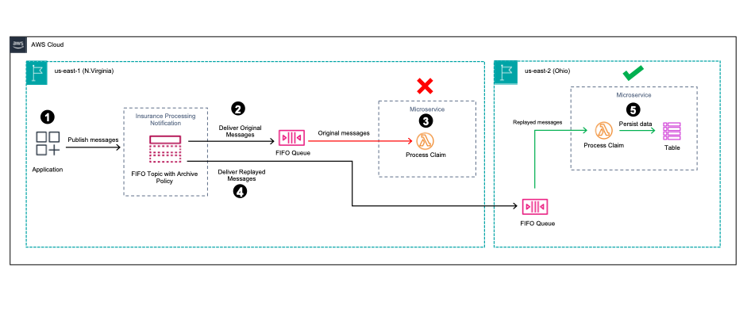

<h1>Amazon SNS FIFO</h1>

1. [Building event-driven architectures with Amazon SNS FIFO by Christian Mueller](https://aws.amazon.com/blogs/compute/building-event-driven-architectures-with-amazon-sns-fifo/?ref=serverlessland)
1. [[CURATE] Implement serverless FIFO queues with filtering capabilities using Amazon DynamoDB transactions by Nikhil Penmetsa and Randy DeFauw](https://aws.amazon.com/blogs/database/serverless-fifo-queues-filtering-dynamodb-transactions/)

# Ordering Messages

1. [Solving Complex Ordering Challenges with Amazon SQS FIFO Queues by Christie Gifrin and Shea Lutton](https://aws.amazon.com/blogs/compute/solving-complex-ordering-challenges-with-amazon-sqs-fifo-queues/)

# 1. How to replay messages

1. [Archiving and replaying messages with Amazon SNS FIFO by Benjamin Smith](https://aws.amazon.com/blogs/compute/archiving-and-replaying-messages-with-amazon-sns-fifo/)

* Messages are published to an SNS FIFO topic from an application.
* Messages are delivered to an SQS FIFO queue containing claim details to be processed by a downstream microservice.
* The microservice fails to process a series of messages due to an exception and discards all of the messages.
* The user then initiates a replay from the SNS FIFO topic, specifies the time frame of messages to replay based on when the failure occurred.
* The microservice is now able to successfully process the replayed messages and persists data into a DynamoDB table.

# 2. Samples

1. [Building event-driven architectures with Amazon SNS FIFO](https://github.com/aws-samples/event-driven-architecture-with-amazon-sns-fifo)
2. [Amazon API Gateway to Amazon Fifo SQS Queue to AWS Lambda to Amazon SNS](https://serverlessland.com/patterns/apigw-http-api-fifo-sqs-lambda-sns-sam)
3. [SNS FIFO to SQS FIFO to Lambda to Firehose](https://serverlessland.com/patterns/sns-sqs-lambda-firehose-s3-terraform)