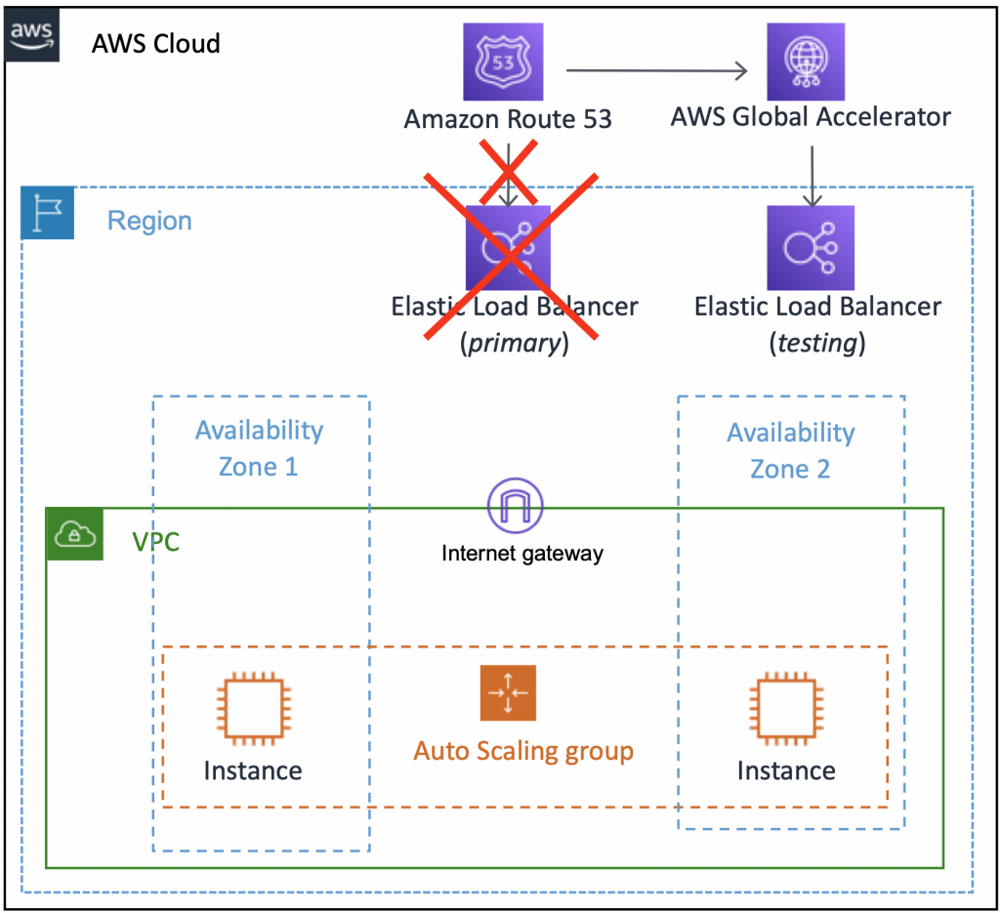

# Quick start

1. [[VISIT] Starting Small with AWS Global Accelerator by Burak Gozluklu ](https://aws.amazon.com/blogs/networking-and-content-delivery/starting-small-with-aws-global-accelerator/)

- my-github/study-guide-repo/amazon/cfns/start-small-with-global-accelerator-v1.yaml
- my-github/study-guide-repo/amazon/cfns/start-small-with-global-accelerator-v2.yaml

# How does it work?

1. [New – AWS Global Accelerator for Availability and Performance by Shaun Ray](https://aws.amazon.com/blogs/aws/new-aws-global-accelerator-for-availability-and-performance/)
- https://aws.amazon.com/getting-started/hands-on/launch-a-wordpress-website/

2. https://stackoverflow.com/questions/76178384/why-does-aws-global-accelerator-use-anycast-internally

3. [Traffic management with AWS Global Accelerator by Tino Tran](https://aws.amazon.com/blogs/networking-and-content-delivery/traffic-management-with-aws-global-accelerator/)

4. [Latency Based Routing in Aws](https://www.bschaatsbergen.com/latency-based-routing-in-aws)

1. [AWS Edge Locations: What They Are and Where to Find Them by Eduardo Rabelo](https://blog.awsfundamentals.com/aws-edge-locations)

# Curate

1. [VERY GOOD](https://www.geeksforgeeks.org/amazon-web-services-global-accelerator/)
1. https://toonk.io/building-a-high-available-anycast-service-using-aws-global-accelerator/index.html
1. [Maximising application resiliency with AWS Global Accelerator by Vikas Purohit](https://aws.amazon.com/blogs/networking-and-content-delivery/maximising-application-resiliency-with-aws-global-accelerator/)

1. [AWS — Global Accelerator Overview By Ashish Patel](https://medium.com/awesome-cloud/aws-global-accelerator-overview-what-is-amazon-global-accelerator-introduction-features-use-cases-benefits-a03cca06d12)

1. [Well-Architecting online applications with CloudFront and AWS Global Accelerator by Achraf Souk](https://aws.amazon.com/blogs/networking-and-content-delivery/well-architecting-online-applications-with-cloudfront-and-aws-global-accelerator/)

# Videos

1. [AWS re:Invent 2019: Building highly available applications using Global Accelerator (NET318-R1)](https://www.youtube.com/watch?v=3ud_LLpzOAE)
1. [Tom Adamski](https://pages.awscloud.com/Building-Highly-Available-and-Performant-Applications-using-AWS-Global-Accelerator_2019_0908-NET_OD.html)

# When to use GA

1. [AWS Anycast Service Global Accelerator](https://dev.to/yashdevops/aws-anycast-service-global-accelerator-2cp2)
1. [AWS Global Accelerator Helps Us Solve the DNS Zone Apex Challenges By Harry Zhou](https://aws.plainenglish.io/aws-global-accelerator-helps-us-solve-the-dns-zone-apex-challenges-62abfcce24ee)
