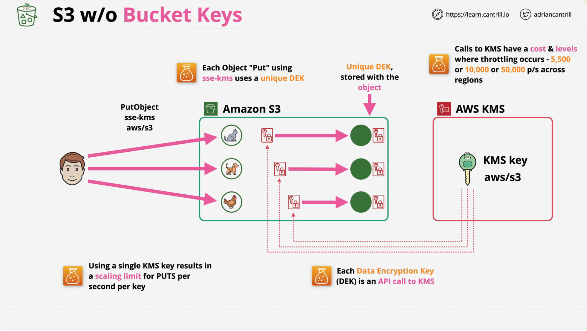
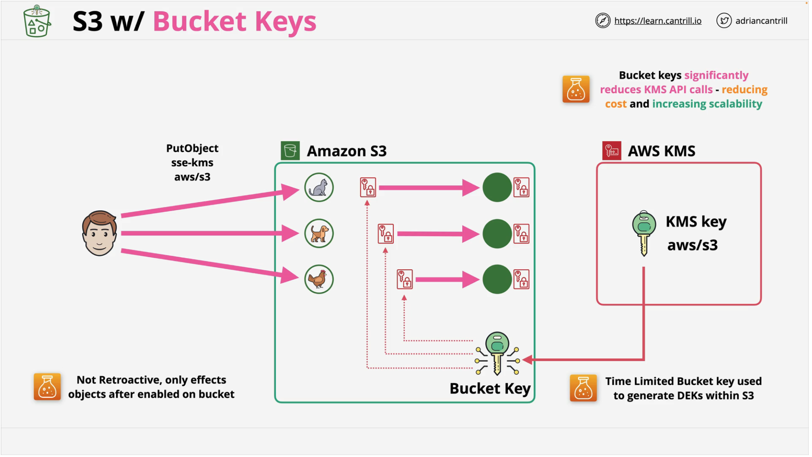

<!-- TOC -->

- [1. Must See](#1-must-see)
- [2. How to double protect your data using IAM policy and encryption](#2-how-to-double-protect-your-data-using-iam-policy-and-encryption)
- [3. How encryption works in AWS](#3-how-encryption-works-in-aws)
- [4. Encrytion for SNS](#4-encrytion-for-sns)
- [5. Encrytion for S3](#5-encrytion-for-s3)
- [6. single-Region or multi-Region KMS key](#6-single-region-or-multi-region-kms-key)
- [7. Customer managed keys vs AWS managed keys vs AWS owned keys](#7-customer-managed-keys-vs-aws-managed-keys-vs-aws-owned-keys)
- [8. Sample Applications](#8-sample-applications)
  - [8.1. Customer-managed AWS KMS Key usage](#81-customer-managed-aws-kms-key-usage)
- [9. Envelop Encryption / Symmetric encryption / DEK](#9-envelop-encryption--symmetric-encryption--dek)
  - [9.1. How do decide when to use Data Key caching?](#91-how-do-decide-when-to-use-data-key-caching)
- [10. Asymmetric keys](#10-asymmetric-keys)
- [11. Encryption Java SDK](#11-encryption-java-sdk)
- [12. How to choose policies for KMS keys](#12-how-to-choose-policies-for-kms-keys)
- [13. Bucket Keys](#13-bucket-keys)
- [14. Samples to curate (categorize)](#14-samples-to-curate-categorize)
- [15. Digital Signing](#15-digital-signing)
- [16. Importing keys (BYOK)](#16-importing-keys-byok)

<!-- /TOC -->

# 1. Must See

1. [AWS KMS Workshop](https://github.com/aws-samples/aws-kms-workshop/tree/master)

# 2. How to double protect your data using IAM policy and encryption

[Encrypting your data in S3 protects it from unauthorized access in the case somebody gains access to the storage layer. However, you can also introduce an additional policy enforcement point with encryption. Imagine a scenario where read-access to an S3 bucket is mistakenly granted through IAM. If the content is encrypted on the server-side, attempts to read objects will still fail because those users were not granted access to the decryption keys](https://catalog.us-east-1.prod.workshops.aws/workshops/aad9ff1e-b607-45bc-893f-121ea5224f24/en-US/s3/serverside)

1. [How to use KMS and IAM to enable independent security controls for encrypted data in S3](https://aws.amazon.com/de/blogs/security/how-to-use-kms-and-iam-to-enable-independent-security-controls-for-encrypted-data-in-s3/)

# 3. How encryption works in AWS

1. [The importance of encryption and how AWS can help by Ken Beer](https://aws.amazon.com/blogs/security/importance-of-encryption-and-how-aws-can-help/)

# 4. Encrytion for SNS

[Encrypting messages published to Amazon SNS with AWS KMS by Michelle Mercier and Otavio Ferreira](https://aws.amazon.com/blogs/compute/encrypting-messages-published-to-amazon-sns-with-aws-kms/)

# 5. Encrytion for S3

1. [Encrypting existing Amazon S3 objects with the AWS CLI by Andrew Guthrie](https://aws.amazon.com/blogs/storage/encrypting-existing-amazon-s3-objects-with-the-aws-cli/)
1. [Changing your Amazon S3 encryption from S3-Managed to AWS KMS by Charlie Llewellyn](https://aws.amazon.com/blogs/storage/changing-your-amazon-s3-encryption-from-s3-managed-encryption-sse-s3-to-aws-key-management-service-sse-kms/)

# 6. single-Region or multi-Region KMS key

1. [Choose the right type of AWS KMS key to encrypt Amazon RDS and Aurora Global Database by Siva Subramaniam and Robert Daly](https://aws.amazon.com/blogs/database/choose-the-right-type-of-aws-kms-key-to-encrypt-amazon-rds-and-aurora-global-database/)

# 7. Customer managed keys vs AWS managed keys vs AWS owned keys

1. [Choose the right type of AWS KMS key to encrypt Amazon RDS and Aurora Global Database by Siva Subramaniam and Robert Daly](https://aws.amazon.com/blogs/database/choose-the-right-type-of-aws-kms-key-to-encrypt-amazon-rds-and-aurora-global-database/)
2. [Customer managed keys](https://docs.aws.amazon.com/kms/latest/developerguide/concepts.html#customer-cmk)
3. [AWS managed keys](https://docs.aws.amazon.com/kms/latest/developerguide/concepts.html#aws-managed-cmk)
4. [AWS owned keys](https://docs.aws.amazon.com/kms/latest/developerguide/concepts.html#aws-owned-cmk)

# 8. Sample Applications

## 8.1. Customer-managed AWS KMS Key usage

1. [Strengthening data security in AWS Step Functions with a customer-managed AWS KMS key by Dhiraj Mahapatro](https://aws.amazon.com/blogs/compute/strengthening-data-security-in-aws-step-functions-with-a-customer-managed-aws-kms-key/)
2. [Sample stock trading application to showcase customer-managed AWS KMS Key usage in Step Functions](https://github.com/aws-samples/aws-stepfunctions-examples/tree/main/sam/app-sfn-kms-integration)

# 9. Envelop Encryption / Symmetric encryption / DEK

Using DEKs (Data encryption keys)

1. [The importance of encryption and how AWS can help by Ken Beer](https://aws.amazon.com/blogs/security/importance-of-encryption-and-how-aws-can-help/)
1. [AWS KMS and Envelope Encryption](https://lobster1234.github.io/2017/09/29/aws-kms-envelope-encryption/)
1. [[JAVA][SDK] How to Use the New AWS Encryption SDK to Simplify Data Encryption and Improve Application Availability by Greg Rubin](https://aws.amazon.com/blogs/security/how-to-use-the-new-aws-encryption-sdk-to-simplify-data-encryption-and-improve-application-availability/)
1. [[SAMPLE] Encryption with AWS KMS](https://github.com/aws-samples/aws-kms-workshop/blob/master/Section-2-Encryption-with-AWS-KMS.md)

## 9.1. How do decide when to use Data Key caching?

1. [AWS Encryption SDK: How to Decide if Data Key Caching Is Right for Your Application by June Blender ](https://aws.amazon.com/blogs/security/aws-encryption-sdk-how-to-decide-if-data-key-caching-is-right-for-your-application/)

# 10. Asymmetric keys

1. [How to use AWS KMS RSA keys for offline encryption by Patrick Palmer](https://aws.amazon.com/blogs/security/how-to-use-aws-kms-rsa-keys-for-offline-encryption/)

# 11. Encryption Java SDK

1. [Encryption SDK - Data Key Caching](https://learn.cantrill.io/courses/1723753/lectures/39253241)

1. [[JAVA] How to Use the New AWS Encryption SDK to Simplify Data Encryption and Improve Application Availability by Greg Rubin](https://aws.amazon.com/blogs/security/how-to-use-the-new-aws-encryption-sdk-to-simplify-data-encryption-and-improve-application-availability/)

# 12. How to choose policies for KMS keys

1. [Key policies in AWS KMS](https://docs.aws.amazon.com/kms/latest/developerguide/key-policies.html)
* Creating a key policy
* Default key policy
* Viewing a key policy
* Changing a key policy
* Permissions for AWS services

# 13. Bucket Keys

How to use buckets to reduce the cost of using `SSE-KMS`

Before

After

1. [AWS Certified Security - Specialty > Bucket Keys](https://learn.cantrill.io/courses/1723753/lectures/39253233)
1. [Reducing AWS Key Management Service costs by up to 99% with Amazon S3 Bucket Keys by Will Cavin](https://aws.amazon.com/blogs/storage/reducing-aws-key-management-service-costs-by-up-to-99-with-s3-bucket-keys/)

# 14. Samples to curate (categorize)

1. /Volumes/Lexar/git-repos/aws-repo/my-github/study-guide-repo/my-pet-projects/kms/enable-bucket-key-example-main

# 15. Digital Signing

1. [[BASICS] AWS Certified Security - Specialty > Digital Signing using KMS](https://learn.cantrill.io/courses/1723753/lectures/39253239)
1. [Digital signing with the new asymmetric keys feature of AWS KMS by Raj Copparapu](https://aws.amazon.com/blogs/security/digital-signing-asymmetric-keys-aws-kms/)
1. [How to verify AWS KMS asymmetric key signatures locally with OpenSSL by J.D. Bean ](https://aws.amazon.com/blogs/security/how-to-verify-aws-kms-asymmetric-key-signatures-locally-with-openssl/)

# 16. Importing keys (BYOK)

1. [New – Bring Your Own Keys with AWS Key Management Service by Jeff Barr ](https://aws.amazon.com/blogs/aws/new-bring-your-own-keys-with-aws-key-management-service/)
1. [Demystifying KMS keys operations, bring your own key (BYOK), custom key store, and ciphertext portability by Arthur Mnev](https://aws.amazon.com/blogs/security/demystifying-kms-keys-operations-bring-your-own-key-byok-custom-key-store-and-ciphertext-portability/)
1. [How to migrate asymmetric keys from CloudHSM to AWS KMS by Mani Manasa Mylavarapu, Kevin Lee, and Patrick Palmer](https://aws.amazon.com/blogs/security/how-to-migrate-asymmetric-keys-from-cloudhsm-to-aws-kms)
