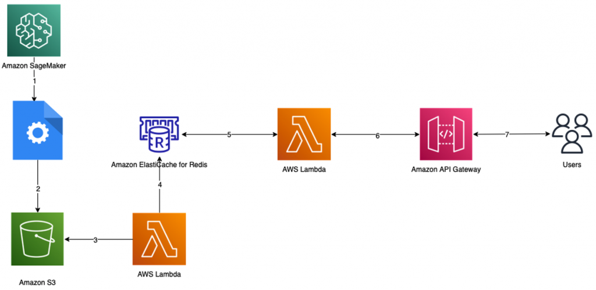

<h1>Using Elasticcache with Lambda</h1>

1. [Use Amazon ElastiCache for Redis as a near-real-time feature store by Kalhan Vundela](https://aws.amazon.com/blogs/database/use-amazon-elasticache-for-redis-as-a-near-real-time-feature-store/)

1. [Integrating Amazon ElastiCache with other AWS services: The serverless way by Nir Mashkowski](https://aws.amazon.com/blogs/database/the-serverless-way-integrating-amazon-elasticache-with-other-aws-services/)
- see `my-github/study-guide-repo/my-projects/dynamo-lambda-blog` for SAM template

# Samples

1.  https://serverlessland.com/patterns/lambda-elasticache-integrationpattern-cdk
1.  [Tutorial: Configuring a Lambda function to access Amazon ElastiCache in an Amazon VPC](https://docs.aws.amazon.com/AmazonElastiCache/latest/red-ug/LambdaRedis.html)
1. https://github.com/aws-samples/amazon-elasticache-samples/tree/main/lambda-feature-store