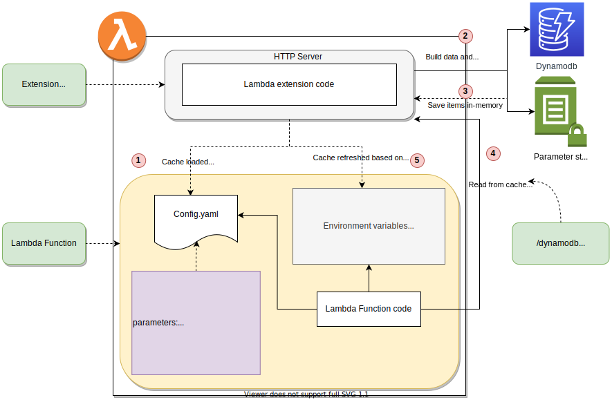

1. [Introducing AWS Lambda Extensions by Julian Wood](https://aws.amazon.com/blogs/compute/introducing-aws-lambda-extensions-in-preview/)
1. [AWS Lambda Extensions: What are they and why do they matter](https://lumigo.io/blog/aws-lambda-extensions-what-are-they-and-why-do-they-matter/)

# Samples

1. https://github.com/aws-samples/aws-lambda-extensions
1. [Cache Extension Demo in Go](https://github.com/aws-samples/aws-lambda-extensions/tree/main/cache-extension-demo)

    

    