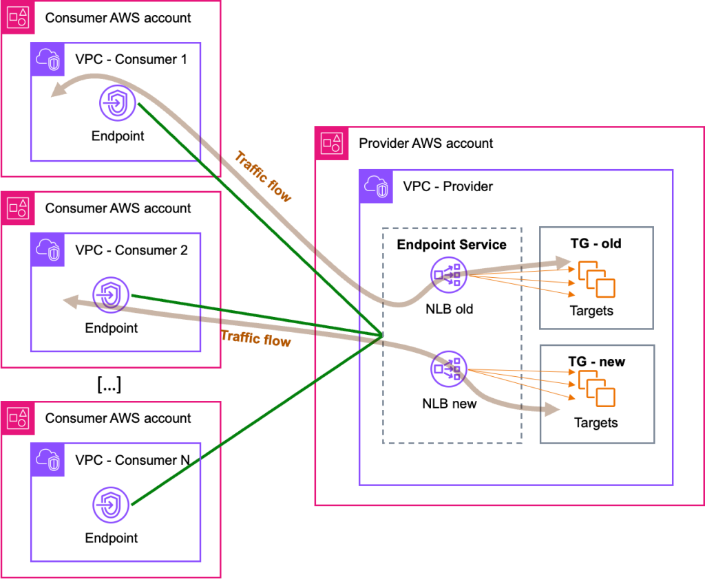

<h1>aws-networking-nlb</h1>

<!-- TOC -->

- [1. Introduction](#1-introduction)
- [2. How to create ALB as targets of NLB](#2-how-to-create-alb-as-targets-of-nlb)
- [3. How to migrate NLB targets gracefully?](#3-how-to-migrate-nlb-targets-gracefully)
- [4. SDK Client](#4-sdk-client)
- [5. Disaster Recovery / Failover Mechanisms](#5-disaster-recovery--failover-mechanisms)

<!-- /TOC -->

# 1. Introduction

1. [New Network Load Balancer – Effortless Scaling to Millions of Requests per Second](https://aws.amazon.com/blogs/aws/new-network-load-balancer-effortless-scaling-to-millions-of-requests-per-second/)

# 2. How to create ALB as targets of NLB

1. [Application Load Balancer-type Target Group for Network Load Balancer by Rohit Aswani and Eugene Wiehahn](https://aws.amazon.com/blogs/networking-and-content-delivery/application-load-balancer-type-target-group-for-network-load-balancer/)

1. [How to configure the Application Load Balancer-type Target Group for Network Load Balancer By Somesh Srivastava](https://someshsrivastava1983.medium.com/how-to-configure-the-application-load-balancer-type-target-group-for-network-load-balancer-9b0c39106699)

    

- Detailed

    

# 3. How to migrate NLB targets gracefully?

1. [How to migrate your VPC endpoint service backend targets by Luis Felipe Silveira da Silva and Tom Adamski ](https://aws.amazon.com/blogs/networking-and-content-delivery/how-to-migrate-your-vpc-endpoint-service-backend-targets/)

    

# 4. SDK Client

1. http://aws-java-sdk-javadoc.s3-website-us-west-2.amazonaws.com/latest/software/amazon/awssdk/services/elasticloadbalancingv2/ElasticLoadBalancingv2Client.html
2. https://docs.aws.amazon.com/code-library/latest/ug/elastic-load-balancing-v2_example_elastic-load-balancing-v2_Hello_section.html

# 5. Disaster Recovery / Failover Mechanisms

see /Volumes/Lexar/git-repos/aws-repo/my-github/study-guide-repo/amazon/amazon-route53-failover.md