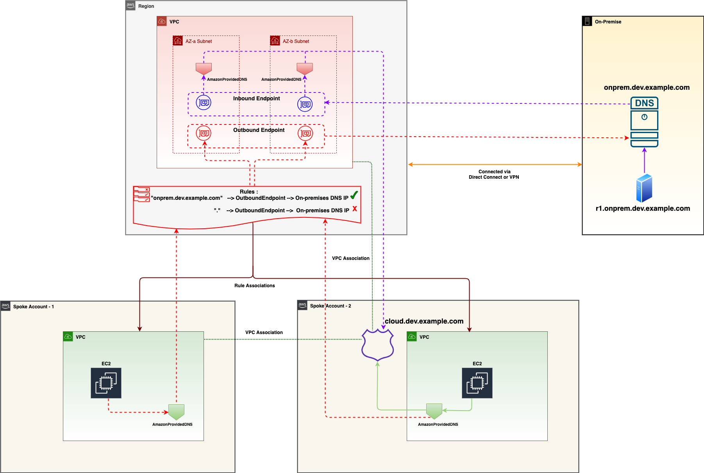

1. [Automating DNS infrastructure using Route 53 Resolver endpoints by Shiva Vaidyanathan and Akhil Nayabu](https://aws.amazon.com/blogs/networking-and-content-delivery/automating-dns-infrastructure-using-route-53-resolver-endpoints/)

- my-github/study-guide-repo/amazon/cfns/resolver.yaml
- my-github/study-guide-repo/amazon/cfns/rule-association.yaml
- my-github/study-guide-repo/amazon/cfns/rule-share.yaml
- my-github/study-guide-repo/amazon/cfns/AuthAndAssociationLambda.yaml
- my-github/study-guide-repo/amazon/cfns/AuthOrAssociation.yaml

1. [Centralized DNS management of hybrid cloud with Amazon Route 53 and AWS Transit Gateway by Bhavin Desai](https://aws.amazon.com/blogs/networking-and-content-delivery/centralized-dns-management-of-hybrid-cloud-with-amazon-route-53-and-aws-transit-gateway/)