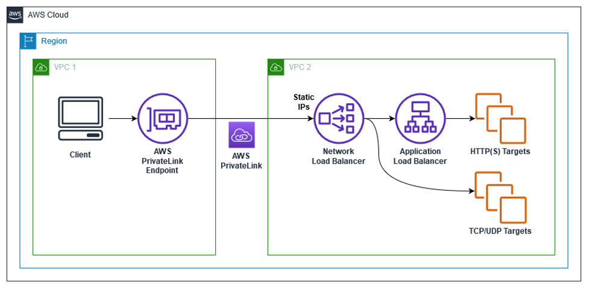

# How to create ALB as targets of NLB

1. [Application Load Balancer-type Target Group for Network Load Balancer by Rohit Aswani and Eugene Wiehahn](https://aws.amazon.com/blogs/networking-and-content-delivery/application-load-balancer-type-target-group-for-network-load-balancer/)

