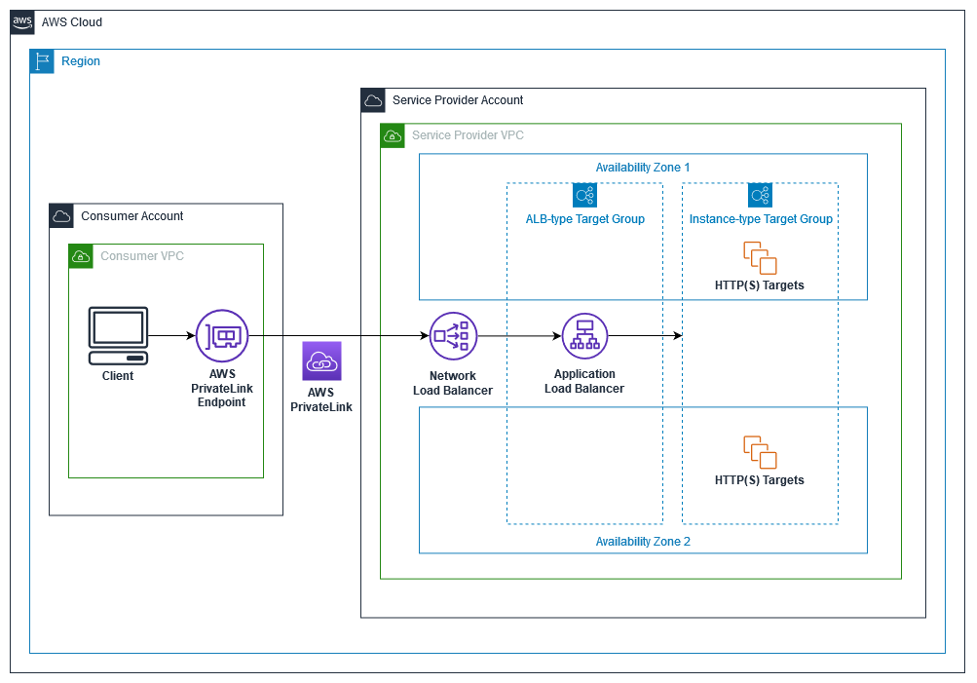
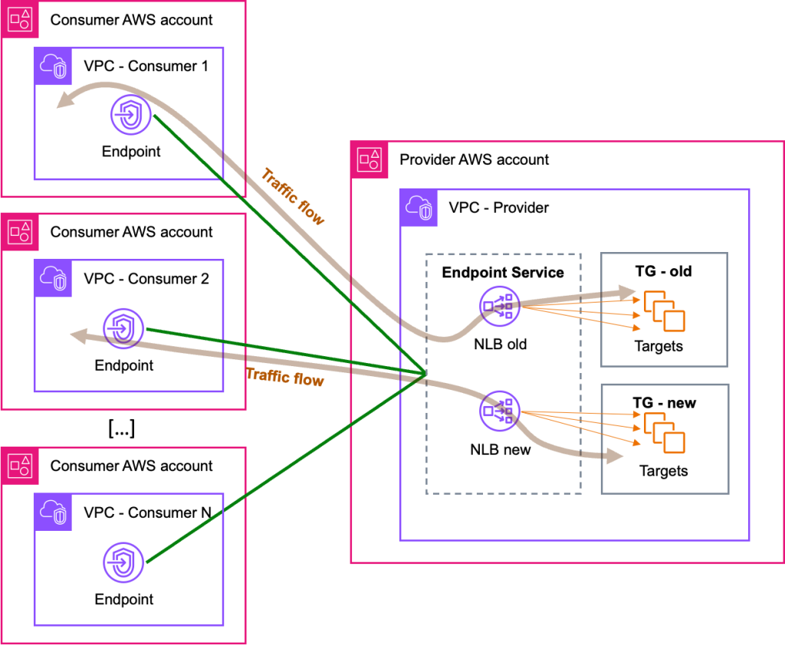

<h1>aws-networking-nlb</h1>

<!-- TOC -->

- [1. How to create ALB as targets of NLB](#1-how-to-create-alb-as-targets-of-nlb)
- [2. How to migrate NLB targets gracefully?](#2-how-to-migrate-nlb-targets-gracefully)

<!-- /TOC -->

# 1. How to create ALB as targets of NLB

1. [Application Load Balancer-type Target Group for Network Load Balancer by Rohit Aswani and Eugene Wiehahn](https://aws.amazon.com/blogs/networking-and-content-delivery/application-load-balancer-type-target-group-for-network-load-balancer/)

1. [How to configure the Application Load Balancer-type Target Group for Network Load Balancer By Somesh Srivastava](https://someshsrivastava1983.medium.com/how-to-configure-the-application-load-balancer-type-target-group-for-network-load-balancer-9b0c39106699)

    

- Detailed

    

# 2. How to migrate NLB targets gracefully?

1. [How to migrate your VPC endpoint service backend targets by Luis Felipe Silveira da Silva and Tom Adamski ](https://aws.amazon.com/blogs/networking-and-content-delivery/how-to-migrate-your-vpc-endpoint-service-backend-targets/)

    