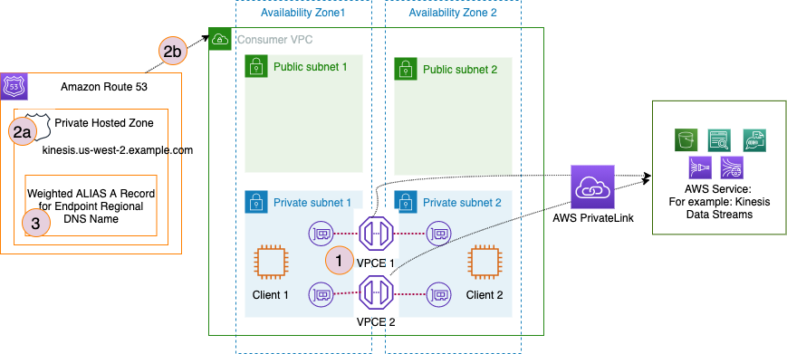
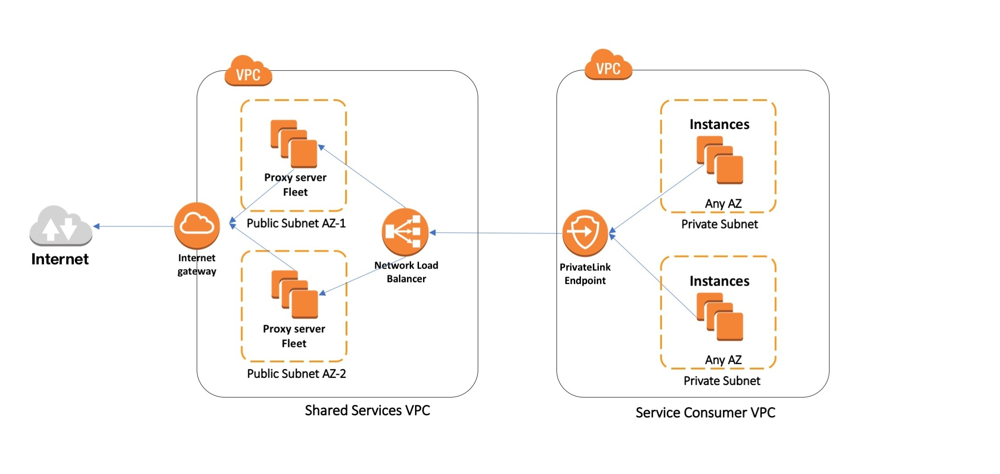

<h1>Private Link Integration Patterns</h1>

1. [Scale traffic using multiple Interface Endpoints by Pratik R. Mankad](https://aws.amazon.com/blogs/networking-and-content-delivery/scale-traffic-using-multiple-interface-endpoints/)

1. [Different ways to connect Networks with Overlapping IP Ranges by Brett Looney](https://aws.amazon.com/blogs/networking-and-content-delivery/connecting-networks-with-overlapping-ip-ranges/)

1. [[VISIT] How to use AWS PrivateLink to secure and scale web filtering using explicit proxy by Vinod Madabushi and Sahil Thapar](https://aws.amazon.com/blogs/networking-and-content-delivery/how-to-use-aws-privatelink-to-secure-and-scale-web-filtering-using-explicit-proxy/)

    

1. [Reviewing DNS Mechanisms for Routing Traffic and Enabling Failover for AWS PrivateLink Deployments by Anuj Dewangan](https://aws.amazon.com/blogs/apn/reviewing-dns-mechanisms-for-routing-traffic-and-enabling-failover-for-aws-privatelink-deployments/)
