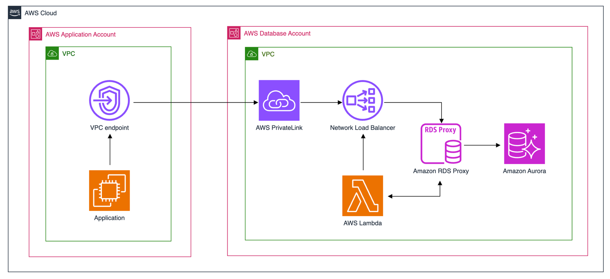

1. [[VISIT] Seamlessly migrate workloads from EKS self-managed node group to EKS-managed node groups by Abhishek Jawali](https://aws.amazon.com/blogs/database/access-amazon-rds-across-aws-accounts-using-aws-privatelink-network-load-balancer-and-amazon-rds-proxy/)
    