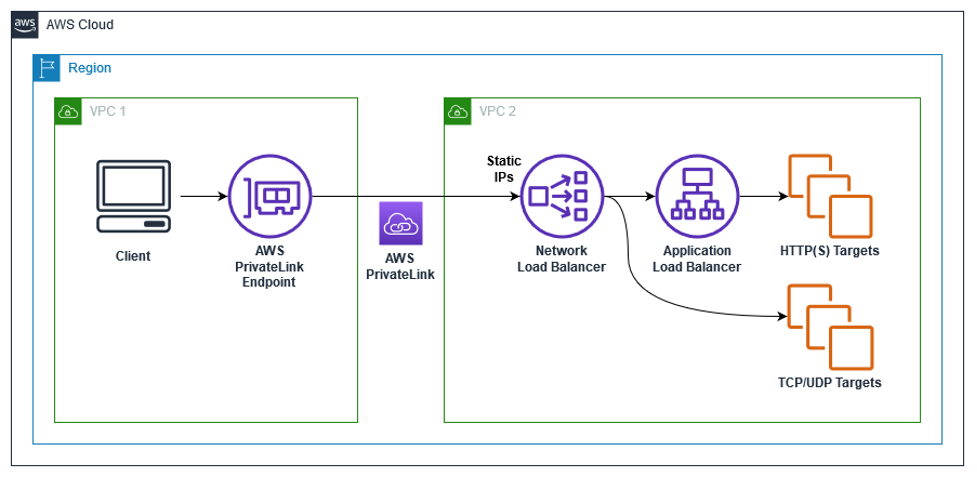

<h1>AWS PrivateLink</h1>

<!-- TOC -->

- [1. Introduction](#1-introduction)
- [2. API-Gateway -> PrivateLink -> AWS Resource](#2-api-gateway---privatelink---aws-resource)
- [3. ALB -> PrivateLink -> NLB](#3-alb---privatelink---nlb)
- [4. PrivateLink -> NLB -> ALB](#4-privatelink---nlb---alb)
- [5. Blue Green Deployments](#5-blue-green-deployments)
- [6. EventBridge](#6-eventbridge)
- [7. Centralized / Shared VPC](#7-centralized--shared-vpc)
- [8. Hyperplane ENI vs ENI](#8-hyperplane-eni-vs-eni)
- [9. Re-invent](#9-re-invent)
- [10. RDS](#10-rds)
- [11. Route53](#11-route53)
- [12. Migration](#12-migration)
- [13. Multi-Region](#13-multi-region)
- [14. S3 endpoints](#14-s3-endpoints)
- [15. Sessions Manager](#15-sessions-manager)
- [16. Static WebSites with S3](#16-static-websites-with-s3)
- [17. Accessing S3 using private Links](#17-accessing-s3-using-private-links)
- [18. Videos](#18-videos)
- [19. Web Proxy](#19-web-proxy)
- [20. Whitepaper](#20-whitepaper)
- [21. Curate](#21-curate)
- [22. Creating Private DNS for Endpoints](#22-creating-private-dns-for-endpoints)
- [23. Creating endpoints for your applications](#23-creating-endpoints-for-your-applications)
- [24. How to preserve client IP address](#24-how-to-preserve-client-ip-address)
- [25. How to gracefully switch NLB target groups](#25-how-to-gracefully-switch-nlb-target-groups)

<!-- /TOC -->

# 1. Introduction

1. [The Routing Loop - Application Networking with PrivateLink By Tom Adamski](https://www.twitch.tv/videos/2231091426)
1. [Interface endpoints/Gateway endpoints](https://blog.awsfundamentals.com/vpc-endpoints)
1. [Basics of Private Links](https://aws.amazon.com/blogs/architecture/reduce-cost-and-increase-security-with-amazon-vpc-endpoints/)
1. [Understanding VPC links in Amazon API Gateway private integrations by Jose Eduardo Montilla Lugo](https://aws.amazon.com/blogs/compute/understanding-vpc-links-in-amazon-api-gateway-private-integrations)

# 2. API-Gateway -> PrivateLink -> AWS Resource

1. [Introducing Amazon API Gateway Private Endpoints by Chris Munns](https://aws.amazon.com/blogs/compute/introducing-amazon-api-gateway-private-endpoints/)

1. [Building HTTP API-based services using Amazon API Gateway, AWS PrivateLink and AWS Fargate by Irshad Buchh](https://aws.amazon.com/blogs/containers/building-http-api-based-services-using-aws-fargate/)

    

# 3. ALB -> PrivateLink -> NLB

1. [How to securely publish Internet applications at scale using Application Load Balancer and AWS PrivateLink by Tom Adamski](https://aws.amazon.com/blogs/networking-and-content-delivery/how-to-securely-publish-internet-applications-at-scale-using-application-load-balancer-and-aws-privatelink/)

    

# 4. PrivateLink -> NLB -> ALB

1. [How to configure the Application Load Balancer-type Target Group for Network Load Balancer By Somesh Srivastava](https://someshsrivastava1983.medium.com/how-to-configure-the-application-load-balancer-type-target-group-for-network-load-balancer-9b0c39106699)

    

- Detailed

    

# 5. Blue Green Deployments

1. [[**CONSOLE**] How to securely publish Internet applications at scale using Application Load Balancer and AWS PrivateLink by Tom Adamski](https://aws.amazon.com/blogs/networking-and-content-delivery/how-to-securely-publish-internet-applications-at-scale-using-application-load-balancer-and-aws-privatelink/)

    

# 6. EventBridge

1. [Introducing global endpoints for Amazon EventBridge By Stephen Liedig](https://aws.amazon.com/blogs/compute/introducing-global-endpoints-for-amazon-eventbridge/)

# 7. Centralized / Shared VPC

1. [[CDK] Centralize access using VPC interface endpoints to access AWS services across multiple VPCs by Chetan Agrawal](https://aws.amazon.com/blogs/networking-and-content-delivery/centralize-access-using-vpc-interface-endpoints/)

&nbsp;

  This post walks through using AWS Cloud Development Kit (CDK) to create a centralized VPC with VPC endpoints, and then sharing those endpoints with other VPCs in the same AWS Organization.

&nbsp;

  

1. [Centralized DNS management of hybrid cloud with Amazon Route 53 and AWS Transit Gateway by Bhavin Desai](https://aws.amazon.com/blogs/networking-and-content-delivery/centralized-dns-management-of-hybrid-cloud-with-amazon-route-53-and-aws-transit-gateway/)

  

1. [See Hub and Spoke @ aws-networking.md](./aws-networking.md#2-hub-and-spoke)

# 8. Hyperplane ENI vs ENI

1. [Understanding VPC links in Amazon API Gateway private integrations by Jose Eduardo Montilla Lugo](https://aws.amazon.com/blogs/compute/understanding-vpc-links-in-amazon-api-gateway-private-integrations))
1. [Deep Dive on AWS App Runner VPC Networking by Archana Srikanta](https://aws.amazon.com/blogs/containers/deep-dive-on-aws-app-runner-vpc-networking/)
1. [Announcing improved VPC networking for AWS Lambda functions by Chris Munns ](https://aws.amazon.com/blogs/compute/announcing-improved-vpc-networking-for-aws-lambda-functions/)

# 9. Re-invent

1. [AWS New York Summit 2018 - AWS PrivateLink: Fundamentals (SRV211)](https://www.youtube.com/watch?v=20RxEzAXG9o)

# 10. RDS

1. [[**CFN**] Access Amazon RDS across VPCs using AWS PrivateLink and Network Load Balancer by Jay Singh](https://aws.amazon.com/blogs/database/access-amazon-rds-across-vpcs-using-aws-privatelink-and-network-load-balancer/)

    

    [CrossAccountRDSAccess.yml](./templates/rds/CrossAccountRDSAccess.yml)

# 11. Route53

1. [Automating DNS infrastructure using Route 53 Resolver endpoints by Shiva Vaidyanathan and Akhil Nayabu ](https://aws.amazon.com/blogs/networking-and-content-delivery/automating-dns-infrastructure-using-route-53-resolver-endpoints/)

    

# 12. Migration

1. [How to migrate your VPC endpoint service backend targets by Luis Felipe Silveira da Silva and Tom Adamski ](https://aws.amazon.com/blogs/networking-and-content-delivery/how-to-migrate-your-vpc-endpoint-service-backend-targets/)

    

# 13. Multi-Region

1. [Amazon S3 Multi-Region Access Points](https://catalog.workshops.aws/s3multiregionaccesspoints/en-US)

# 14. S3 endpoints

1. [[**MY_NEXT**] Best practices for using Amazon S3 endpoints with AWS CloudFormation by Tony Bulding](https://aws.amazon.com/blogs/infrastructure-and-automation/best-practices-for-using-amazon-s3-endpoints-in-aws-cloudformation-templates/)
- difference between path-style and virtual-hosted-style endpoints
- code: /Volumes/Lexar/git-repos/aws-repo/aws-samples/s3/s3-endpoints-and-cfn

    

# 15. Sessions Manager

1. [Automated configuration of Session Manager without an internet gateway by Brian Landry](https://aws.amazon.com/blogs/mt/automated-configuration-of-session-manager-without-an-internet-gateway/)

# 16. Static WebSites with S3

1. [Hosting Internal HTTPS Static Websites with ALB, S3, and PrivateLink by Schuyler Jager](https://aws.amazon.com/blogs/networking-and-content-delivery/hosting-internal-https-static-websites-with-alb-s3-and-privatelink/)

    

# 17. Accessing S3 using private Links

1. [Secure hybrid access to Amazon S3 using AWS PrivateLink by Josh Dean and Rohit Aswani ](https://aws.amazon.com/blogs/networking-and-content-delivery/secure-hybrid-access-to-amazon-s3-using-aws-privatelink/)

# 18. Videos

1. [The Routing Loop - Application Networking with PrivateLink By Tom Adamski](https://www.twitch.tv/videos/2231091426)
1. [What is an interface VPC endpoint and how can I create one for my VPC?](https://www.youtube.com/watch?v=xvdJsP5U50Q)
2. [Keep Your Network Traffic in AWS with VPC Endpoints By BeABetterDev](https://www.youtube.com/watch?v=jo3X_aay4Vs)

# 19. Web Proxy

1. [How to use AWS PrivateLink to secure and scale web filtering using explicit proxy by Vinod Madabushi and Sahil Thapar](https://aws.amazon.com/blogs/networking-and-content-delivery/how-to-use-aws-privatelink-to-secure-and-scale-web-filtering-using-explicit-proxy/)

    

[cfn-privatelink.yaml](./templates/privatelink/cfn-privatelink.yaml)

# 20. Whitepaper

1. [Securely Access Services Over AWS PrivateLink](https://docs.aws.amazon.com/whitepapers/latest/aws-privatelink/aws-privatelink.html)

# 21. Curate

1. [Building Secure Private Connectivity with AWS PrivateLink for TiDB Cloud by Ayan Ray, Arun Vijayraghavan, Savi Venkatachalapathy, and Yunqing Zhou](https://aws.amazon.com/blogs/apn/building-secure-private-connectivity-with-aws-privatelink-for-tidb-cloud/)

    

# 22. Creating Private DNS for Endpoints

Default Name: com.amazonaws.vpce.us-east-2.vpce-svc-12345
Custom Name: service.example.com

Regional hostname: vpce-123.vpce-svc-12345.us-east-2.vpce.amazonaws.com
Zonal hostname: vpce-123-us-east-2a.vpce-svc-12345.us-east-2.vpce.amazonaws.com

1. [Introducing private DNS support for Amazon S3 with AWS PrivateLink by Sumiran Tandon, Rohit Aswani, and Shubham Singh ](https://aws.amazon.com/blogs/storage/introducing-private-dns-support-for-amazon-s3-with-aws-privatelink/)
1. [The Routing Loop - Application Networking with PrivateLink @ 1:24](https://www.twitch.tv/videos/2231091426)

# 23. Creating endpoints for your applications

1. [AWS PrivateLink Update – VPC Endpoints for Your Own Applications & Services by Jeff Barr ](https://aws.amazon.com/blogs/storage/introducing-private-dns-support-for-amazon-s3-with-aws-privatelink/)

# 24. How to preserve client IP address

1. [Preserving client IP address with Proxy protocol v2 and Network Load Balancer by Ken Kitts](https://aws.amazon.com/blogs/networking-and-content-delivery/preserving-client-ip-address-with-proxy-protocol-v2-and-network-load-balancer/)
1. [See Tom Adamski's talk @ 0:44](https://www.twitch.tv/videos/2231091426)

# 25. How to gracefully switch NLB target groups

1. [How to migrate your VPC endpoint service backend targets by Luis Felipe Silveira da Silva and Tom Adamski](https://aws.amazon.com/blogs/networking-and-content-delivery/how-to-migrate-your-vpc-endpoint-service-backend-targets/)

    

Also see https://www.twitch.tv/videos/2231091426 @ 1:12