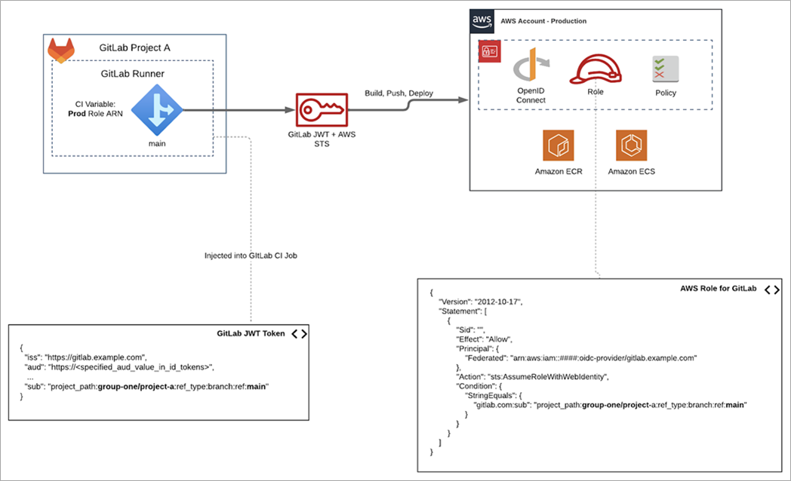

[Setting Up OpenID Connect with GitLab CI/CD to Provide Secure Access to Environments in AWS Accounts by Joe Randazzo, Darwin Sanoy, and Mark Kriaf ](https://aws.amazon.com/blogs/apn/setting-up-openid-connect-with-gitlab-ci-cd-to-provide-secure-access-to-environments-in-aws-accounts/)

- This has lot of how to tutorials - [Configure OpenID Connect in AWS and GitLab](https://gitlab.com/guided-explorations/aws/configure-openid-connect-in-aws), [OIDC and Multi-Account Deployments with GitLab and Amazon ECS](https://gitlab.com/guided-explorations/aws/oidc-and-multi-account-deployment-with-ecs)

# GitActions

1. [Use IAM roles to connect GitHub Actions to actions in AWS by David Rowe](https://aws.amazon.com/blogs/security/use-iam-roles-to-connect-github-actions-to-actions-in-aws/)