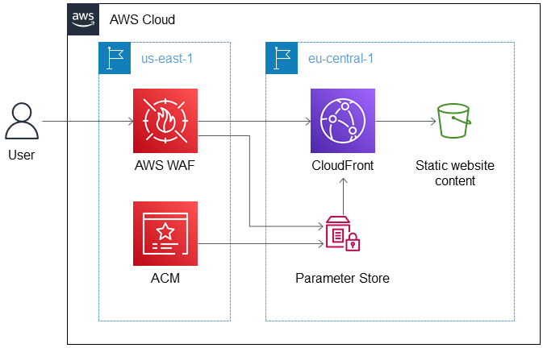

# 1. Cross Account Sharing

[Introducing Parameter Store cross-account sharing by Neville Lewis](https://aws.amazon.com/blogs/mt/introducing-parameter-store-cross-account-sharing/)

# 2. Cross Region

1. [Read parameters across AWS Regions with AWS CloudFormation custom resources by Jagdeep Singh Soni and Michael Fraedrich](https://aws.amazon.com/blogs/infrastructure-and-automation/read-parameters-across-aws-regions-with-aws-cloudformation-custom-resources/)

