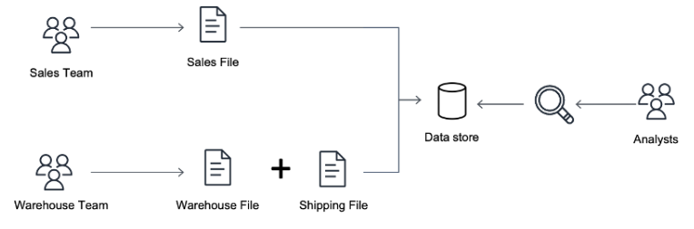
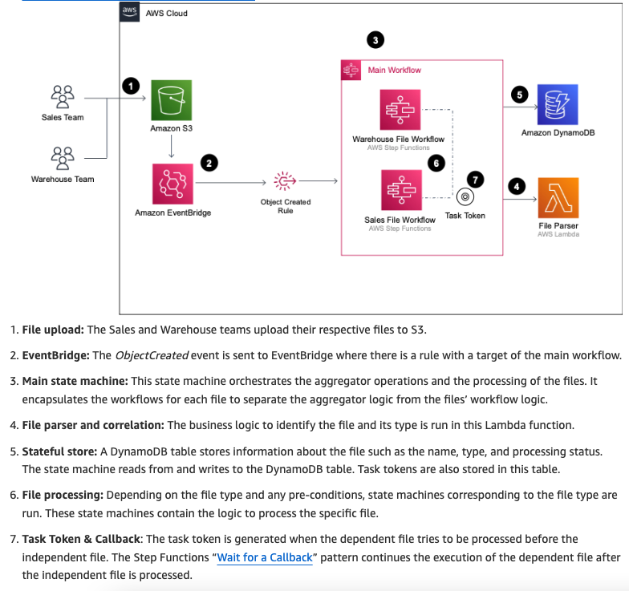

<h1>step functions<h1>

CLEAUP THIS DOC

<!-- TOC -->

- [1. Dashboard](#1-dashboard)
  - [1.1. Testing](#11-testing)
  - [1.2. Workshop](#12-workshop)
- [2. Calling HTTP Endpoints without API Gateway](#2-calling-http-endpoints-without-api-gateway)
- [3. Examples](#3-examples)
  - [3.1. Repo](#31-repo)
  - [3.2. Content aggregation](#32-content-aggregation)
- [4. Drools](#4-drools)
- [5. CallBacks](#5-callbacks)
  - [5.1. Callbacks across accounts](#51-callbacks-across-accounts)
  - [5.2. SNS](#52-sns)
  - [5.3. API Gateway](#53-api-gateway)
  - [5.4. SQS](#54-sqs)
  - [5.5. Emails](#55-emails)
- [6. Courses](#6-courses)
- [7. Benefits of using step functions](#7-benefits-of-using-step-functions)
- [8. Pricing](#8-pricing)
- [9. Distributed Map](#9-distributed-map)
- [10. JSON Paths](#10-json-paths)
- [11. Parallelisms](#11-parallelisms)
- [12. Patterns](#12-patterns)
  - [12.1. Aggregating Events](#121-aggregating-events)
  - [12.2. Circuit Breaker](#122-circuit-breaker)
  - [12.3. Invoking external systems](#123-invoking-external-systems)
  - [12.4. Scatter-Gather (Divide and conquer)](#124-scatter-gather-divide-and-conquer)
- [13. Integrations](#13-integrations)
  - [13.1. What're SDK Integration?](#131-whatre-sdk-integration)
  - [13.2. What're Optimized integrations](#132-whatre-optimized-integrations)
- [14. Using With API Gateway](#14-using-with-api-gateway)
- [15. Testing Locally](#15-testing-locally)
- [16. Tutorials](#16-tutorials)
- [17. Use cases / Real world scenarios](#17-use-cases--real-world-scenarios)
- [18. Videos](#18-videos)
- [19. Workshop](#19-workshop)
- [20. Workflows](#20-workflows)
  - [20.1. Queue based workflow](#201-queue-based-workflow)

<!-- /TOC -->

# 1. Dashboard

1. [Scatter-Gather](#73-scatter-gather)
1. [Extending a serverless, event-driven architecture to existing container workloads By Dhiraj Mahapatro](https://aws.amazon.com/blogs/compute/extending-a-serverless-event-driven-architecture-to-existing-container-workloads/)

## 1.1. Testing

1. [Mocking service integrations with AWS Step Functions Local By Sam Dengler and Dhiraj Mahapatro](https://aws.amazon.com/blogs/compute/mocking-service-integrations-with-aws-step-functions-local/)
1. [AWS Step Functions Local Testing with mocking](https://github.com/aws-samples/aws-stepfunctions-examples/tree/main/sam/app-local-testing-mock-config)
1. [Step Functions Local - mocking service integrations | Serverless Office Hours By Sam Dengler and Dhiraj Mahapatro](https://www.youtube.com/watch?v=4pTfYon6zJ8&t=38s)
- How throw and handle business exceptions
- Creating mocks for AwS integrations
1. [Step Functions Local Testing using JUnit and Spock By Dhiraj Mahapatro](https://github.com/aws-samples/aws-stepfunctions-examples/tree/main/sam/demo-local-testing-using-java)

## 1.2. Workshop
1. [The AWS Step Functions Workshop](https://catalog.us-east-1.prod.workshops.aws/workshops/9e0368c0-8c49-4bec-a210-8480b51a34ac/en-US)
1. [Welcome to the source code repository for The AWS Step Functions Workshop!](https://github.com/aws-samples/the-aws-step-functions-workshop)
1. [Complete guide to AWS Step Functions (FREE) By Yan Cui](https://school.theburningmonk.com/courses/take/complete-guide-to-aws-step-functions/lessons/6989783-what-is-step-functions)

# 2. Calling HTTP Endpoints without API Gateway

**Pre-req:** [Read about Event Bridge API Destinations](./amazon-eventbridge.md#31-http-targets-api-destinations)

1. [External endpoints and testing of task states now available in AWS Step Functions by Marcia Villalb](https://aws.amazon.com/blogs/aws/external-endpoints-and-testing-of-task-states-now-available-in-aws-step-functions/)
1. [Step Functions: What's new! | Serverless Office Hours](https://www.twitch.tv/videos/1996001723)

# 3. Examples

## 3.1. Repo

1. [aws-stepfunctions-examples](https://github.com/aws-samples/aws-stepfunctions-examples)
- Accelerating workloads using parallelism in AWS Step Functions
- Controlling concurrency in distributed systems using AWS Step Functions
- Mocking service integrations with Step Functions Local
- Orchestrating S3 Glacier Deep Archive object retrieval using Step Functions
- Demo Step Functions Local testing with Mock service integrations using Java testing frameworks (JUnit and Spock)
- Video Transcription with AWS SDK Service Integrations

## 3.2. Content aggregation

> 1. [[MY NEXT] Building Serverless Land: Part 1 – Automating content aggregation by Benjamin Smith ](https://aws.amazon.com/blogs/compute/building-serverless-land-part-1-automating-content-aggregation/)
2. [Building Serverless Land: Part 2 – An auto-building static site by Benjamin Smith](https://aws.amazon.com/blogs/compute/building-serverless-land-part-2-an-auto-building-static-site/)
3. [[MY NEXT] Building Serverless Land](https://github.com/aws-samples/content-aggregator-example)

# 4. Drools
1. [Using AWS Step Functions and Amazon DynamoDB for business rules orchestration by Vijaykumar Pannirselvam](https://aws.amazon.com/blogs/compute/using-aws-step-functions-and-amazon-dynamodb-for-business-rules-orchestration/)

# 5. CallBacks

1. [Invoking asynchronous external APIs with AWS Step Functions by Jorge Fonseca, Hossam Ebrahim, and Shirisha Vivek](https://aws.amazon.com/blogs/architecture/invoking-asynchronous-external-apis-with-aws-step-functions/)

## 5.1. Callbacks across accounts

1. [Introducing cross-account access capabilities for AWS Step Functions by Siarhei Kazhura](https://aws.amazon.com/blogs/compute/introducing-cross-account-access-capabilities-for-aws-step-functions/)

## 5.2. SNS

1. [Integrating AWS Step Functions callbacks and external systems by Zach Abrahamson,](https://aws.amazon.com/blogs/compute/integrating-aws-step-functions-callbacks-and-external-systems)

## 5.3. API Gateway

1. [[Wait-for-Callback with APIGateway] Introducing Amazon API Gateway service integration for AWS Step Functions by Benjamin Smith](https://aws.amazon.com/blogs/compute/introducing-amazon-api-gateway-service-integration-for-aws-step-functions/)
1. [Introducing Amazon API Gateway service integration for AWS Step Functions by Benjamin Smith](https://aws.amazon.com/blogs/compute/introducing-amazon-api-gateway-service-integration-for-aws-step-functions/)
1. [Example Step Functions API Gateway integration](https://github.com/aws-samples/example-step-functions-integration-api-gateway)

## 5.4. SQS

1. [Callback with Task Token](https://catalog.us-east-1.prod.workshops.aws/workshops/9e0368c0-8c49-4bec-a210-8480b51a34ac/en-US/basics/task-state/callback)

## 5.5. Emails

1. [Using callback URLs for approval emails with AWS Step Functions by Ben Kehoe](https://aws.amazon.com/blogs/aws/using-callback-urls-for-approval-emails-with-aws-step-functions/)

# 6. Courses

1. [Design Patterns for AWS Step Functions](https://explore.skillbuilder.aws/learn/course/10471/play/37562/design-patterns-for-aws-step-functions)
1. [Troubleshooting Serverless Applications](https://explore.skillbuilder.aws/learn/course/internal/view/elearning/1124/troubleshooting-serverless-applications)
1. [Complete guide to AWS Step Functions (FREE) By Yan Cui](https://school.theburningmonk.com/courses/take/complete-guide-to-aws-step-functions/lessons/6989783-what-is-step-functions)

# 7. Benefits of using step functions

1. [Why use AWS Step Functions?](https://www.reddit.com/r/aws/comments/pmc1o2/why_use_aws_step_functions/)

# 8. Pricing

1. [AWS Step function pricing page](https://aws.amazon.com/step-functions/pricing/)
1. [Callback pricing](https://stackoverflow.com/questions/58110826/aws-step-function-costing)
2. [Pricing for Wait Tasks](https://blog.scottlogic.com/2018/06/19/step-functions.html)

# 9. Distributed Map

1. Missing Paper - introduction to distributed map for serverless data processing uma ramadoss
2. [AWS Step functions Map State & Parallel State](https://towardsaws.com/aws-step-functions-map-state-parallel-state-3d1be5be8fc5)

# 10. JSON Paths

1. [Using JSONPath effectively in AWS Step Functions by Dhiraj Mahapatro](https://aws.amazon.com/blogs/compute/using-jsonpath-effectively-in-aws-step-functions/)

# 11. Parallelisms

1. [AWS re:Invent 2022 - [NEW] Accelerate workloads using parallelism w/Step Functions & Lambda (API205)](https://www.youtube.com/watch?v=SG6_oy72hh4)
1. [[Dynamic parallelism,AWS Batch] Orchestrating high performance computing with AWS Step Functions and AWS Batch By Dan Fox](https://aws.amazon.com/blogs/compute/orchestrating-high-performance-computing-with-aws-step-functions-and-aws-batch/)

# 12. Patterns

## 12.1. Aggregating Events

1. [Orchestrating dependent file uploads with AWS Step Functions by Ben Smith](https://aws.amazon.com/blogs/compute/orchestrating-dependent-file-uploads-with-aws-step-functions/)

## 12.2. Circuit Breaker

1. [Using the circuit breaker pattern with AWS Step Functions and Amazon DynamoDB by Anitha Deenadayalan](https://aws.amazon.com/blogs/compute/using-the-circuit-breaker-pattern-with-aws-step-functions-and-amazon-dynamodb/)

## 12.3. Invoking external systems

1. [Integrating AWS Step Functions callbacks and external systems by Zach Abrahamson,](https://aws.amazon.com/blogs/compute/integrating-aws-step-functions-callbacks-and-external-systems)
1. [Invoking asynchronous external APIs with AWS Step Functions by Jorge Fonseca, Hossam Ebrahim, and Shirisha Vivek](https://aws.amazon.com/blogs/architecture/invoking-asynchronous-external-apis-with-aws-step-functions/)

## 12.4. Scatter-Gather (Divide and conquer)

1. [How do we combine the results of individual, but related messages so that they can be processed as a whole?](https://www.enterpriseintegrationpatterns.com/patterns/messaging/Aggregator.html)
1. [Scatter Gather High level Example](https://www.enterpriseintegrationpatterns.com/patterns/messaging/ComposedMessagingExample.html)
1. [Loan Broker Implementation with AWS Step Functions - Part 1 By Gregor Hohpe](https://www.enterpriseintegrationpatterns.com/ramblings/loanbroker_stepfunctions.html)
1. [Loan Broker with Recipient List - Part 2 By Gregor Hohpe](https://www.enterpriseintegrationpatterns.com/ramblings/loanbroker_cdk.html)
1. [Serverless Loan Broker @AWS, Part 3: Publish-Subscribe with SNS By Gregor Hohpe](https://www.enterpriseintegrationpatterns.com/ramblings/loanbroker_cdk.html)
1. [Serverless Loan Broker @ AWS, Part 4: Automation By Gregor Hohpe](https://www.enterpriseintegrationpatterns.com/ramblings/loanbroker_cdk.html)
1. [Serverless Loan Broker @ AWS, Part 5: Integration Patterns with CDK By Gregor Hohpe](https://www.enterpriseintegrationpatterns.com/ramblings/loanbroker_cdk.html)

# 13. Integrations

## 13.1. What're SDK Integration?

1. [Now — AWS Step Functions Supports 200 AWS Services To Enable Easier Workflow Automation by Marcia Villalba](https://aws.amazon.com/blogs/aws/now-aws-step-functions-supports-200-aws-services-to-enable-easier-workflow-automation/)

## 13.2. What're Optimized integrations

1. [Optimized integrations for Step Functions](https://docs.aws.amazon.com/step-functions/latest/dg/connect-supported-services.html)

# 14. Using With API Gateway

1. [[Wait-for-Callback with APIGateway] Introducing Amazon API Gateway service integration for AWS Step Functions by Benjamin Smith](https://aws.amazon.com/blogs/compute/introducing-amazon-api-gateway-service-integration-for-aws-step-functions/)
1. [Introducing Amazon API Gateway service integration for AWS Step Functions by Benjamin Smith](https://aws.amazon.com/blogs/compute/introducing-amazon-api-gateway-service-integration-for-aws-step-functions/)
1. [Example Step Functions API Gateway integration](https://github.com/aws-samples/example-step-functions-integration-api-gateway)

# 15. Testing Locally

1. [Step Functions Local - mocking service integrations | Serverless Office Hours](https://www.youtube.com/watch?v=4pTfYon6zJ8)
1. [🆕 UNIT TEST your Step Functions with the Mocked Service Integrations By FooBar Serverless](https://www.youtube.com/watch?v=P3hEqxKxZe)
1. [Mocking service integrations with AWS Step Functions Local By Sam Dengler and Dhiraj Mahapatro](https://aws.amazon.com/blogs/compute/mocking-service-integrations-with-aws-step-functions-local/)
1. [Step Functions Local - mocking service integrations | Serverless Office Hours By Sam Dengler and Dhiraj Mahapatro](https://www.youtube.com/watch?v=4pTfYon6zJ8&t=38s)
1. [Step Functions Local Testing using JUnit and Spock By Dhiraj Mahapatro](https://github.com/aws-samples/aws-stepfunctions-examples/tree/main/sam/demo-local-testing-using-java)

# 16. Tutorials

1. [Create a Serverless Workflow with AWS Step Functions and AWS Lambda](https://aws.amazon.com/tutorials/create-a-serverless-workflow-step-functions-lambda/)
1. [How to Handle Errors in Serverless Apps with AWS Step Functions and AWS Lambda](https://aws.amazon.com/tutorials/handle-serverless-application-errors-step-functions-lambda/)
1. [Schedule a Serverless Workflow with AWS Step Functions and Amazon EventBridge Scheduler](https://aws.amazon.com/tutorials/scheduling-a-serverless-workflow-step-functions-amazon-eventbridge-scheduler/)

# 17. Use cases / Real world scenarios

1. [Testing Amazon EventBridge events using AWS Step Functions by Siarhei Kazhura,](https://aws.amazon.com/blogs/compute/testing-amazon-eventbridge-events-using-aws-step-functions/)

# 18. Videos

1. [AWS re:Invent 2022 - Advanced serverless workflow patterns and best practices (API309) By Ben Smith](https://www.youtube.com/watch?v=o6-7BAUWaqg)
1. [Big Data Processing Using Distributed Maps and AWS Step Functions (S3 + Lambda) By Be Better Dev](https://www.youtube.com/watch?v=0Zs5s5F_lFc)
1. [Building distributed data processing workloads with AWS Step Functions By Uma Ramadoss](https://www.youtube.com/watch?v=b7zfFdKzttw)
1. [AWS re:Invent 2022 - [NEW] Accelerate workloads using parallelism w/Step Functions & Lambda (API205)](https://www.youtube.com/watch?v=SG6_oy72hh4&t=120s)
1. [AWS Step Functions: Parallelism and concurrency in Step Functions and AWS Lambda](https://www.youtube.com/watch?v=At5mw8T2riY&t=214s)
1. [AWS Step Functions: Support in the AWS Toolkit for Visual Studio Code](https://www.youtube.com/watch?v=1RJtCKpdELQ&list=PLJo-rJlep0EBq0-P-2wq5tzTXjL_jmynX)

# 19. Workshop

1. [The AWS Step Functions Workshop](https://catalog.us-east-1.prod.workshops.aws/workshops/9e0368c0-8c49-4bec-a210-8480b51a34ac/en-US)
1. [Welcome to the source code repository for The AWS Step Functions Workshop!](https://github.com/aws-samples/the-aws-step-functions-workshop)
1. [Building the workflow - Part 1](https://workshop.serverlesscoffee.com/1-workflow/2-create.html)
1. [Welcome to the source code repository for The AWS Step Functions Workshop!](https://github.com/aws-samples/the-aws-step-functions-workshop)
1. [The AWS Step Functions workshop reinvent2022](https://d1.awsstatic.com/events/Summits/reinvent2022/API201-R_The-AWS-Step-Functions-workshop.pdf)

# 20. Workflows

## 20.1. Queue based workflow

1. [How To Orchestrate Queue-Based Microservices With AWS Step Functions And Amazon SQS?](https://www.workfall.com/learning/blog/how-to-orchestrate-queue-based-microservices-with-aws-step-functions-and-amazon-sqs/)