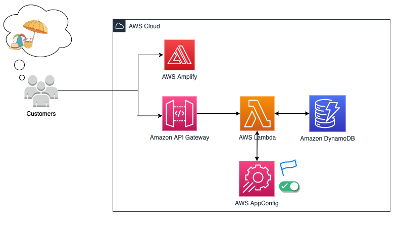

1. [Deploying application configuration to serverless: Introducing the AWS AppConfig Lambda extension by Steve Rice, Jonathan (JT) Thompson, and Tim Yao ](https://aws.amazon.com/blogs/mt/introducing-aws-appconfig-lambda-extension-deploying-application-configuration-serverless/)

2. [AWS Lambda Cookbook  - Part 6 -  Configuration & Feature Flags Best Practices](https://www.ranthebuilder.cloud/post/aws-lambda-cookbook-part-6-feature-flags-configuration-best-practices)

# Workshop

1. [Learn to Use AWS AppConfig Feature Flags](https://catalog.us-east-1.prod.workshops.aws/workshops/2ee2fc71-0618-479c-86dd-1d5fb168eb20/en-US/02-getting-started/01-aws-event)

  

2. [AWS Management and Governance Tools Workshop > AWS AppConfig](https://mng.workshop.aws/appconfig.html)

3. [Serverless Optimization Workshop (Performance and Cost) > Setting Log Levels using AppConfig](https://catalog.us-east-1.prod.workshops.aws/workshops/2d960419-7d15-44e7-b540-fd3ebeb7ce2e/en-US/log-tuning)

