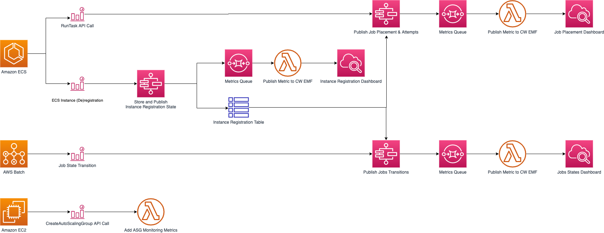

# 1. Workshops

1. [Running Workload on AWS Batch](https://catalog.us-east-1.prod.workshops.aws/workshops/446990a8-b38c-43a2-89c4-f8657eb6f757/en-US)
2. [Fair-share scheduling on AWS Batch](https://catalog.us-east-1.prod.workshops.aws/workshops/c3d652f2-6de1-4014-9a1b-c1b3c8f08b8d/en-US)
3. [Running batch workloads on Amazon EKS with AWS Batch](https://catalog.workshops.aws/running-batch-on-eks/en-US)

# 2. AWS Samples

1. [[MUST SEE] Amazon ECS Reference Architecture: Batch Processing](https://github.com/aws-samples/ecs-refarch-batch-processing)
2. [AWS Batch Application Orchectration using AWS Fargate](https://github.com/aws-samples/aws-batch-processing-job-repo)
  
3. [AWS Batch Runtime Monitoring Dashboards Solution](https://github.com/aws-samples/aws-batch-runtime-monitoring)
  
- Autoscaling
- Dashboard

# 3. Step functions

1. [Orchestrating high performance computing with AWS Step Functions and AWS Batch by Dan Fox](https://aws.amazon.com/blogs/compute/orchestrating-high-performance-computing-with-aws-step-functions-and-aws-batch/)