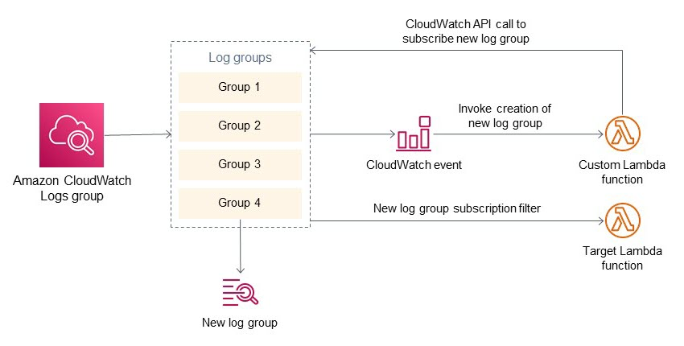

<h1>AWS Cloudwatch </h1>

<!-- TOC -->

- [1. Alarms](#1-alarms)
- [2. Customize Alarms](#2-customize-alarms)
- [3. Insights](#3-insights)
- [4. Custom Metrics](#4-custom-metrics)
- [5. Custom Dashboard using CDK](#5-custom-dashboard-using-cdk)
- [6. DocumentDB](#6-documentdb)
- [7. Tutorials](#7-tutorials)
- [8. Workshops](#8-workshops)
- [9. Subscription filters](#9-subscription-filters)

<!-- /TOC -->

# 1. Alarms

1. [Alarms, incident management, and remediation in the cloud with Amazon CloudWatch by Eric Scholz ](https://aws.amazon.com/blogs/mt/alarms-incident-management-and-remediation-in-the-cloud-with-amazon-cloudwatch/)

# 2. Customize Alarms

1. [Customize Amazon CloudWatch alarm notifications to your local time zone – Part 1 by Ahmed Magdy Wahdan](https://aws.amazon.com/blogs/mt/customize-amazon-cloudwatch-alarm-notifications-to-your-local-time-zone-part-1/)
- [Customize-CloudWatch-alarm-Eventrule.yaml](./templates/Customize-CloudWatch-alarm-Eventrule.yaml)
2. [Customize Amazon CloudWatch alarm notifications to your local time zone – Part 2 by Ahmed Magdy Wahdan](https://aws.amazon.com/blogs/mt/customize-amazon-cloudwatch-alarm-notifications-to-your-local-time-zone-part-2/)
- [Customize-CloudWatch-alarm-SNSSubscription.yaml](./templates/Customize-CloudWatch-alarm-SNSSubscription.yaml)

# 3. Insights

1. [The Serverless Guide to AWS CloudWatch Logs Insights](https://baselime.io/blog/cloudwatch-insights-guide)
1. [Operating Lambda: Using CloudWatch Logs Insights by James Beswick](https://aws.amazon.com/blogs/compute/operating-lambda-using-cloudwatch-logs-insights/)
1. [Operating Lambda: Logging and custom metrics by James Beswick](https://aws.amazon.com/blogs/compute/operating-lambda-logging-and-custom-metrics/)
1. [New – Amazon CloudWatch Logs Insights – Fast, Interactive Log Analytics   by Jeff Barr](https://aws.amazon.com/blogs/aws/new-amazon-cloudwatch-logs-insights-fast-interactive-log-analytics/)

# 4. Custom Metrics

1. [Writing Custom Metrics to Amazon CloudWatch Using the AWS SDK for Java by Sascha Moellering](https://aws.amazon.com/blogs/developer/writing-custom-metrics-to-amazon-cloudwatch-using-the-aws-sdk-for-java/)

# 5. Custom Dashboard using CDK

1. [The CloudWatch Dashboard using CDK](https://github.com/cdk-patterns/serverless/blob/main/the-cloudwatch-dashboard/)
2. [Deploying an automated Amazon CloudWatch dashboard for AWS Outposts using AWS CDK by Sheila Busser ](https://aws.amazon.com/blogs/compute/deploying-an-automated-amazon-cloudwatch-dashboard-for-aws-outposts-using-aws-cdk/)
3. [AWS Dashboards with AWS CDK in TypeScript](https://levelup.gitconnected.com/aws-dashboards-with-aws-cdk-in-typescript-12d97bf0958)
4. [[MY-NEXT] Building Amazon CloudWatch dashboards with AWS CDK By FooBar](https://www.youtube.com/watch?v=0VNKHIcQ5wk)
- https://github.com/mavi888/cdk-migrated-app-infra
3. [[cdk-patterns/serverless] The CloudWatch Dashboard](https://github.com/cdk-patterns/serverless/blob/main/the-cloudwatch-dashboard/README.md)

# 6. DocumentDB

7. [Dashboard automation for DocumentDB](https://catalog.us-east-1.prod.workshops.aws/workshops/464d6c17-9faa-4fef-ac9f-dd49610174d3/en-US/monitoring/deploy)

# 7. Tutorials

1. [Mastering AWS CloudWatch: A Step-by-Step Tutorial for Beginners](https://cto.ai/blog/aws-cloudwatch/)

# 8. Workshops

1. [AWS CloudWatch and Systems Manager Workshop](https://catalog.us-east-1.prod.workshops.aws/workshops/a8e9c6a6-0ba9-48a7-a90d-378a440ab8ba/en-US)
2. [AWS Management and Governance Tools Workshop > Amazon CloudWatch](https://mng.workshop.aws/cloudwatch.html)
3. [AWS for Linux Workloads Immersion Day > CloudWatch](https://catalog.us-east-1.prod.workshops.aws/workshops/a8e9c6a6-0ba9-48a7-a90d-378a440ab8ba/en-US/300-cloudwatch)

# 9. Subscription filters

1. [How to automatically subscribe to Amazon CloudWatch Logs groups by Rohit Kumar Singh and Ennio Pastore](https://aws.amazon.com/blogs/infrastructure-and-automation/how-to-automatically-subscribe-to-amazon-cloudwatch-logs-groups/)

2. [CloudWatch Lambda Subscription Filter (CDK-Demo) by Duleendra Shashimal](https://towardsaws.com/cloudwatch-lamba-subscription-filter-cdk-demo-f0eb571547c6)

3. [[WORKSHOP] AWS CloudTrail Log Monitoring > Subscriptions Filter](https://catalog.us-east-1.prod.workshops.aws/workshops/2e48b9fc-f721-4417-b811-962b7f31b61c/en-US/subscriptionsfilter/creating-filter)

1. [Example 1: Subscription filters with Kinesis Data Streams](https://docs.aws.amazon.com/AmazonCloudWatch/latest/logs/SubscriptionFilters.html#DestinationKinesisExample)
2. [Example 2: Subscription filters with AWS Lambda](https://docs.aws.amazon.com/AmazonCloudWatch/latest/logs/SubscriptionFilters.html#LambdaFunctionExample)
3. [Example 3: Subscription filters with Amazon Kinesis Data Firehose](https://docs.aws.amazon.com/AmazonCloudWatch/latest/logs/SubscriptionFilters.html#FirehoseExample)

