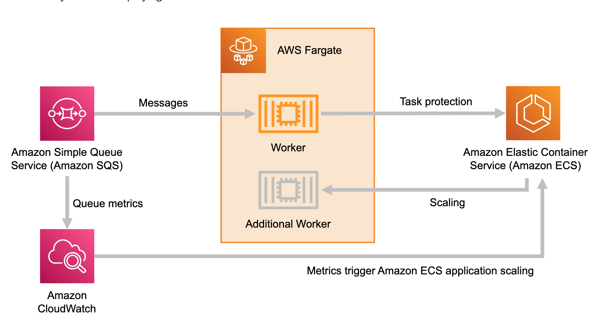
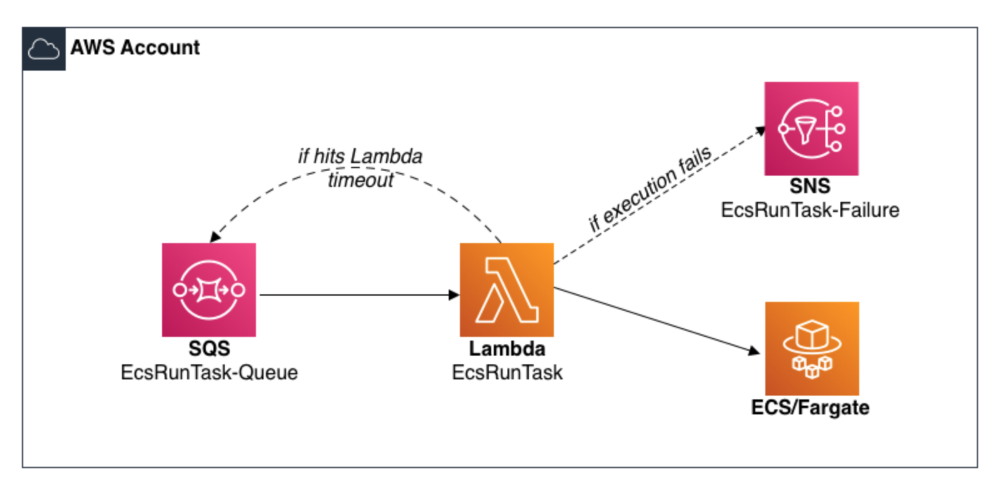
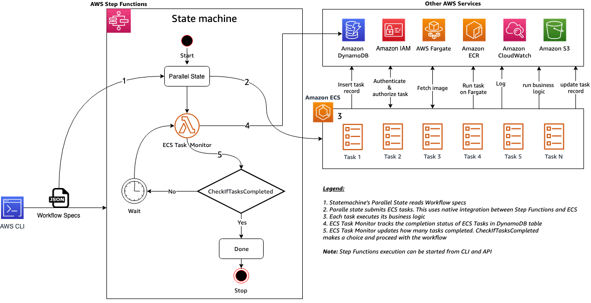

<h1>ECS</h1>

<!-- TOC -->

- [1. Start Here](#1-start-here)
- [2. Autoscaling](#2-autoscaling)
  - [2.1. Autoscaling using CDK](#21-autoscaling-using-cdk)
- [3. BluePrints](#3-blueprints)
- [4. Books](#4-books)
- [5. CDK](#5-cdk)
- [6. CI/CD](#6-cicd)
- [7. Debugging](#7-debugging)
- [8. Docker containers on ECS](#8-docker-containers-on-ecs)
- [9. ECS Console v2](#9-ecs-console-v2)
- [10. Hands-on](#10-hands-on)
- [11. Integrations](#11-integrations)
  - [11.1. Event Bridge](#111-event-bridge)
  - [11.2. Parameter Store](#112-parameter-store)
  - [11.3. SQS](#113-sqs)
- [12. Java](#12-java)
- [13. LaunchTypes - EC2 vs Fargate](#13-launchtypes---ec2-vs-fargate)
- [14. Tasks](#14-tasks)
  - [14.1. Task with Multi-Containers](#141-task-with-multi-containers)
- [15. Networking](#15-networking)
  - [15.1. Differences between different Networking modes](#151-differences-between-different-networking-modes)
  - [15.2. AWS VPC mode](#152-aws-vpc-mode)
  - [15.3. Bridge Mode](#153-bridge-mode)
  - [15.4. Host Mode](#154-host-mode)
  - [15.5. NAT Mode](#155-nat-mode)
  - [15.6. NONE Mode](#156-none-mode)
- [16. Samples](#16-samples)
  - [16.1. API Gateway](#161-api-gateway)
  - [16.2. ALB](#162-alb)
  - [16.3. SQS](#163-sqs)
- [17. Step functions](#17-step-functions)
- [18. Videos](#18-videos)
- [19. Workshops](#19-workshops)

<!-- /TOC -->

# 1. Start Here

1. [containersonaws.com/](https://containersonaws.com/)
2. [[MUST SEE] ECS on Fargate by AWSfundamentals.com](https://blog.awsfundamentals.com/ecs-on-fargate)

# 2. Autoscaling

1. [[**MUST TRY**] Autoscale ECS using cloudwatch metrics for SQS](https://containersonaws.com/pattern/background-worker-sqs-queue-container-copilot)
2. [Deep Dive on Amazon ECS Cluster Auto Scaling by Nick Coult](https://aws.amazon.com/blogs/containers/deep-dive-on-amazon-ecs-cluster-auto-scaling/)
3. [Autoscaling Amazon ECS services based on custom metrics with Application Auto Scaling by Viji Sarathy and Anoop Singh ](https://aws.amazon.com/blogs/containers/autoscaling-amazon-ecs-services-based-on-custom-metrics-with-application-auto-scaling/)
4. [Autoscaling Amazon ECS services based on custom CloudWatch and Prometheus metrics by Viji Sarathy](https://aws.amazon.com/blogs/containers/autoscaling-amazon-ecs-services-based-on-custom-cloudwatch-and-prometheus-metrics/)
5. [Amazon Elastic Container Service (ECS) Auto Scaling using custom metrics by Ahmed Azzam and Sebastian Lee](https://aws.amazon.com/blogs/containers/amazon-elastic-container-service-ecs-auto-scaling-using-custom-metrics/)
6. [How can I configure Amazon ECS Service Auto Scaling on Fargate?](https://repost.aws/knowledge-center/ecs-fargate-service-auto-scaling)
7. [Amazon ECS Scalability Best Practices By Nathan Peck](https://nathanpeck.com/amazon-ecs-scaling-best-practices/)
8. [Auto Scale EC2 using SQS](https://dev.to/aws-builders/auto-scale-ec2-using-sqs-306e)

## 2.1. Autoscaling using CDK

1. [A Complete Guide on How to Autoscale Your ECS based application Using Cdk](https://mafiaguy.medium.com/a-complete-guide-on-how-to-autoscale-your-ecs-based-application-using-cdk-36d5e0ec46da)
    - Target Tracking Scaling Policy
    - Step Scaling Policy
    - Scheduled Scaling Policy

# 3. BluePrints

1. [Accelerate Amazon ECS-based workloads with ECS Blueprints by Jooyoung Kim and Arvind Soni ](https://aws.amazon.com/blogs/containers/accelerate-amazon-ecs-based-workloads-with-ecs-blueprints/)
2. [ECS Blueprints workshop](https://catalog.workshops.aws/ecs-solution-blueprints/en-US)
3. [Amazon ECS Solution Blueprints with Terraform](https://www.youtube.com/watch?v=ERIvaZ3UCJk)
4. [Elastic Container Service (ECS) Blueprints for Terraform By Nathan Peck](https://containersonaws.com/pattern/ecs-blueprint-terraform)

# 4. Books

1. [AWS Cookbook](https://github.com/AWSCookbook/Containers)

# 5. CDK

1. [CDK Construct library for higher-level ECS Constructs](https://docs.aws.amazon.com/cdk/api/v2/docs/aws-cdk-lib.aws_ecs_patterns-readme.html)
2. [Deploying a containerized web application with AWS Cloud Development Kit](https://pages.awscloud.com/rs/112-TZM-766/images/2019_0911-CON_Slide-Deck.pdf)

# 6. CI/CD

1. [Sharing automated blueprints for Amazon ECS continuous delivery using AWS Service Catalog](https://aws.amazon.com/blogs/compute/sharing-automated-blueprints-for-amazon-ecs-continuous-delivery-using-aws-service-catalog/)

# 7. Debugging

1. [Debugging into AWS ECS Task Containers: What You Need to Know](https://towardsaws.com/debugging-into-aws-ecs-task-containers-what-you-need-to-know-95d153376fc5)

# 8. Docker containers on ECS

1. [Building container images on Amazon ECS on AWS Fargate by Re Alvarez-Parmar and Olly Pomeroy](https://aws.amazon.com/blogs/containers/building-container-images-on-amazon-ecs-on-aws-fargate/)
2. [Deploy Docker Containers on Amazon ECS](https://aws.amazon.com/getting-started/hands-on/deploy-docker-containers/)
3. [Creating a container image for use on Amazon ECS](https://docs.aws.amazon.com/AmazonECS/latest/userguide/create-container-image.html)

# 9. ECS Console v2

1. [Amazon ECS Console v2 updates](https://www.youtube.com/watch?v=aTlTH61GKKA)

# 10. Hands-on

1. [[OUTDATED] Deploy Docker Containers on Amazon ECS fargate](https://aws.amazon.com/getting-started/hands-on/deploy-docker-containers/)
2. [Deploy a Container Web App on Amazon ECS Using Amazon CodeCatalyst](https://community.aws/tutorials/deploy-webapp-ecs-codecatalyst)
3. [Deploy a Web App Using AWS Copilot](https://aws.amazon.com/getting-started/guides/deploy-webapp-copilot)
4. [AWS ECS Tutorial using ECS Console v2](https://earthly.dev/blog/aws-ecs-tutorial/)

# 11. Integrations

## 11.1. Event Bridge

1. [[**MUST TRY**] Integrating Amazon EventBridge and Amazon ECS By Jakub Narloch](https://aws.amazon.com/blogs/compute/integrating-amazon-eventbridge-and-amazon-ecs/)

## 11.2. Parameter Store

1. [Managing Secrets for Amazon ECS Applications Using Parameter Store and IAM Roles for Tasks by Chris Barclay](https://aws.amazon.com/blogs/compute/managing-secrets-for-amazon-ecs-applications-using-parameter-store-and-iam-roles-for-tasks/)
2. [How to Manage Secrets for Amazon EC2 Container Service–Based Applications by Using Amazon S3 and Docker by Matthew McClean](https://aws.amazon.com/blogs/security/how-to-manage-secrets-for-amazon-ec2-container-service-based-applications-by-using-amazon-s3-and-docker/)

## 11.3. SQS

1. [How to poll for SQS by Fargate by Dhiraj Mahapatro](https://aws.amazon.com/blogs/compute/extending-a-serverless-event-driven-architecture-to-existing-container-workloads/)
    - See https://github.com/aws-samples/serverless-eda-insurance-claims-processing/blob/main/lib/services/settlement/app/src/main/java/com/amazon/settlement/services/SubscriberService.java
    - QueueProcessingFargateService is also mentioned in this article

2. [Spinning up an AWS Fargate service based on messages on a queue - using aws-cdk](https://dev.to/seanyboi/how-to-create-a-queue-processing-fargate-service-using-aws-cdk-2b3n)

3. [[**MUST TRY**] Queue Integration with Third-party Services on AWS by Rostislav Markov, Justin Kuskowski, Ravindra Agrawal, Saswata Dash, and Michael Steward](https://aws.amazon.com/blogs/architecture/queue-integration-with-third-party-services-on-aws/)

4. [[**MUST TRY**] aws-lambda-amazon-ecs-run-task](https://github.com/awslabs/aws-lambda-ecs-run-task)
- nice scripts to adopt
- how to integrate ecs task with SQS using Lambda
- Demos exception handling with retries

# 12. Java

1. [Field Notes: Optimize your Java application for Amazon ECS with Quarkus by Sascha Moellering](https://aws.amazon.com/blogs/architecture/field-notes-optimize-your-java-application-for-amazon-ecs-with-quarkus/)
2. [[AWS Prescriptive Guidance] Deploy Java microservices on Amazon ECS using AWS Fargate](https://docs.aws.amazon.com/prescriptive-guidance/latest/patterns/deploy-java-microservices-on-amazon-ecs-using-aws-fargate.html)
3. [[AWS Prescriptive Guidance] Deploy Java microservices on Amazon ECS using Amazon ECR and AWS Fargate](https://docs.aws.amazon.com/prescriptive-guidance/latest/patterns/deploy-java-microservices-on-amazon-ecs-using-amazon-ecr-and-aws-fargate.html)
4. [[AWS Prescriptive Guidance] Deploy Java microservices on Amazon ECS using Amazon ECR and load balancing](https://docs.aws.amazon.com/prescriptive-guidance/latest/patterns/deploy-java-microservices-on-amazon-ecs-using-amazon-ecr-and-load-balancing.html)
5. [[**MUST TRY**] Building dynamic Amazon SNS subscriptions for auto scaling container workloads By Mithun Mallick](https://aws.amazon.com/blogs/compute/building-dynamic-amazon-sns-subscriptions-for-auto-scaling-container-workloads/)
    - Architecture: SNS -> SQS -> ECS (Java Polls SQS) -> EventBridge -> Lambda/Dynamodb
6. [[**MUST TRY**] Spring Pet Clinic - Deploying Java Microservices on Amazon Elastic Container Service by Huy Huynh and Magnus Bjorkman](https://aws.amazon.com/blogs/compute/deploying-java-microservices-on-amazon-ec2-container-service/)

# 13. LaunchTypes - EC2 vs Fargate

1. [[**MUST SEE**] ECS on Fargate by AWSfundamentals.com](https://blog.awsfundamentals.com/ecs-on-fargate)
2. [[**MUST SEE**] Comparing Amazon ECS launch types: EC2 vs. Fargate By Lumigo](https://lumigo.io/blog/comparing-amazon-ecs-launch-types-ec2-vs-fargate/)

# 14. Tasks

## 14.1. Task with Multi-Containers

1. [Create a multi-container app with multiple tasks using ECS- Elastic Container Service. AWS Tutorials](https://www.youtube.com/watch?v=mbtU-5fXXiw)

# 15. Networking

## 15.1. Differences between different Networking modes

1. [Multi-Containers App on AWS Fargate](https://yosi-pramajaya.medium.com/multi-containers-app-on-aws-fargate-e86d9dc6e207)

## 15.2. AWS VPC mode

1. [[**MY NEXT**] Introducing Cloud Native Networking for Amazon ECS Containers By Anirudh Aithal](https://aws.amazon.com/blogs/compute/introducing-cloud-native-networking-for-ecs-containers/)
2. [[**MY NEXT**] Under the Hood: Task Networking for Amazon ECS By Anirudh Aithal](https://aws.amazon.com/blogs/compute/under-the-hood-task-networking-for-amazon-ecs/)
3. [Optimizing Amazon ECS task density using awsvpc network mode by Tony Pujals ](https://aws.amazon.com/blogs/compute/optimizing-amazon-ecs-task-density-using-awsvpc-network-mode/)
4. [Task Networking in AWS Fargate by Nathan Peck](https://aws.amazon.com/blogs/compute/task-networking-in-aws-fargate/)
5. [Amazon ECS Workshop > ECS Networking > AWSVPC mode](https://ecsworkshop.com/ecs_networking/awsvpc/)

## 15.3. Bridge Mode

1. [Amazon ECS Workshop > ECS Networking > Bridge mode](https://ecsworkshop.com/ecs_networking/bridge/)

## 15.4. Host Mode

1. [Amazon ECS Workshop > ECS Networking > Host mode](https://ecsworkshop.com/ecs_networking/host/)

## 15.5. NAT Mode

1. [Amazon ECS Workshop > ECS Networking > NAT mode (Windows)](https://ecsworkshop.com/ecs_networking/nat/)

## 15.6. NONE Mode

1. [ Amazon ECS Workshop > ECS Networking > None mode](https://ecsworkshop.com/ecs_networking/none/)

# 16. Samples

## 16.1. API Gateway

1. [[**CFN Included]** Serverless Container-based APIs with Amazon ECS and Amazon API Gateway by Simone Pomata ](https://aws.amazon.com/blogs/architecture/field-notes-serverless-container-based-apis-with-amazon-ecs-and-amazon-api-gateway/)

    

## 16.2. ALB

2. [Deploying Microservices with Amazon ECS, AWS CloudFormation, and an Application Load Balancer](https://github.com/aws-samples/ecs-refarch-cloudformation)
- Has Nested Cloudformation templates

    

## 16.3. SQS

1. [[**MUST TRY**] Background worker that gets jobs from an SQS queue](https://containersonaws.com/pattern/background-worker-sqs-queue-container-copilot)
- Poll SQS queue for messages?

    

2. [[**MUST TRY**] aws-lambda-amazon-ecs-run-task](https://github.com/awslabs/aws-lambda-ecs-run-task)
- nice scripts to adopt
- how to integrate ecs task with SQS using Lambda
- Demos exception handling with retries

    

# 17. Step functions

1. [[**MUST TRY**] Amazon ECS and AWS Step Functions Design Patterns Starter kit](https://github.com/aws-samples/amazon-ecs-and-aws-step-functions-design-patterns-starter-kit)

    

    

# 18. Videos

1. [Lightning talk on Amazon ECS and AWS Fargate](https://www.youtube.com/playlist?list=PLhr1KZpdzukeNrcZo5aAgVPkm4UnugRX3)
2. [Amazon ECS Console v2 updates](https://www.youtube.com/watch?v=aTlTH61GKKA)

# 19. Workshops

1. [Amazon ECS Workshop](https://ecsworkshop.com/)
2. [Module 2: Container Performance Tuning](https://catalog.workshops.aws/performance-tuning/en-US/50-container/51-architecture)
3. [Modernize with AWS App2Container Workshop](https://catalog.us-east-1.prod.workshops.aws/workshops/2c1e5f50-0ebe-4c02-a957-8a71ba1e8c89/en-US)
4. [Building your first DevOps Blue/Green pipeline with Amazon ECS](https://catalog.us-east-1.prod.workshops.aws/workshops/4b59b9fb-48b6-461c-9377-907b2e33c9df/en-US/introduction)
    - Create and Use Aurora MySQL DB
    - Create Application Load Balancer
    - Create ECS Cluster with Autoscaling
    - DevOps Pipeline with Blue/Green Deployment

5. [CI/CD workshop for Amazon ECS](https://catalog.us-east-1.prod.workshops.aws/workshops/869f7eee-d3a2-490b-bf9a-ac90a8fb2d36/en-US)
    - Lab 0: CodeCommit
    - Lab 1 : Rolling update
    - Lab 2 : Blue green deployment
    - Lab 3 : Exploring CodeDeploy
    - Lab 4: Git-based Service Configuration
    - Lab 5: Canary Deployment
    - Misc: Git-based Service Configuration with Terraform

6. [AWS Modernization with Docker](https://docker.awsworkshop.io/0_introduction.html)

7. [ECS Blueprints workshop](https://catalog.workshops.aws/ecs-solution-blueprints/en-US)
- https://github.com/aws-ia/ecs-blueprints
