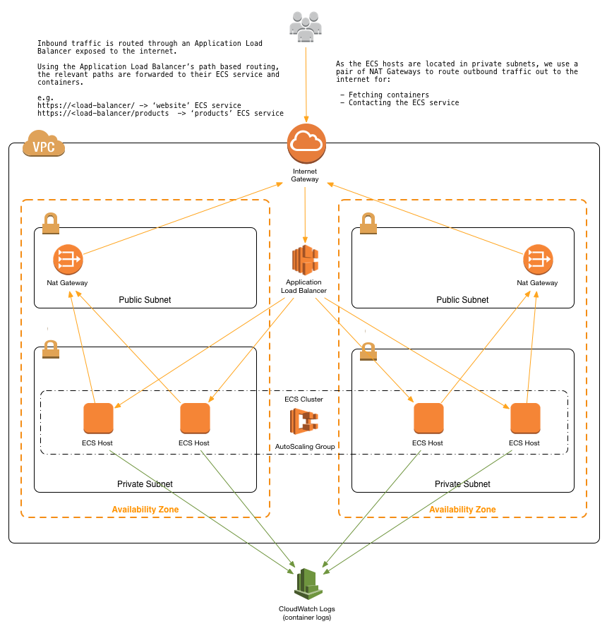

<h1>ECS</h1>

<!-- TOC -->

- [1. Start Here](#1-start-here)
- [2. Integrations](#2-integrations)
  - [2.1. SQS](#21-sqs)
  - [2.2. Parameter Store](#22-parameter-store)
- [3. CDK](#3-cdk)
- [4. Workshop](#4-workshop)
- [5. BluePrints](#5-blueprints)
- [6. Java](#6-java)
- [7. Debugging](#7-debugging)
- [8. Samples](#8-samples)
- [9. How build and deploy docker containers on ECS?](#9-how-build-and-deploy-docker-containers-on-ecs)
- [10. CDK](#10-cdk)
- [11. Autoscaling](#11-autoscaling)
  - [11.1. Using CDK](#111-using-cdk)
- [12. Step functions](#12-step-functions)

<!-- /TOC -->

# 1. Start Here

1. [containersonaws.com/](https://containersonaws.com/)

# 2. Integrations

## 2.1. SQS

1. [How to poll for SQS by Fargate by Dhiraj Mahapatro](https://aws.amazon.com/blogs/compute/extending-a-serverless-event-driven-architecture-to-existing-container-workloads/)
    - See https://github.com/aws-samples/serverless-eda-insurance-claims-processing/blob/main/lib/services/settlement/app/src/main/java/com/amazon/settlement/services/SubscriberService.java
    - QueueProcessingFargateService is also mentioned in this article

2. [Spinning up an AWS Fargate service based on messages on a queue - using aws-cdk](https://dev.to/seanyboi/how-to-create-a-queue-processing-fargate-service-using-aws-cdk-2b3n)

## 2.2. Parameter Store

1. [Managing Secrets for Amazon ECS Applications Using Parameter Store and IAM Roles for Tasks by Chris Barclay](https://aws.amazon.com/blogs/compute/managing-secrets-for-amazon-ecs-applications-using-parameter-store-and-iam-roles-for-tasks/)
2. [How to Manage Secrets for Amazon EC2 Container Service–Based Applications by Using Amazon S3 and Docker by Matthew McClean](https://aws.amazon.com/blogs/security/how-to-manage-secrets-for-amazon-ec2-container-service-based-applications-by-using-amazon-s3-and-docker/)

# 3. CDK

1. [Deploying a containerized web application with AWS Cloud Development Kit](https://pages.awscloud.com/rs/112-TZM-766/images/2019_0911-CON_Slide-Deck.pdf)

# 4. Workshop

1. [Module 2: Container Performance Tuning](https://catalog.workshops.aws/performance-tuning/en-US/50-container/51-architecture)
2. [Modernize with AWS App2Container Workshop](https://catalog.us-east-1.prod.workshops.aws/workshops/2c1e5f50-0ebe-4c02-a957-8a71ba1e8c89/en-US)
3. [Building your first DevOps Blue/Green pipeline with Amazon ECS](https://catalog.us-east-1.prod.workshops.aws/workshops/4b59b9fb-48b6-461c-9377-907b2e33c9df/en-US/introduction)
- Create and Use Aurora MySQL DB
- Create Application Load Balancer
- Create ECS Cluster with Autoscaling
- DevOps Pipeline with Blue/Green Deployment

4. [CI/CD workshop for Amazon ECS](https://catalog.us-east-1.prod.workshops.aws/workshops/869f7eee-d3a2-490b-bf9a-ac90a8fb2d36/en-US)
- Lab 0: CodeCommit
- Lab 1 : Rolling update
- Lab 2 : Blue green deployment
- Lab 3 : Exploring CodeDeploy
- Lab 4: Git-based Service Configuration
- Lab 5: Canary Deployment
- Misc: Git-based Service Configuration with Terraform

# 5. BluePrints

1. [Accelerate Amazon ECS-based workloads with ECS Blueprints by Jooyoung Kim and Arvind Soni ](https://aws.amazon.com/blogs/containers/accelerate-amazon-ecs-based-workloads-with-ecs-blueprints/)

# 6. Java

1. [Field Notes: Optimize your Java application for Amazon ECS with Quarkus by Sascha Moellering](https://aws.amazon.com/blogs/architecture/field-notes-optimize-your-java-application-for-amazon-ecs-with-quarkus/)
2. [[AWS Prescriptive Guidance] Deploy Java microservices on Amazon ECS using AWS Fargate](https://docs.aws.amazon.com/prescriptive-guidance/latest/patterns/deploy-java-microservices-on-amazon-ecs-using-aws-fargate.html)
3. [[AWS Prescriptive Guidance] Deploy Java microservices on Amazon ECS using Amazon ECR and AWS Fargate](https://docs.aws.amazon.com/prescriptive-guidance/latest/patterns/deploy-java-microservices-on-amazon-ecs-using-amazon-ecr-and-aws-fargate.html)
4. [[AWS Prescriptive Guidance] Deploy Java microservices on Amazon ECS using Amazon ECR and load balancing](https://docs.aws.amazon.com/prescriptive-guidance/latest/patterns/deploy-java-microservices-on-amazon-ecs-using-amazon-ecr-and-load-balancing.html)
5. [[MUST SEE] Building dynamic Amazon SNS subscriptions for auto scaling container workloads By Mithun Mallick](https://aws.amazon.com/blogs/compute/building-dynamic-amazon-sns-subscriptions-for-auto-scaling-container-workloads/)

    * Architecture: SNS -> SQS -> ECS (Java Polls SQS) -> EventBridge -> Lambda/Dynamodb
6. [[MUST SEE] Spring Pet Clinic - Deploying Java Microservices on Amazon Elastic Container Service by Nathan Taber](https://aws.amazon.com/blogs/compute/deploying-java-microservices-on-amazon-ec2-container-service/)

# 7. Debugging

1. [Debugging into AWS ECS Task Containers: What You Need to Know](https://towardsaws.com/debugging-into-aws-ecs-task-containers-what-you-need-to-know-95d153376fc5)

# 8. Samples

1. [[CFN Included] Serverless Container-based APIs with Amazon ECS and Amazon API Gateway by Simone Pomata ](https://aws.amazon.com/blogs/architecture/field-notes-serverless-container-based-apis-with-amazon-ecs-and-amazon-api-gateway/)

    

2. [Deploying Microservices with Amazon ECS, AWS CloudFormation, and an Application Load Balancer](https://github.com/aws-samples/ecs-refarch-cloudformation)
- Has Nested Cloudformation templates

# 9. How build and deploy docker containers on ECS?

1. [Building container images on Amazon ECS on AWS Fargate by Re Alvarez-Parmar and Olly Pomeroy](https://aws.amazon.com/blogs/containers/building-container-images-on-amazon-ecs-on-aws-fargate/)
2. [Deploy Docker Containers on Amazon ECS](https://aws.amazon.com/getting-started/hands-on/deploy-docker-containers/)
3. [Creating a container image for use on Amazon ECS](https://docs.aws.amazon.com/AmazonECS/latest/userguide/create-container-image.html)

# 10. CDK

1. [CDK Construct library for higher-level ECS Constructs](https://docs.aws.amazon.com/cdk/api/v2/docs/aws-cdk-lib.aws_ecs_patterns-readme.html)

# 11. Autoscaling

1. [Deep Dive on Amazon ECS Cluster Auto Scaling by Nick Coult](https://aws.amazon.com/blogs/containers/deep-dive-on-amazon-ecs-cluster-auto-scaling/)
2. [Autoscaling Amazon ECS services based on custom metrics with Application Auto Scaling by Viji Sarathy and Anoop Singh ](https://aws.amazon.com/blogs/containers/autoscaling-amazon-ecs-services-based-on-custom-metrics-with-application-auto-scaling/)
3. [Autoscaling Amazon ECS services based on custom CloudWatch and Prometheus metrics by Viji Sarathy](https://aws.amazon.com/blogs/containers/autoscaling-amazon-ecs-services-based-on-custom-cloudwatch-and-prometheus-metrics/)
4. [Amazon Elastic Container Service (ECS) Auto Scaling using custom metrics by Ahmed Azzam and Sebastian Lee](https://aws.amazon.com/blogs/containers/amazon-elastic-container-service-ecs-auto-scaling-using-custom-metrics/)
5. [How can I configure Amazon ECS Service Auto Scaling on Fargate?](https://repost.aws/knowledge-center/ecs-fargate-service-auto-scaling)
6. [Amazon ECS Scalability Best Practices By Nathan Peck](https://nathanpeck.com/amazon-ecs-scaling-best-practices/)
7. [[START HERE] Auto Scale EC2 using SQS](https://dev.to/aws-builders/auto-scale-ec2-using-sqs-306e)

## 11.1. Using CDK

1. [A Complete Guide on How to Autoscale Your ECS based application Using Cdk](https://mafiaguy.medium.com/a-complete-guide-on-how-to-autoscale-your-ecs-based-application-using-cdk-36d5e0ec46da)
- Target Tracking Scaling Policy
- Step Scaling Policy
- Scheduled Scaling Policy

# 12. Step functions

1. [[MUST SEE] Amazon ECS and AWS Step Functions Design Patterns Starter kit](https://github.com/aws-samples/amazon-ecs-and-aws-step-functions-design-patterns-starter-kit)

