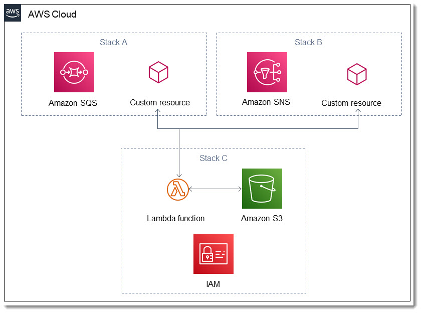
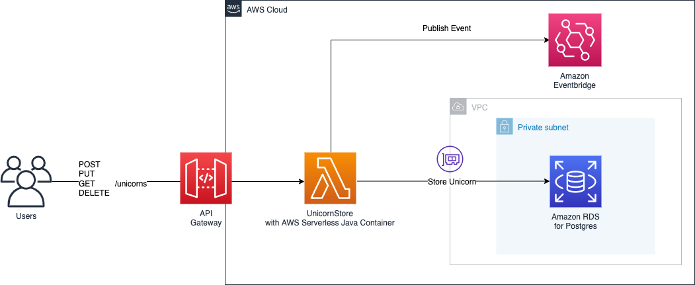
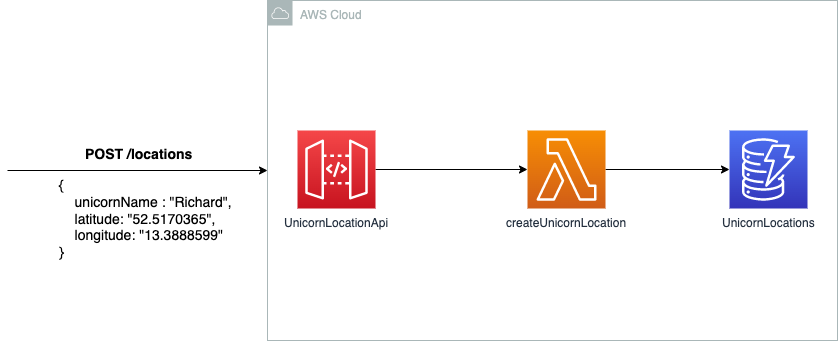

<H1>Lambda BackLog</h1>

<!-- TOC -->

- [1. Best Practices](#1-best-practices)
- [2. Architecture](#2-architecture)
- [3. Autoscaling](#3-autoscaling)
- [4. Costs](#4-costs)
- [5. CI/CD](#5-cicd)
- [6. Code Signing](#6-code-signing)
- [7. Core Topics](#7-core-topics)
  - [7.1. Throttling](#71-throttling)
  - [7.2. Error Handling](#72-error-handling)
    - [7.2.1. Exponential backoff and jitter algorithm](#721-exponential-backoff-and-jitter-algorithm)
- [8. Cloudwatch Insights](#8-cloudwatch-insights)
- [9. Devops](#9-devops)
- [10. Development](#10-development)
  - [10.1. Compilation techniques](#101-compilation-techniques)
  - [10.2. Designing](#102-designing)
  - [10.3. Java](#103-java)
  - [10.4. SAM](#104-sam)
  - [10.5. Snapstart](#105-snapstart)
  - [10.6. Code organization](#106-code-organization)
- [11. Event Source Mapping](#11-event-source-mapping)
  - [11.1. Core](#111-core)
  - [11.2. Filtering](#112-filtering)
  - [11.3. FIFO SQS as Event Source](#113-fifo-sqs-as-event-source)
  - [11.4. Kinesis](#114-kinesis)
- [12. Function URLs](#12-function-urls)
- [13. Integration with AWS Services](#13-integration-with-aws-services)
  - [13.1. ECS](#131-ecs)
  - [13.2. Kafka](#132-kafka)
  - [13.3. S3](#133-s3)
  - [13.4. Secrets-Manager](#134-secrets-manager)
  - [13.5. SNS](#135-sns)
  - [13.6. SQS](#136-sqs)
- [14. Invocation Models](#14-invocation-models)
- [15. Skillbuilder Courses](#15-skillbuilder-courses)
- [16. Scaling and concurrency in Lambda](#16-scaling-and-concurrency-in-lambda)
  - [16.1. Core Concepts](#161-core-concepts)
  - [16.2. Provisioned Concurrency](#162-provisioned-concurrency)
  - [16.3. Devops](#163-devops)
  - [16.4. Concurrency Controls and Quotas](#164-concurrency-controls-and-quotas)
  - [16.5. Max Concurrency](#165-max-concurrency)
  - [16.6. Throttling](#166-throttling)
- [17. Comparison between REST and GraphQL API architectures](#17-comparison-between-rest-and-graphql-api-architectures)
- [18. RDSProxy](#18-rdsproxy)
- [19. Security](#19-security)
  - [19.1. Lambda Security Using Resource Policy / ExecutionRole](#191-lambda-security-using-resource-policy--executionrole)
  - [19.2. Lambda Authorizers](#192-lambda-authorizers)
  - [19.3. Using Cognito to secure Lambda's function URL](#193-using-cognito-to-secure-lambdas-function-url)
- [20. Testing](#20-testing)
- [21. Stream Event Sources](#21-stream-event-sources)
- [22. User Stories](#22-user-stories)
- [23. How to use Spring with Lambda?](#23-how-to-use-spring-with-lambda)
- [24. Networking](#24-networking)
- [25. Troubleshooting](#25-troubleshooting)
- [26. Tracing](#26-tracing)
- [27. Well Architected](#27-well-architected)
  - [27.1. Series TOC](#271-series-toc)
  - [27.2. Controlling serverless API access](#272-controlling-serverless-api-access)
  - [27.3. Security](#273-security)
  - [27.4. Service Quotas / Scaling / Concurrency](#274-service-quotas--scaling--concurrency)
  - [27.5. Event Driven](#275-event-driven)
  - [27.6. How to secure workloads with public endpoints](#276-how-to-secure-workloads-with-public-endpoints)
  - [27.7. Serverless Lens](#277-serverless-lens)
- [28. Cross-account access](#28-cross-account-access)
- [29. Powertools](#29-powertools)
  - [29.1. Java](#291-java)
  - [29.2. Typescript](#292-typescript)
- [30. Batch Processing](#30-batch-processing)
  - [30.1. Checkpointing](#301-checkpointing)
- [31. Staging](#31-staging)
- [32. VPC-Enabled Lambda](#32-vpc-enabled-lambda)
- [33. Cookbooks](#33-cookbooks)
  - [33.1. Cookbook by Ran Isenberg](#331-cookbook-by-ran-isenberg)
- [34. DLQs](#34-dlqs)
- [35. Monitoring](#35-monitoring)
- [36. Workshops](#36-workshops)
- [37. Videos](#37-videos)
- [38. Function URLs](#38-function-urls)
- [39. Use cases](#39-use-cases)
  - [39.1. Aggregating Data](#391-aggregating-data)

<!-- /TOC -->

# 1. Best Practices

1. [[MY NEXT] AWS LAMBDA BEST PRACTICES](https://dev.to/aws-builders/aws-lambda-best-practices-4chn)
2. [Best practices for organizing larger serverless applications by James Beswick ](https://aws.amazon.com/blogs/compute/best-practices-for-organizing-larger-serverless-applications/)
3. [aws api gateway & lambda: multiple endpoint/functions vs single endpoint](https://stackoverflow.com/questions/41425511/aws-api-gateway-lambda-multiple-endpoint-functions-vs-single-endpoint)
4. [Best Practices for Integrating Amazon SQS with AWS Lambda](https://levelup.gitconnected.com/best-practices-for-integrating-amazon-sqs-with-aws-lambda-443db4b959e0)

# 2. Architecture

1. [AWS re:Invent 2022 - A closer look at AWS Lambda (SVS404-R)](https://www.youtube.com/watch?v=0_jfH6qijVY&t=1308s)

# 3. Autoscaling

See [autoscaling-backlog.md](./autoscaling-backlog.md)

# 4. Costs

1. [Understanding techniques to reduce AWS Lambda costs in serverless applications by James Beswick](https://aws.amazon.com/blogs/compute/understanding-techniques-to-reduce-aws-lambda-costs-in-serverless-applications/)
2. [Serverless Automated Cost Controls, Part1 by Shankar Ramachandran ](https://aws.amazon.com/blogs/compute/serverless-automated-cost-controls-part1/)
    - [cfn_budget_lambda_blog_post.yaml](./templates/cfn_budget_lambda_blog_post.yaml)

# 5. CI/CD

1. [Using AWS Lambda SnapStart with infrastructure as code and CI/CD pipelines by James Beswick](https://aws.amazon.com/blogs/compute/using-aws-lambda-snapstart-with-infrastructure-as-code-and-ci-cd-pipelines/)
2. [Implementing cross-account CI/CD with AWS SAM for container-based Lambda functions by Eric Johnson ](https://aws.amazon.com/blogs/compute/implementing-cross-account-cicd-with-aws-sam-for-container-based-lambda/)

# 6. Code Signing

1. [Best practices and advanced patterns for Lambda code signing by Cassia Martin](https://aws.amazon.com/blogs/security/best-practices-and-advanced-patterns-for-lambda-code-signing/)

# 7. Core Topics

## 7.1. Throttling

1. [Understanding AWS Lambda’s invoke throttling limits](https://aws.amazon.com/blogs/compute/understanding-aws-lambdas-invoke-throttle-limits/)

## 7.2. Error Handling

1. [Implementing AWS Lambda error handling patterns by Julian Wood, Jeff Chen, and Jeff Li](https://aws.amazon.com/blogs/compute/implementing-aws-lambda-error-handling-patterns/)
    - [Github code](https://github.com/aws-samples/aws-lambda-error-handling-pattern)
2. [Implementing error handling for AWS Lambda asynchronous invocations By Poornima Chand](https://aws.amazon.com/blogs/compute/implementing-error-handling-for-aws-lambda-asynchronous-invocations/)

### 7.2.1. Exponential backoff and jitter algorithm

1. [Using Amazon SQS dead-letter queues to replay messages By Alexandre Pinhel](https://aws.amazon.com/blogs/compute/using-amazon-sqs-dead-letter-queues-to-replay-messages)

# 8. Cloudwatch Insights
1. [Understanding AWS Lambda behavior using Amazon CloudWatch Logs Insights by Greg Eppel](https://aws.amazon.com/blogs/mt/understanding-aws-lambda-behavior-using-amazon-cloudwatch-logs-insights/)
1. [Operating Lambda: Using CloudWatch Logs Insights by James Beswick](https://aws.amazon.com/blogs/compute/operating-lambda-using-cloudwatch-logs-insights/)

# 9. Devops

1. [Automatically Detect Operational Issues in Lambda Functions with Amazon DevOps Guru for Serverless by Marcia Villalba](https://aws.amazon.com/blogs/aws/automatically-detect-operational-issues-in-lambda-functions-with-amazon-devops-guru-for-serverless/)

# 10. Development

## 10.1. Compilation techniques

1. [[CDK] Increasing performance of Java AWS Lambda functions using tiered compilation By Mark Sailes](https://aws.amazon.com/blogs/compute/increasing-performance-of-java-aws-lambda-functions-using-tiered-compilation/)
- https://github.com/aws-samples/aws-lambda-java-tiered-compilation-example/tree/main

## 10.2. Designing

1. [Developing portable AWS Lambda functions by Pascal Vogel](https://aws.amazon.com/blogs/compute/developing-portable-aws-lambda-functions/)
2. [Developing evolutionary architecture with AWS Lambda by Luca Mezzalira](https://aws.amazon.com/blogs/compute/developing-evolutionary-architecture-with-aws-lambda/)
3.  [Issues to Avoid When Implementing Serverless Architecture with AWS Lambda by Andrei Maksimov](https://aws.amazon.com/blogs/architecture/mistakes-to-avoid-when-implementing-serverless-architecture-with-lambda/)

## 10.3. Java

1. [Bootstrapping a Java Lambda application with minimal AWS Java SDK startup time using Maven by Zoe Wang ](https://aws.amazon.com/blogs/developer/bootstrapping-a-java-lambda-application-with-minimal-aws-java-sdk-startup-time-using-maven/)
    - shows how to create maven archetypes

## 10.4. SAM

1. [[MY NEXT] Building serverless Java applications with the AWS SAM CLI by James Beswick](https://aws.amazon.com/blogs/compute/building-serverless-java-applications-with-the-aws-sam-cli/)
    - [Building Java apps with SAM | Serverless Office Hours](https://www.youtube.com/watch?v=c7_gGalsIyE)

## 10.5. Snapstart

1. [Reducing Java cold starts on AWS Lambda functions with SnapStart by Mark Sailes](https://aws.amazon.com/blogs/compute/reducing-java-cold-starts-on-aws-lambda-functions-with-snapstart/)
    - https://serverlessland.com/patterns/apigw-lambda-snapstart

## 10.6. Code organization

1. [Best practices for organizing larger serverless applications by James Beswick](https://aws.amazon.com/blogs/compute/best-practices-for-organizing-larger-serverless-applications/)

# 11. Event Source Mapping

## 11.1. Core

1. [AWS Lambda Permissions: Execution Role and Resource-based Policies By Mehmet Ozkaya](https://medium.com/aws-lambda-serverless-developer-guide-with-hands/aws-lambda-permissions-execution-role-and-resource-based-policies-be2e325998fc)

## 11.2. Filtering

1. [Understanding Amazon SQS and AWS Lambda Event Source Mapping for Efficient Message Processing by Tushar Sharma and Shaun Wang](https://aws.amazon.com/blogs/apn/understanding-amazon-sqs-and-aws-lambda-event-source-mapping-for-efficient-message-processing/)
2. [Filtering event sources for AWS Lambda functions by Benjamin Smith](https://aws.amazon.com/blogs/compute/filtering-event-sources-for-aws-lambda-functions/)
    - Show how to filter messages before the invocation of a Lambda function
3. [[Workshop] Serverless Optimization Workshop (Performance and Cost) > Event Filtering](https://catalog.us-east-1.prod.workshops.aws/workshops/2d960419-7d15-44e7-b540-fd3ebeb7ce2e/en-US/event-filtering)

## 11.3. FIFO SQS as Event Source

1. [New for AWS Lambda – SQS FIFO as an event source by James Beswick ](https://aws.amazon.com/blogs/compute/new-for-aws-lambda-sqs-fifo-as-an-event-source/)

## 11.4. Kinesis

1. [Filtering event sources for AWS Lambda functions](https://aws.amazon.com/blogs/compute/filtering-event-sources-for-aws-lambda-functions/)

# 12. Function URLs

1. [Announcing AWS Lambda Function URLs: Built-in HTTPS Endpoints for Single-Function Microservices by Alex Casalboni ](https://aws.amazon.com/blogs/aws/announcing-aws-lambda-function-urls-built-in-https-endpoints-for-single-function-microservices/)

# 13. Integration with AWS Services

## 13.1. ECS

1. [[MUST SEE] Run message-driven workloads at scale by using AWS Fargate](https://docs.aws.amazon.com/prescriptive-guidance/latest/patterns/run-message-driven-workloads-at-scale-by-using-aws-fargate.html)
2. [[MUST SEE] Run event-driven and scheduled workloads at scale with AWS Fargate](https://docs.aws.amazon.com/prescriptive-guidance/latest/patterns/run-event-driven-and-scheduled-workloads-at-scale-with-aws-fargate.html)

## 13.2. Kafka

1. [Using Aws Lambda To Process Apache Kafka Streams](https://serverlessland.com/content/guides/lambda-kafka/introduction)

## 13.3. S3

1. [S3-to-Lambda patterns: Avoiding recursive invocation](https://github.com/aws-samples/s3-to-lambda-invocation-patterns)
2. [Manage Amazon S3 Event Notifications using a Lambda function by Philip Chen](https://aws.amazon.com/blogs/infrastructure-and-automation/manage-amazon-s3-event-notifications-using-lambda-function/)
3. [[MY NEXT] Manage Amazon S3 Event Notifications using a Lambda function by Philip Chen ](https://aws.amazon.com/blogs/infrastructure-and-automation/manage-amazon-s3-event-notifications-using-lambda-function/)

## 13.4. Secrets-Manager

1. [Lambda function had to reside in the same AWS account as the ECR repository that owned the container image by Andy Hall](https://aws.amazon.com/blogs/compute/creating-aws-lambda-environmental-variables-from-aws-secrets-manager/)
2. [Cache secrets using AWS Lambda extensions](https://docs.aws.amazon.com/prescriptive-guidance/latest/patterns/cache-secrets-using-aws-lambda-extensions.html)
3. [How to securely provide database credentials to Lambda functions by using AWS Secrets Manager by Ramesh Adabala, Anand Komandooru, and Noorul Hasan](https://aws.amazon.com/blogs/security/how-to-securely-provide-database-credentials-to-lambda-functions-by-using-aws-secrets-manager/)
> 4. [Retrieving parameters and secrets with Powertools for AWS Lambda (TypeScript) by Pascal Vogel](https://aws.amazon.com/blogs/compute/retrieving-parameters-and-secrets-with-powertools-for-aws-lambda-typescript/)
5. [Using the AWS Parameters and Secrets Lambda Extension with Python: A Practical Example](https://community.aws/posts/parameters-and-secrets-lambda-extension-with-python)

## 13.5. SNS

1. [Invoking AWS Lambda functions via Amazon SNS by Arjun Cholkar](https://aws.amazon.com/tw/blogs/mobile/invoking-aws-lambda-functions-via-amazon-sns/)
2. [How do I subscribe a Lambda function to an Amazon SNS topic in the same account?](https://repost.aws/knowledge-center/lambda-subscribe-sns-topic-same-account)
3. [Tutorial: Using AWS Lambda with Amazon Simple Notification Service](https://docs.aws.amazon.com/en_us/lambda/latest/dg/with-sns-example.html)

## 13.6. SQS

1. [Handle SQS message failure in batch with partial batch response feature](https://medium.com/srcecde/handle-sqs-message-failure-in-batch-with-partial-batch-response-b858ad212573)
2. [Lambda + SQS Users Should Know About This](https://www.youtube.com/watch?v=0707Py8Jyf0)
3. [Why isn't my Lambda function with an Amazon SQS event source scaling optimally?](https://repost.aws/knowledge-center/lambda-sqs-scaling)
> 4. [Implementing AWS Well-Architected best practices for Amazon SQS – Part 1 by Pascal Vogel ](https://aws.amazon.com/blogs/compute/implementing-aws-well-architected-best-practices-for-amazon-sqs-part-1/)
> 5. [Implementing AWS Well-Architected best practices for Amazon SQS – Part 2 by Pascal Vogel ](https://aws.amazon.com/blogs/compute/implementing-aws-well-architected-best-practices-for-amazon-sqs-part-2/)
> 6. [Implementing AWS Well-Architected best practices for Amazon SQS – Part 3 by Pascal Vogel](https://aws.amazon.com/blogs/compute/implementing-aws-well-architected-best-practices-for-amazon-sqs-part-3/)

# 14. Invocation Models

1. [How to Design Your Serverless Apps for Massive Scale by George Mao](https://aws.amazon.com/blogs/architecture/how-to-design-your-serverless-apps-for-massive-scale/)
2. [[MY NEXT] Understanding the Different Ways to Invoke Lambda Functions by George Mao](https://aws.amazon.com/blogs/architecture/understanding-the-different-ways-to-invoke-lambda-functions/)
3. [Best Practices for Developing on AWS Lambda by George Mao](https://aws.amazon.com/blogs/architecture/best-practices-for-developing-on-aws-lambda/)
4. [AWS Lambda Fundamentals - AWS Lambda invocation models](https://www.youtube.com/watch?v=8K3_w3QyN6M)

# 15. Skillbuilder Courses

1. [Troubleshooting: AWS Lambda](https://explore.skillbuilder.aws/learn/course/10771/play/41089/troubleshooting-aws-lambda)

# 16. Scaling and concurrency in Lambda

## 16.1. Core Concepts

1. [Scaling and concurrency in Lambda](https://aws.amazon.com/blogs/compute/operating-lambda-application-design-scaling-and-concurrency-part-2/)
- On-demand scaling example
- Provisioned Concurrency scaling example
- Reserved concurrency
2. [Managing AWS Lambda Function Concurrency by Chris Munns](https://aws.amazon.com/blogs/compute/managing-aws-lambda-function-concurrency/)
3. [[MY NEXT] Understanding AWS Lambda scaling and throughput by Julian Wood](https://aws.amazon.com/blogs/compute/understanding-aws-lambda-scaling-and-throughput/)

## 16.2. Provisioned Concurrency

1. [Scheduling AWS Lambda Provisioned Concurrency for recurring peak usage by Chris Munns](https://aws.amazon.com/blogs/compute/scheduling-aws-lambda-provisioned-concurrency-for-recurring-peak-usage/)

## 16.3. Devops

1. [Investigating spikes in AWS Lambda function concurrency by Chris Munns](https://aws.amazon.com/blogs/compute/investigating-spikes-in-aws-lambda-function-concurrency/)

## 16.4. Concurrency Controls and Quotas

1. [AWS Lambda Fundamentals - AWS Lambda concurrency controls and quotas](https://www.youtube.com/watch?v=5XRBZNPy6Ng)

## 16.5. Max Concurrency

1. [Does Maximum Concurrency Solve the Lambda+SQS Issue?](https://zaccharles.medium.com/does-maximum-concurrency-solve-the-lambda-sqs-issue-3c19701e6e75)
2. [Introducing maximum concurrency of AWS Lambda functions when using Amazon SQS as an event source by Julian Wood](https://aws.amazon.com/blogs/compute/introducing-maximum-concurrency-of-aws-lambda-functions-when-using-amazon-sqs-as-an-event-source/)

## 16.6. Throttling

1. [Understanding AWS Lambda’s invoke throttling limits by Archana Srikanta](https://aws.amazon.com/blogs/compute/understanding-aws-lambdas-invoke-throttle-limits/)

# 17. Comparison between REST and GraphQL API architectures

1. [[MY NEXT] How to Architect APIs for Scale and Security by George Mao](https://aws.amazon.com/blogs/architecture/how-to-architect-apis-for-scale-and-security/)

# 18. RDSProxy

1. [Using Amazon RDS Proxy with AWS Lambda by George Mao](https://aws.amazon.com/blogs/compute/using-amazon-rds-proxy-with-aws-lambda/)

# 19. Security

## 19.1. Lambda Security Using Resource Policy / ExecutionRole

1. [Building AWS Lambda governance and guardrails by Julian Wood](https://aws.amazon.com/blogs/compute/building-aws-lambda-governance-and-guardrails/)
2. [AWS Lambda Fundamentals - AWS Lambda function permissions](https://www.youtube.com/watch?v=6oG9O44U9x0)
3. https://aws.amazon.com/blogs/compute/building-aws-lambda-governance-and-guardrails/
4. [Operating Lambda: Building a solid security foundation – Part 1 by James Beswick](https://aws.amazon.com/blogs/compute/operating-lambda-building-a-solid-security-foundation-part-1/)
5. [Operating Lambda: Building a solid security foundation – Part 2 by James Beswick](https://aws.amazon.com/blogs/compute/operating-lambda-building-a-solid-security-foundation-part-2/)
5. https://docs.aws.amazon.com/lambda/latest/dg/lambda-permissions.html
6. https://docs.aws.amazon.com/lambda/latest/dg/access-control-resource-based.html
7. [[MUST SEE] AWS LAMBDA OPERATOR GUIDE Security](https://serverlessland.com/content/service/lambda/guides/aws-lambda-operator-guide/security-ops)
8. [Building well-architected serverless applications: Controlling serverless API access – part 1 by Julian Wood](https://aws.amazon.com/blogs/compute/building-well-architected-serverless-applications-controlling-serverless-api-access-part-1/)
9. [Building well-architected serverless applications: Controlling serverless API access – part 2 by Julian Wood](https://aws.amazon.com/blogs/compute/building-well-architected-serverless-applications-controlling-serverless-api-access-part-2/)
10.[Building well-architected serverless applications: Controlling serverless API access – part 3 by Julian Wood](https://aws.amazon.com/blogs/compute/building-well-architected-serverless-applications-controlling-serverless-api-access-part-3/)

## 19.2. Lambda Authorizers

1. [Use AWS Lambda authorizers with a third-party identity provider to secure Amazon API Gateway REST APIs by Bryant Bost ](https://aws.amazon.com/blogs/security/use-aws-lambda-authorizers-with-a-third-party-identity-provider-to-secure-amazon-api-gateway-rest-apis/)
2. [How to secure API Gateway HTTP endpoints with JWT authorizer by Siva Rajamani, Rajat Mathur, and Sudhanshu Malhotra](https://aws.amazon.com/blogs/security/how-to-secure-api-gateway-http-endpoints-with-jwt-authorizer/)

## 19.3. Using Cognito to secure Lambda's function URL

1. [Securing Lambda Function URLs using Amazon Cognito, Amazon CloudFront and AWS WAF by Marcia Villalba](https://aws.amazon.com/blogs/compute/securing-lambda-function-urls-using-amazon-cognito-amazon-cloudfront-and-aws-waf/)

# 20. Testing

1. [Review of "Testing Serverless Architectures" by Yan Cui](https://www.trek10.com/blog/review-of-testing-serverless-architectures-by-yan-cui)
2. [Testing Serverless Applications By Dan Fox](https://serverlessland.com/testing)
3. [Testing Serverless Applications By Dan Fox | Serverless Office Hours](https://www.youtube.com/watch?v=8AxsqNmwAFw)

# 21. Stream Event Sources

1. [SVS323-R – Mastering AWS Lambda streaming event sources](https://d1.awsstatic.com/events/reinvent/2019/REPEAT_1_Mastering_AWS_Lambda_streaming_event_sources_SVS323-R1.pdf)

# 22. User Stories

1. [Building Scalable and Responsive Big Data Interfaces with AWS Lambda by FireEye](https://aws.amazon.com/blogs/big-data/building-scalable-and-responsive-big-data-interfaces-with-aws-lambda/)

# 23. How to use Spring with Lambda?

1. [AWS Lambda series by Dan Vega](https://www.youtube.com/watch?v=bxK4GscuVgs&list=PLZV0a2jwt22vS1QAp0XJsFACeLNL5oN1g)
2. [SpringBoot on Lambda By James Eastham](https://github.com/jeastham1993/java-spring-on-lambda)
- https://www.youtube.com/watch?v=eierYzOAyg8

# 24. Networking

1. [Building private serverless APIs with AWS Lambda and Amazon VPC Lattice by James Beswick ](https://aws.amazon.com/blogs/compute/building-private-serverless-apis-with-aws-lambda-and-amazon-vpc-lattice/)
2. [AWS Lambda Fundamentals - AWS Lambda networking](https://www.youtube.com/watch?v=W1YZs1YEdKM)

# 25. Troubleshooting

1. [AWS Lambda - Troubleshooting](https://explore.skillbuilder.aws/learn/course/internal/view/elearning/10771/aws-lambda-troubleshooting)
2. [How to Speed Up Your AWS Lambda Functions](https://explore.skillbuilder.aws/learn/course/internal/view/elearning/14738/how-to-speed-up-your-aws-lambda-functions)
3. [AWS Lambda Fundamentals - AWS Lambda observability and troubleshooting](https://www.youtube.com/watch?v=K2aebIhjWj8)
4. [Introducing new asynchronous invocation metrics for AWS Lambda By Dhiraj Mahapatro](https://aws.amazon.com/blogs/compute/introducing-new-asynchronous-invocation-metrics-for-aws-lambda/)

# 26. Tracing

1. [AWS Lambda Fundamentals - AWS Lambda tracing](https://www.youtube.com/watch?v=FSE_ngsBbTE)

# 27. Well Architected

## 27.1. Series TOC

1. [Building well-architected serverless applications: Introduction by Julian Wood](https://aws.amazon.com/blogs/compute/building-well-architected-serverless-applications-introduction/)

## 27.2. Controlling serverless API access

1. [Building well-architected serverless applications: Controlling serverless API access – part 1 by Julian Wood ](https://aws.amazon.com/blogs/compute/building-well-architected-serverless-applications-controlling-serverless-api-access-part-1/)
2. [Building well-architected serverless applications: Controlling serverless API access – part 2 by Julian Wood](https://aws.amazon.com/blogs/compute/building-well-architected-serverless-applications-controlling-serverless-api-access-part-2/)
3. [Building well-architected serverless applications: Controlling serverless API access – part 3 by Julian Wood ](https://aws.amazon.com/blogs/compute/building-well-architected-serverless-applications-controlling-serverless-api-access-part-3/)

## 27.3. Security

4. [Building well-architected serverless applications: Managing application security boundaries – part 1 by Julian Wood](https://aws.amazon.com/blogs/compute/building-well-architected-serverless-applications-managing-application-security-boundaries-part-1/)
5. [Building well-architected serverless applications: Managing application security boundaries – part 2 by Julian Wood ](https://aws.amazon.com/blogs/compute/building-well-architected-serverless-applications-managing-application-security-boundaries-part-2/)

## 27.4. Service Quotas / Scaling / Concurrency

1. [Operating Lambda: Application design and Service Quotas – Part 1 by James Beswick](https://aws.amazon.com/blogs/compute/operating-lambda-application-design-and-service-quotas-part-1/)
2. [Operating Lambda: Application design – Scaling and concurrency: Part 2 by James Beswick ](https://aws.amazon.com/blogs/compute/operating-lambda-application-design-scaling-and-concurrency-part-2/)
3. [Operating Lambda: Application design – Part 3 by James Beswick](https://aws.amazon.com/blogs/compute/operating-lambda-application-design-part-3/)

## 27.5. Event Driven

1. [Operating Lambda: Understanding event-driven architecture – Part 1 by James Beswick](https://aws.amazon.com/blogs/compute/operating-lambda-understanding-event-driven-architecture-part-1/)
2. [Operating Lambda: Design principles in event-driven architectures – Part 2 by James Beswick](https://aws.amazon.com/blogs/compute/operating-lambda-design-principles-in-event-driven-architectures-part-2/)
3. [Operating Lambda: Anti-patterns in event-driven architectures – Part 3 by James Beswick ](https://aws.amazon.com/blogs/compute/operating-lambda-anti-patterns-in-event-driven-architectures-part-3/)

## 27.6. How to secure workloads with public endpoints

1. [Operating Lambda: Building a solid security foundation – Part 1 by James Beswick ](https://aws.amazon.com/blogs/compute/operating-lambda-building-a-solid-security-foundation-part-1/)
2. [Operating Lambda: Building a solid security foundation – Part 2 by James Beswick ](https://aws.amazon.com/blogs/compute/operating-lambda-building-a-solid-security-foundation-part-2/)

## 27.7. Serverless Lens

1. https://d1.awsstatic.com/whitepapers/architecture/AWS-Serverless-Applications-Lens.pdf

# 28. Cross-account access

1. [Introducing cross-account Amazon ECR access for AWS Lambda by Brian Zambrano](https://aws.amazon.com/blogs/compute/introducing-cross-account-amazon-ecr-access-for-aws-lambda/)
    - Shows how to centralize docker images to a single account. This way Lambda function can reside in a different AWS account (in Account A) from ECR repository (in Account B) that owned the container image

# 29. Powertools

## 29.1. Java

1. [Powertools for AWS Lambda (Java)](https://awslabs.github.io/aws-lambda-powertools-java/)
2. [Simplifying serverless best practices with AWS Lambda Powertools Java by Pankaj Agrawal](https://aws.amazon.com/blogs/opensource/simplifying-serverless-best-practices-with-aws-lambda-powertools-java/)
3. [[MY NEXT] SVS 307 Workshop - Easily Add Observability with AWS Lambda Powertools for Java](https://catalog.us-east-1.prod.workshops.aws/workshops/a7011c82-e4af-4a52-80fa-fcd61f1dacd9/en-US/introduction)

## 29.2. Typescript

1. [AWS Lambda Powertools for TypeScript Workshop](https://github.com/aws-samples/aws-lambda-powertools-typescript-workshop)

# 30. Batch Processing

## 30.1. Checkpointing

1. [Optimizing batch processing with custom checkpoints in AWS Lambda by James Beswick |](https://aws.amazon.com/blogs/compute/optimizing-batch-processing-with-custom-checkpoints-in-aws-lambda/)

# 31. Staging

1. [Extract time series from satellite weather data with AWS Lambda by Lior Perez](https://aws.amazon.com/blogs/big-data/extract-time-series-from-satellite-weather-data-with-aws-lambda/)
2. [Enrich VPC Flow Logs with resource tags and deliver data to Amazon S3 using Amazon Kinesis Data Firehose by Chaitanya Shah and Vaibhav Katkade](https://aws.amazon.com/blogs/big-data/enrich-vpc-flow-logs-with-resource-tags-and-deliver-data-to-amazon-s3-using-amazon-kinesis-data-firehose/)
3. [AWS Lambda resources](https://aws.amazon.com/lambda/resources/?aws-lambda-resources-blog.sort-by=item.additionalFields.createdDate&aws-lambda-resources-blog.sort-order=desc)

# 32. VPC-Enabled Lambda

1. [Steps to secure AWS Serverless — Lambda (Part 1)](https://medium.com/orchestrated/steps-to-secure-aws-serverless-lambda-part-1-a6e5d1b05f45)
2. [Three ways to use AWS services from a Lambda in a VPC By Alex Debrie](https://www.alexdebrie.com/posts/aws-lambda-vpc/)
3. [Things You Must Know When Configuring Lambda With VPC Resources Access By Aruna Silva](https://medium.com/@arunasilva86/how-to-use-vpc-networking-effectively-for-lambda-445abefdf8cf)
4. [AWS re:Invent 2020: AWS Lambda networking best practices By Uri Segev](https://www.youtube.com/watch?v=Ax6cnBEDnsM)

# 33. Cookbooks

1. [aws/serverless-application-model](https://github.com/aws/serverless-application-model/tree/master/examples)
- Found this link from https://aws.amazon.com/blogs/architecture/top-resources-for-api-architects-and-developers/
2. [AWS Lambda Handler Cookbook - A Serverless Service Template By Ran the builder](https://ran-isenberg.github.io/aws-lambda-handler-cookbook/)
- [Lambda cookbook with Python](https://www.youtube.com/watch?v=yoLAuHaIRs8)

## 33.1. Cookbook by Ran Isenberg

1. [AWS Lambda Cookbook — Part 1 — Logging Best Practices By Ran Isenberg](https://www.ranthebuilder.cloud/post/aws-lambda-cookbook-elevate-your-handler-s-code-part-1-logging)
2. [AWS Lambda Cookbook — Part 2 — Observability Best Practices By Ran Isenberg](https://www.ranthebuilder.cloud/post/aws-lambda-cookbook-elevate-your-handler-s-code-part-2-observability)
3. [AWS Lambda Cookbook — Part 3 —Business Domain Observability Best Practices By Ran Isenberg](https://www.ranthebuilder.cloud/post/aws-lambda-cookbook-elevate-your-handler-s-code-part-3-business-domain-observability)
4. [AWS Lambda Cookbook  - Part 4 - Environment Variables Best Practices By Ran Isenberg](https://www.ranthebuilder.cloud/post/aws-lambda-cookbook-environment-variables)
5. [AWS Lambda Cookbook  - Part 5 - Input Validation Best Practices By Ran Isenberg](https://www.ranthebuilder.cloud/post/aws-lambda-cookbook-elevate-your-handler-s-code-part-5-input-validation)
6. [AWS Lambda Cookbook  - Part 6 -  Configuration & Feature Flags Best Practices By Ran Isenberg](https://www.ranthebuilder.cloud/post/aws-lambda-cookbook-part-6-feature-flags-configuration-best-practices)
7. [Start Your AWS Serverless Service With Two Clicks By Ran Isenberg](https://www.ranthebuilder.cloud/post/aws-lambda-cookbook-part-7-how-to-use-the-aws-lambda-cookbook-github-template-project)
8. [AWS CDK - Best Practices From The Trenches By Ran Isenberg](https://www.ranthebuilder.cloud/post/aws-cdk-best-practices-from-the-trenches)

# 34. DLQs

1. [Durable Serverless Architectures: Working with Dead-Letter Queues API309 By Otavio Ferreira](https://d1.awsstatic.com/events/reinvent/2019/Durable_serverless_architecture_Working_with_dead-letter_queues_API309.pdf)
2. [Asynchronous invocation](https://docs.aws.amazon.com/lambda/latest/dg/invocation-async.html)
3. [Configuring an Amazon SNS dead-letter queue for a subscription](https://docs.aws.amazon.com/sns/latest/dg/sns-configure-dead-letter-queue.html)
4. [Designing durable serverless apps with DLQs for Amazon SNS, Amazon SQS, AWS Lambda By Otavio Ferreira](https://aws.amazon.com/blogs/compute/designing-durable-serverless-apps-with-dlqs-for-amazon-sns-amazon-sqs-aws-lambda/)
5. [Introducing payload-based message filtering for Amazon SNS](https://aws.amazon.com/blogs/compute/introducing-payload-based-message-filtering-for-amazon-sns/)
6. [**[MY NEXT]** Implementing AWS Lambda error handling patterns by Julian Wood, Jeff Chen, and Jeff Li ](https://aws.amazon.com/blogs/compute/implementing-aws-lambda-error-handling-patterns/)
7. [**[MY NEXT]** Using Amazon SQS dead-letter queues to replay messages By Alexandre Pinhel](https://aws.amazon.com/blogs/compute/using-amazon-sqs-dead-letter-queues-to-replay-messages/?ref=serverlessland)
8. [How do dead-letter queues work](https://docs.aws.amazon.com/AWSSimpleQueueService/latest/SQSDeveloperGuide/sqs-dead-letter-queues.html)

# 35. Monitoring

1. [Lambda Monitoring Overview](https://www.youtube.com/watch?v=idkluLIwous)

# 36. Workshops

1. [Java on AWS Lambda](https://catalog.workshops.aws/java-on-aws-lambda/en-US)
  - From Serverful to Serverless Java with AWS Lambda
  
  - Accelerate Serverless Java with GraalVM
  
  - Starting up faster with AWS Lambda SnapStart
  
2. [Build a Serverless Web Application with AWS Lambda, Amazon API Gateway, AWS Amplify, Amazon DynamoDB, and Amazon Cognito](https://aws.amazon.com/getting-started/hands-on/build-serverless-web-app-lambda-apigateway-s3-dynamodb-cognito/)

# 37. Videos

1. [AWS re:Invent 2022 - Serverless Compute](https://www.youtube.com/watch?v=SbL3a9YOW7s&list=PL2yQDdvlhXf8Erryfslfo3E42QtcX-aiD)

# 38. Function URLs

1. [Announcing AWS Lambda Function URLs: Built-in HTTPS Endpoints for Single-Function Microservices by Alex Casalboni ](https://aws.amazon.com/blogs/aws/announcing-aws-lambda-function-urls-built-in-https-endpoints-for-single-function-microservices/)

# 39. Use cases

## 39.1. Aggregating Data

1. [Build a fault-tolerant, serverless data aggregation pipeline with exactly-once processing by Lucas Rettenmeier and Kirill Bogdanov](https://aws.amazon.com/blogs/database/build-a-fault-tolerant-serverless-data-aggregation-pipeline-with-exactly-once-processing/)