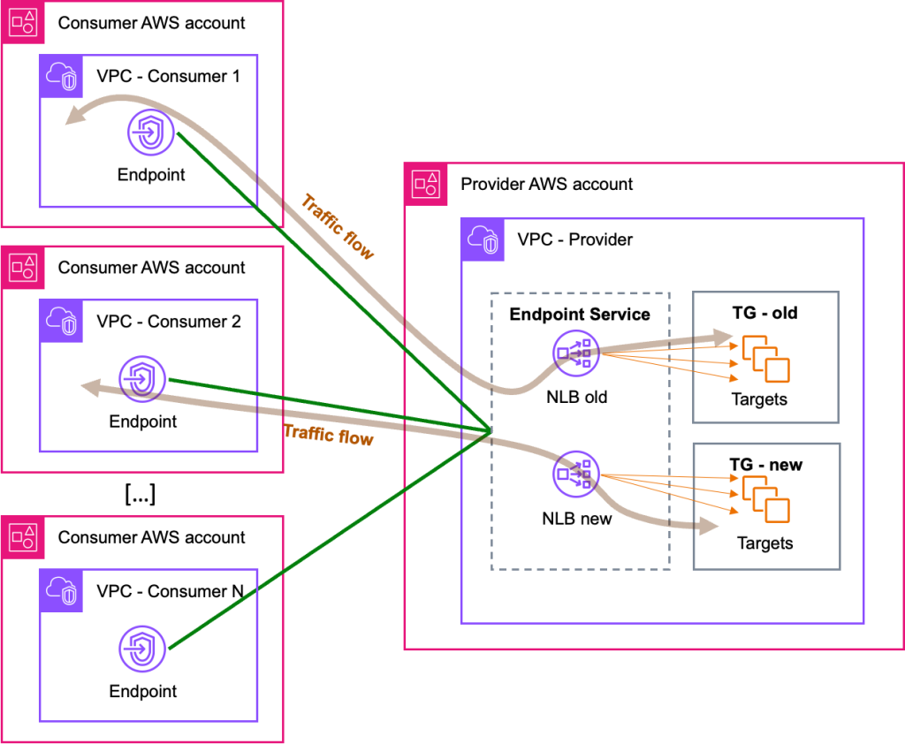
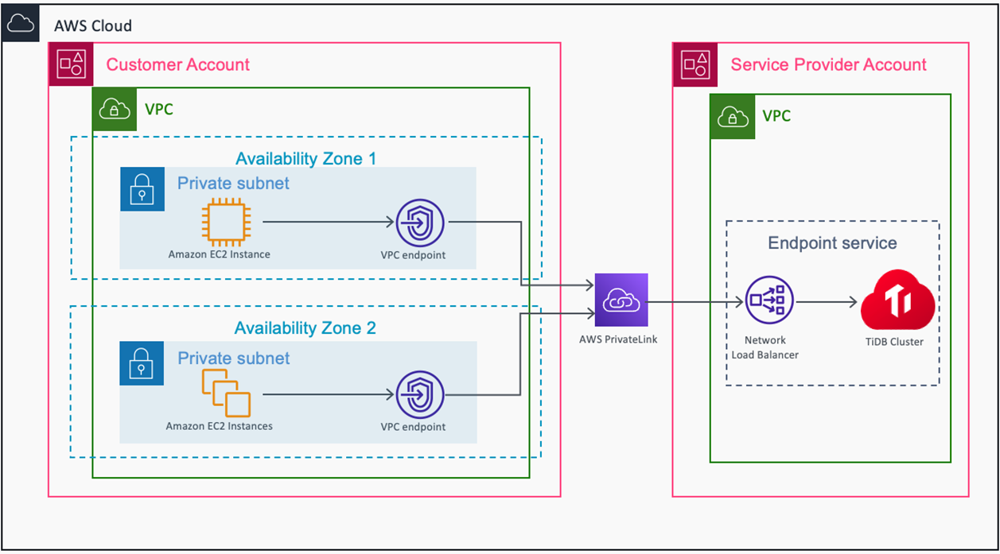

<h1>AWS PrivateLink</h1>

<!-- TOC -->

- [1. Basics](#1-basics)
- [2. APIGateway](#2-apigateway)
- [3. ALB -> NLB](#3-alb---nlb)
- [4. NLB -> ALB](#4-nlb---alb)
- [5. Blue Green Deployments](#5-blue-green-deployments)
- [6. EventBridge](#6-eventbridge)
- [7. Centralized / Shared VPC](#7-centralized--shared-vpc)
- [8. Re-invent](#8-re-invent)
- [9. RDS](#9-rds)
- [10. Route53](#10-route53)
- [11. Migration](#11-migration)
- [12. Multi-Region](#12-multi-region)
- [13. S3 endpoints](#13-s3-endpoints)
- [14. Sessions Manager](#14-sessions-manager)
- [15. Static WebSites with S3](#15-static-websites-with-s3)
- [16. Videos](#16-videos)
- [17. Web Proxy](#17-web-proxy)
- [18. Whitepaper](#18-whitepaper)
- [19. Curate](#19-curate)
- [20. Workshops](#20-workshops)

<!-- /TOC -->

# 1. Basics

1. [Interface endpoints/Gateway endpoints](https://blog.awsfundamentals.com/vpc-endpoints)
1. [Basics of Private Links](https://aws.amazon.com/blogs/architecture/reduce-cost-and-increase-security-with-amazon-vpc-endpoints/)

# 2. APIGateway

1. [Introducing Amazon API Gateway Private Endpoints by Chris Munns](https://aws.amazon.com/blogs/compute/introducing-amazon-api-gateway-private-endpoints/)

# 3. ALB -> NLB

1. [How to securely publish Internet applications at scale using Application Load Balancer and AWS PrivateLink by Tom Adamski](https://aws.amazon.com/blogs/networking-and-content-delivery/how-to-securely-publish-internet-applications-at-scale-using-application-load-balancer-and-aws-privatelink/)

    

# 4. NLB -> ALB

1. [How to configure the Application Load Balancer-type Target Group for Network Load Balancer By Somesh Srivastava](https://someshsrivastava1983.medium.com/how-to-configure-the-application-load-balancer-type-target-group-for-network-load-balancer-9b0c39106699)

    

- Detailed

    

# 5. Blue Green Deployments

1. [[CONSOLE] How to securely publish Internet applications at scale using Application Load Balancer and AWS PrivateLink by Tom Adamski](https://aws.amazon.com/blogs/networking-and-content-delivery/how-to-securely-publish-internet-applications-at-scale-using-application-load-balancer-and-aws-privatelink/)

    

# 6. EventBridge

1. [Introducing global endpoints for Amazon EventBridge By Stephen Liedig](https://aws.amazon.com/blogs/compute/introducing-global-endpoints-for-amazon-eventbridge/)

# 7. Centralized / Shared VPC

1. [[CDK] Centralize access using VPC interface endpoints to access AWS services across multiple VPCs by Chetan Agrawal](https://aws.amazon.com/blogs/networking-and-content-delivery/centralize-access-using-vpc-interface-endpoints/)

    

1. [Centralized DNS management of hybrid cloud with Amazon Route 53 and AWS Transit Gateway by Bhavin Desai](https://aws.amazon.com/blogs/networking-and-content-delivery/centralized-dns-management-of-hybrid-cloud-with-amazon-route-53-and-aws-transit-gateway/)

  

1. [See Hub and Spoke @ aws-networking.md](./aws-networking.md#2-hub-and-spoke)

# 8. Re-invent

1. [AWS New York Summit 2018 - AWS PrivateLink: Fundamentals (SRV211)](https://www.youtube.com/watch?v=20RxEzAXG9o)

# 9. RDS

1. [[CFN] Access Amazon RDS across VPCs using AWS PrivateLink and Network Load Balancer by Jay Singh](https://aws.amazon.com/blogs/database/access-amazon-rds-across-vpcs-using-aws-privatelink-and-network-load-balancer/)

    

    [CrossAccountRDSAccess.yml](./templates/rds/CrossAccountRDSAccess.yml)

# 10. Route53

1. [Automating DNS infrastructure using Route 53 Resolver endpoints by Shiva Vaidyanathan and Akhil Nayabu ](https://aws.amazon.com/blogs/networking-and-content-delivery/automating-dns-infrastructure-using-route-53-resolver-endpoints/)

    

# 11. Migration

1. [How to migrate your VPC endpoint service backend targets by Luis Felipe Silveira da Silva and Tom Adamski ](https://aws.amazon.com/blogs/networking-and-content-delivery/how-to-migrate-your-vpc-endpoint-service-backend-targets/)

    

# 12. Multi-Region

1. [Amazon S3 Multi-Region Access Points](https://catalog.workshops.aws/s3multiregionaccesspoints/en-US)

# 13. S3 endpoints

1. [[MY NEXT] Best practices for using Amazon S3 endpoints with AWS CloudFormation by Tony Bulding](https://aws.amazon.com/blogs/infrastructure-and-automation/best-practices-for-using-amazon-s3-endpoints-in-aws-cloudformation-templates/)
- difference between path-style and virtual-hosted-style endpoints
- code: /Volumes/Lexar/git-repos/aws-repo/aws-samples/s3/s3-endpoints-and-cfn

    

# 14. Sessions Manager

1. [Automated configuration of Session Manager without an internet gateway by Brian Landry](https://aws.amazon.com/blogs/mt/automated-configuration-of-session-manager-without-an-internet-gateway/)

# 15. Static WebSites with S3

1. [Hosting Internal HTTPS Static Websites with ALB, S3, and PrivateLink by Schuyler Jager](https://aws.amazon.com/blogs/networking-and-content-delivery/hosting-internal-https-static-websites-with-alb-s3-and-privatelink/)

# 16. Videos

1. [What is an interface VPC endpoint and how can I create one for my VPC?](https://www.youtube.com/watch?v=xvdJsP5U50Q)
2. [Keep Your Network Traffic in AWS with VPC Endpoints By BeABetterDev](https://www.youtube.com/watch?v=jo3X_aay4Vs)

# 17. Web Proxy

1. [How to use AWS PrivateLink to secure and scale web filtering using explicit proxy by Vinod Madabushi and Sahil Thapar](https://aws.amazon.com/blogs/networking-and-content-delivery/how-to-use-aws-privatelink-to-secure-and-scale-web-filtering-using-explicit-proxy/)

[cfn-privatelink.yaml](./templates/privatelink/cfn-privatelink.yaml)

# 18. Whitepaper

1. [Securely Access Services Over AWS PrivateLink](https://docs.aws.amazon.com/whitepapers/latest/aws-privatelink/aws-privatelink.html)

# 19. Curate

[Building Secure Private Connectivity with AWS PrivateLink for TiDB Cloud by Ayan Ray, Arun Vijayraghavan, Savi Venkatachalapathy, and Yunqing Zhou](https://aws.amazon.com/blogs/apn/building-secure-private-connectivity-with-aws-privatelink-for-tidb-cloud/)

# 20. Workshops

1. [Read this before doing the workshops](https://aws.amazon.com/blogs/architecture/reduce-cost-and-increase-security-with-amazon-vpc-endpoints/)
1. [VPC Endpoint Workshop](https://catalog.us-east-1.prod.workshops.aws/workshops/25daa7f1-11a5-4c96-8923-9b0e333acc59/en-US)
1. [Amazon S3 Multi-Region Access Points](https://catalog.workshops.aws/s3multiregionaccesspoints/en-US)
1. [Secure Hybrid Access to S3 using VPC Endpoints](https://catalog.us-east-1.prod.workshops.aws/workshops/3a8d4ddf-66c5-4d26-ae6f-6292a517f46c/en-US)