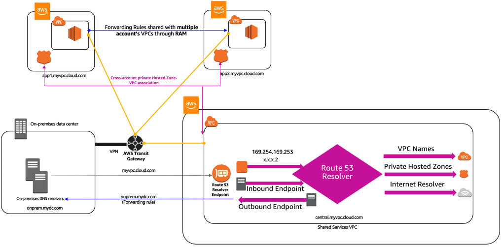

# Shared services VPC

1. [[CDK] Centralize access using VPC interface endpoints to access AWS services across multiple VPCs by Chetan Agrawal](https://aws.amazon.com/blogs/networking-and-content-delivery/centralize-access-using-vpc-interface-endpoints/)

    

1. [Centralized DNS management of hybrid cloud with Amazon Route 53 and AWS Transit Gateway by Bhavin Desai](https://aws.amazon.com/blogs/networking-and-content-delivery/centralized-dns-management-of-hybrid-cloud-with-amazon-route-53-and-aws-transit-gateway/)

  

# Zone Delegation

1. [[WORKSHOP] SHARED SERVICES ACCOUNT VPC](https://workshop-aws-account-setup.fstehle.com/shared-services-account/)