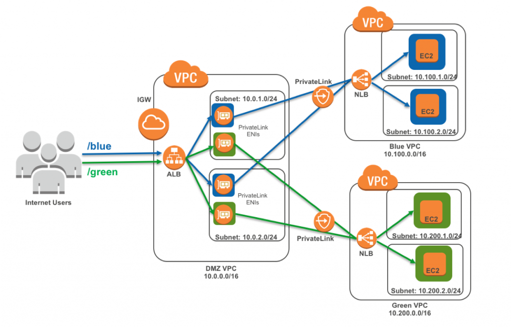
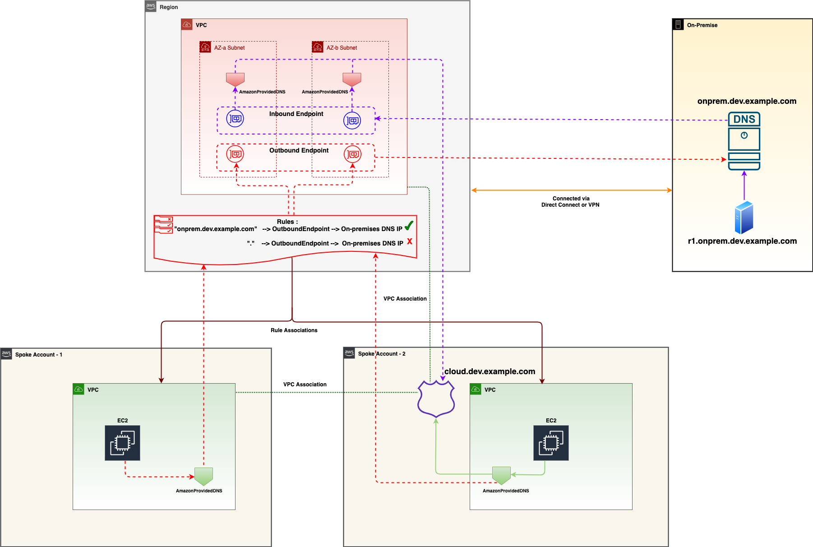
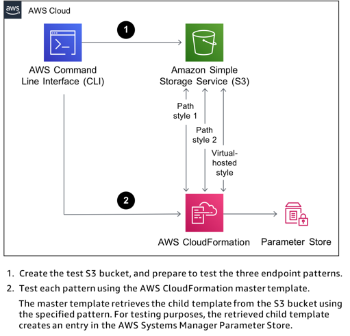

<h1>AWS PrivateLink</h1>

<!-- TOC -->

- [1. APIGateway](#1-apigateway)
- [2. EP -> NLB -> ALB](#2-ep---nlb---alb)
- [3. ALB -> NLB](#3-alb---nlb)
- [4. EventBridge](#4-eventbridge)
- [5. Route53](#5-route53)
- [6. Multi-Region](#6-multi-region)
- [7. S3 endpoints](#7-s3-endpoints)
- [8. Sessions Manager](#8-sessions-manager)
- [9. Static WebSites with S3](#9-static-websites-with-s3)
- [10. Web Proxy](#10-web-proxy)
- [11. Videos](#11-videos)
- [12. Whitepaper](#12-whitepaper)

<!-- /TOC -->

# 1. APIGateway

1. [Introducing Amazon API Gateway Private Endpoints by Chris Munns](https://aws.amazon.com/blogs/compute/introducing-amazon-api-gateway-private-endpoints/)

# 2. EP -> NLB -> ALB

1. [How to configure the Application Load Balancer-type Target Group for Network Load Balancer By Somesh Srivastava](https://someshsrivastava1983.medium.com/how-to-configure-the-application-load-balancer-type-target-group-for-network-load-balancer-9b0c39106699)

# 3. ALB -> NLB

1. [How to securely publish Internet applications at scale using Application Load Balancer and AWS PrivateLink by Tom Adamski](https://aws.amazon.com/blogs/networking-and-content-delivery/how-to-securely-publish-internet-applications-at-scale-using-application-load-balancer-and-aws-privatelink/)

# 4. EventBridge

1. [Introducing global endpoints for Amazon EventBridge By Stephen Liedig](https://aws.amazon.com/blogs/compute/introducing-global-endpoints-for-amazon-eventbridge/)

# 5. Route53

1. [Automating DNS infrastructure using Route 53 Resolver endpoints by Shiva Vaidyanathan and Akhil Nayabu ](https://aws.amazon.com/blogs/networking-and-content-delivery/automating-dns-infrastructure-using-route-53-resolver-endpoints/)

# 6. Multi-Region

1. [Amazon S3 Multi-Region Access Points](https://catalog.workshops.aws/s3multiregionaccesspoints/en-US)

# 7. S3 endpoints

1. [[MY NEXT] Best practices for using Amazon S3 endpoints with AWS CloudFormation by Tony Bulding](https://aws.amazon.com/blogs/infrastructure-and-automation/best-practices-for-using-amazon-s3-endpoints-in-aws-cloudformation-templates/)
- difference between path-style and virtual-hosted-style endpoints
- code: /Volumes/Lexar/git-repos/aws-repo/aws-samples/s3/s3-endpoints-and-cfn

# 8. Sessions Manager

1. [Automated configuration of Session Manager without an internet gateway by Brian Landry](https://aws.amazon.com/blogs/mt/automated-configuration-of-session-manager-without-an-internet-gateway/)

# 9. Static WebSites with S3

1. [Hosting Internal HTTPS Static Websites with ALB, S3, and PrivateLink by Schuyler Jager](https://aws.amazon.com/blogs/networking-and-content-delivery/hosting-internal-https-static-websites-with-alb-s3-and-privatelink/)

# 10. Web Proxy

1. [How to use AWS PrivateLink to secure and scale web filtering using explicit proxy by Vinod Madabushi and Sahil Thapar](https://aws.amazon.com/blogs/networking-and-content-delivery/how-to-use-aws-privatelink-to-secure-and-scale-web-filtering-using-explicit-proxy/)

[cfn-privatelink.yaml](./templates/cfn-privatelink.yaml)

# 11. Videos

1. [What is an interface VPC endpoint and how can I create one for my VPC?](https://www.youtube.com/watch?v=xvdJsP5U50Q)
2. [Keep Your Network Traffic in AWS with VPC Endpoints By BeABetterDev](https://www.youtube.com/watch?v=jo3X_aay4Vs)

# 12. Whitepaper

1. [Securely Access Services Over AWS PrivateLink](https://docs.aws.amazon.com/whitepapers/latest/aws-privatelink/aws-privatelink.html)

