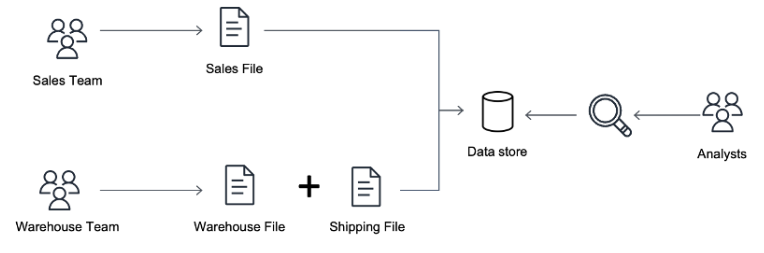
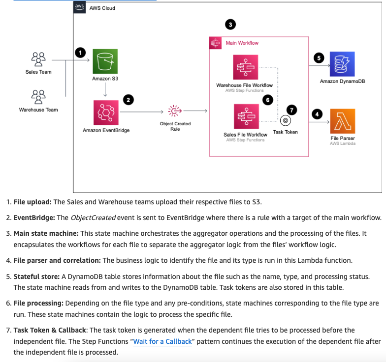

<h1>step functions<h1>

<!-- TOC -->

- [1. Dashboard](#1-dashboard)
  - [1.1. Testing](#11-testing)
  - [1.2. Workshop](#12-workshop)
- [2. Samples](#2-samples)
  - [2.1. Content aggregation](#21-content-aggregation)
- [3. CallBack](#3-callback)
- [4. Courses](#4-courses)
- [5. Distributed Map](#5-distributed-map)
- [6. Parallelisms](#6-parallelisms)
- [7. Patterns](#7-patterns)
  - [7.1. Aggregating Events](#71-aggregating-events)
  - [7.2. Invoking external systems](#72-invoking-external-systems)
  - [7.3. Scatter-Gather](#73-scatter-gather)
- [8. Testing Locally](#8-testing-locally)
- [9. Tutorials](#9-tutorials)
- [10. Videos](#10-videos)
- [11. workshop](#11-workshop)

<!-- /TOC -->

# 1. Dashboard

1. [Scatter-Gather](#73-scatter-gather)

## 1.1. Testing
1. [Mocking service integrations with AWS Step Functions Local By Sam Dengler and Dhiraj Mahapatro](https://aws.amazon.com/blogs/compute/mocking-service-integrations-with-aws-step-functions-local/)
1. [AWS Step Functions Local Testing with mocking](https://github.com/aws-samples/aws-stepfunctions-examples/tree/main/sam/app-local-testing-mock-config)
1. [Step Functions Local - mocking service integrations | Serverless Office Hours By Sam Dengler and Dhiraj Mahapatro](https://www.youtube.com/watch?v=4pTfYon6zJ8&t=38s)
- How throw and handle business exceptions
- Creating mocks for AwS integrations
1. [Step Functions Local Testing using JUnit and Spock By Dhiraj Mahapatro](https://github.com/aws-samples/aws-stepfunctions-examples/tree/main/sam/demo-local-testing-using-java)

## 1.2. Workshop
1. [The AWS Step Functions Workshop](https://catalog.us-east-1.prod.workshops.aws/workshops/9e0368c0-8c49-4bec-a210-8480b51a34ac/en-US)
1. [Welcome to the source code repository for The AWS Step Functions Workshop!](https://github.com/aws-samples/the-aws-step-functions-workshop)
1. [Complete guide to AWS Step Functions (FREE) By Yan Cui](https://school.theburningmonk.com/courses/take/complete-guide-to-aws-step-functions/lessons/6989783-what-is-step-functions)

# 2. Samples

## 2.1. Content aggregation

> 1. [[MY NEXT] Building Serverless Land: Part 1 – Automating content aggregation by Benjamin Smith ](https://aws.amazon.com/blogs/compute/building-serverless-land-part-1-automating-content-aggregation/)
2. [Building Serverless Land: Part 2 – An auto-building static site by Benjamin Smith](https://aws.amazon.com/blogs/compute/building-serverless-land-part-2-an-auto-building-static-site/)
3. [[MY NEXT] Building Serverless Land](https://github.com/aws-samples/content-aggregator-example)

# 3. CallBack

1. [Integrating AWS Step Functions callbacks and external systems by Zach Abrahamson,](https://aws.amazon.com/blogs/compute/integrating-aws-step-functions-callbacks-and-external-systems)
1. [Invoking asynchronous external APIs with AWS Step Functions by Jorge Fonseca, Hossam Ebrahim, and Shirisha Vivek](https://aws.amazon.com/blogs/architecture/invoking-asynchronous-external-apis-with-aws-step-functions/)

# 4. Courses

1. [Design Patterns for AWS Step Functions](https://explore.skillbuilder.aws/learn/course/10471/play/37562/design-patterns-for-aws-step-functions)
1. [Troubleshooting Serverless Applications](https://explore.skillbuilder.aws/learn/course/internal/view/elearning/1124/troubleshooting-serverless-applications)
1. [Complete guide to AWS Step Functions (FREE) By Yan Cui](https://school.theburningmonk.com/courses/take/complete-guide-to-aws-step-functions/lessons/6989783-what-is-step-functions)

# 5. Distributed Map

1. Missing Paper - introduction to distributed map for serverless data processing uma ramadoss
2. [AWS Step functions Map State & Parallel State](https://towardsaws.com/aws-step-functions-map-state-parallel-state-3d1be5be8fc5)

# 6. Parallelisms

1. [AWS re:Invent 2022 - [NEW] Accelerate workloads using parallelism w/Step Functions & Lambda (API205)](https://www.youtube.com/watch?v=SG6_oy72hh4)

# 7. Patterns

## 7.1. Aggregating Events

1. [Orchestrating dependent file uploads with AWS Step Functions](https://aws.amazon.com/blogs/compute/orchestrating-dependent-file-uploads-with-aws-step-functions/)

## 7.2. Invoking external systems

1. [Integrating AWS Step Functions callbacks and external systems by Zach Abrahamson,](https://aws.amazon.com/blogs/compute/integrating-aws-step-functions-callbacks-and-external-systems)
1. [Invoking asynchronous external APIs with AWS Step Functions by Jorge Fonseca, Hossam Ebrahim, and Shirisha Vivek](https://aws.amazon.com/blogs/architecture/invoking-asynchronous-external-apis-with-aws-step-functions/)

## 7.3. Scatter-Gather

1. [How do we combine the results of individual, but related messages so that they can be processed as a whole?](https://www.enterpriseintegrationpatterns.com/patterns/messaging/Aggregator.html)
1. [Scatter Gather High level Example](https://www.enterpriseintegrationpatterns.com/patterns/messaging/ComposedMessagingExample.html)
1. [Loan Broker Implementation with AWS Step Functions - Part 1 By Gregor Hohpe](https://www.enterpriseintegrationpatterns.com/ramblings/loanbroker_stepfunctions.html)
1. [Loan Broker with Recipient List - Part 2 By Gregor Hohpe](https://www.enterpriseintegrationpatterns.com/ramblings/loanbroker_cdk.html)
1. [Serverless Loan Broker @AWS, Part 3: Publish-Subscribe with SNS By Gregor Hohpe](https://www.enterpriseintegrationpatterns.com/ramblings/loanbroker_cdk.html)
1. [Serverless Loan Broker @ AWS, Part 4: Automation By Gregor Hohpe](https://www.enterpriseintegrationpatterns.com/ramblings/loanbroker_cdk.html)
1. [Serverless Loan Broker @ AWS, Part 5: Integration Patterns with CDK By Gregor Hohpe](https://www.enterpriseintegrationpatterns.com/ramblings/loanbroker_cdk.html)

# 8. Testing Locally

1. [Step Functions Local - mocking service integrations | Serverless Office Hours](https://www.youtube.com/watch?v=4pTfYon6zJ8)
1. [🆕 UNIT TEST your Step Functions with the Mocked Service Integrations By FooBar Serverless](https://www.youtube.com/watch?v=P3hEqxKxZe)
1. [Mocking service integrations with AWS Step Functions Local By Sam Dengler and Dhiraj Mahapatro](https://aws.amazon.com/blogs/compute/mocking-service-integrations-with-aws-step-functions-local/)
1. [Step Functions Local - mocking service integrations | Serverless Office Hours By Sam Dengler and Dhiraj Mahapatro](https://www.youtube.com/watch?v=4pTfYon6zJ8&t=38s)
1. [Step Functions Local Testing using JUnit and Spock By Dhiraj Mahapatro](https://github.com/aws-samples/aws-stepfunctions-examples/tree/main/sam/demo-local-testing-using-java)

# 9. Tutorials

1. [Create a Serverless Workflow with AWS Step Functions and AWS Lambda](https://aws.amazon.com/tutorials/create-a-serverless-workflow-step-functions-lambda/)
1. [How to Handle Errors in Serverless Apps with AWS Step Functions and AWS Lambda](https://aws.amazon.com/tutorials/handle-serverless-application-errors-step-functions-lambda/)
1. [Schedule a Serverless Workflow with AWS Step Functions and Amazon EventBridge Scheduler](https://aws.amazon.com/tutorials/scheduling-a-serverless-workflow-step-functions-amazon-eventbridge-scheduler/)

# 10. Videos

1. [AWS re:Invent 2022 - Advanced serverless workflow patterns and best practices (API309) By Ben Smith](https://www.youtube.com/watch?v=o6-7BAUWaqg)
1. [Big Data Processing Using Distributed Maps and AWS Step Functions (S3 + Lambda) By Be Better Dev](https://www.youtube.com/watch?v=0Zs5s5F_lFc)
1. [Building distributed data processing workloads with AWS Step Functions By Uma Ramadoss](https://www.youtube.com/watch?v=b7zfFdKzttw)

# 11. workshop

1. [The AWS Step Functions Workshop](https://catalog.us-east-1.prod.workshops.aws/workshops/9e0368c0-8c49-4bec-a210-8480b51a34ac/en-US)
1. [Welcome to the source code repository for The AWS Step Functions Workshop!](https://github.com/aws-samples/the-aws-step-functions-workshop)
1. [Building the workflow - Part 1](https://workshop.serverlesscoffee.com/1-workflow/2-create.html)
1. [Welcome to the source code repository for The AWS Step Functions Workshop!](https://github.com/aws-samples/the-aws-step-functions-workshop)
1. [The AWS Step Functions workshop reinvent2022](https://d1.awsstatic.com/events/Summits/reinvent2022/API201-R_The-AWS-Step-Functions-workshop.pdf)