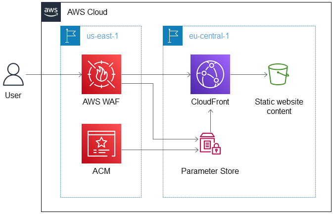

<h1>Systems Manager</h1>

# 1. Integrations

## 1.1. ECS

1. [Managing Secrets for Amazon ECS Applications Using Parameter Store and IAM Roles for Tasks by Chris Barclay](https://aws.amazon.com/blogs/compute/managing-secrets-for-amazon-ecs-applications-using-parameter-store-and-iam-roles-for-tasks/)
2. [How to Manage Secrets for Amazon EC2 Container Service–Based Applications by Using Amazon S3 and Docker by Matthew McClean](https://aws.amazon.com/blogs/security/how-to-manage-secrets-for-amazon-ec2-container-service-based-applications-by-using-amazon-s3-and-docker/)

## 1.2. Parameter Store

1. [Read parameters across AWS Regions with AWS CloudFormation custom resources by Jagdeep Singh Soni and Michael Fraedrich](https://aws.amazon.com/blogs/infrastructure-and-automation/read-parameters-across-aws-regions-with-aws-cloudformation-custom-resources/)

# 2. Videos

1. [All Things Patch: AWS Systems Manager | AWS Events](https://www.youtube.com/watch?v=PhIiVsCEBu8)
1. [Automating Operations with AWS Systems Manager | AWS Events](https://www.youtube.com/watch?v=qNi-CNpnfmY)
1. [Mini Project - Learn how to use AWS Systems Manager By LearnCantrill](https://www.youtube.com/watch?v=B2MecqC5nJA)

# 3. Workshop

1. [AWS CloudWatch and Systems Manager Workshop](https://catalog.us-east-1.prod.workshops.aws/workshops/a8e9c6a6-0ba9-48a7-a90d-378a440ab8ba/en-US)
2. [AWS for Linux Workloads Immersion Day > Systems Manager](https://catalog.us-east-1.prod.workshops.aws/workshops/a8e9c6a6-0ba9-48a7-a90d-378a440ab8ba/en-US/200-ssm)
3. [Workshop: Getting started with Centralized Operations Management on AWS](https://catalog.workshops.aws/getting-started-with-com/en-US)
- Managing nodes using the AWS Systems Manager agent
- Patch Management
- Create AWS Config rule to detect when banned applications are installed
- [com-workshop-resources.yaml](./templates/systems-manager/com-workshop-resources.yaml)
4. [Workshop: Cloud Operations on AWS](https://catalog.us-east-1.prod.workshops.aws/workshops/79a61310-00d6-4abd-9c96-b5f856659507/en-US)