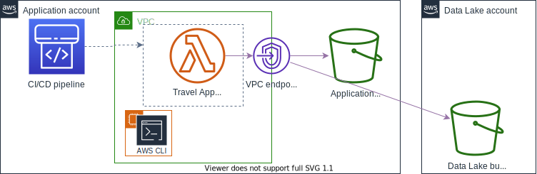

1. [AWS Identity and Access Management (IAM) Immersion Day](https://catalog.us-east-1.prod.workshops.aws/workshops/18b3622c-5d4c-45c9-9834-6a7091109072/en-US)

- Basic Modules > Introduction to Identity and Access Management (IAM) > IAM Terminology
- Basic Modules > Introduction to Identity and Access Management (IAM) > Policies and Permissions in IAM
- Basic Modules > Introduction to Identity and Access Management (IAM) > IAM Users
- Basic Modules > Introduction to Identity and Access Management (IAM) > IAM User Groups
- Basic Modules > Introduction to Identity and Access Management (IAM) > IAM Roles
- Basic Modules > Introduction to Identity and Access Management (IAM) > Programmatic Access
- Basic Modules > IAM Access Analyzer - Introduction

- Advanced Modules > Advanced Roles, Policies, and Permissions > Switching Roles with the AWS Management Console
- Advanced Modules > Advanced Roles, Policies, and Permissions > Switching Roles with the AWS CLI
- Advanced Modules > Advanced Roles, Policies, and Permissions > Conditional Access Control in IAM Policies
- Advanced Modules > Advanced Roles, Policies, and Permissions > Using Variables in the Resource Block
- Advanced Modules > Advanced Roles, Policies, and Permissions > Restricting Access to Roles with Trust Policies

- Advanced Modules > Attribute Based Access Control > Lab Prerequisites for ABAC
- Advanced Modules > Attribute Based Access Control > Role Based Access Control
- Advanced Modules > Attribute Based Access Control > ABAC Configuration
- Advanced Modules > Attribute Based Access Control > ABAC based permission check
- Advanced Modules > Attribute Based Access Control > Checking PrincipalTag Logs in CloudTrail

- Advanced Modules > Monitoring and Alerting > Alert when an IAM User is created or deleted
- Advanced Modules > Monitoring and Alerting > Alert when specific IAM credentials are used
- Advanced Modules > Monitoring and Alerting > Report on unused IAM identities (users/roles)

- Advanced Modules > Permission Boundaries as Guardrails > Create Policies to use as a Permission Boundary
- Advanced Modules > Permission Boundaries as Guardrails > Create Roles with Permission Boundaries
- Advanced Modules > Permission Boundaries as Guardrails > Test Effective Permissions

- Advanced Modules > IAM Access Analyzer Advanced

&nbsp;

1. [[**MY_NEXT**] How and when to use different IAM policy types](https://catalog.workshops.aws/iam-policy-types/en-US)
&nbsp;

&nbsp;
    - [ ] Lab 1: Grant access to Application Team
    - [ ] Lab 2: Delegate access to the CI/CD pipeline
    - [ ] Lab 3: Deploy the application
    - [ ] Lab 4: Limit access to trusted buckets
    - [ ] Lab 5: Enable access to Data Lake bucket
    - [ ] Lab 6: Apply enterprise guardrails with SCPs (optional)

&nbsp;

1. [IAM policy evaluation workshop](https://catalog.us-east-1.prod.workshops.aws/workshops/6dc3124a-6bd4-46eb-b5c4-be438a82ba3d/en-US)
&nbsp;
    - [x] Lab 1: IAM policy evaluation logic with identities and resources in the same account
    - [ ] Lab 2: IAM policy evaluation logic with permissions boundaries
    - [ ] Lab 3: IAM policy evaluation logic with VPC endpoints
    - [ ] Lab 4: Working with AWS KMS key policies
    - [ ] Lab 5: Working with IAM policy conditions

&nbsp;

1. [Refining IAM Permissions Like A Pro](https://catalog.workshops.aws/refining-iam-permissions-like-a-pro/en-US)
- IAM Access Analyzer > Validate policy
- IAM Access Analyzer > Custom policy checks
- IAM Access Analyzer > Unused access findings
- Scenario > Central Security Team > Amazon SNS
- Scenario > Central Security Team > CodePipeline and Codebuild
- Scenario > Central Security Team > Lambda
- Scenario > Central Security Team > Unused access
- Scenario > DevOps Engineer > Test IAM policies in pipeline

&nbsp;

1. [IAM Troubleshooting Workshop](https://catalog.us-east-1.prod.workshops.aws/workshops/a9661c42-97f6-400a-8dee-a8396e8d418f/en-US)
- Lab 1: Testing IAM policies through role sessions
- Lab 2: Validate IAM policies with IAM Access Analyzer
- Lab 3: Understanding the authorization error messages
- Lab 4: Use AWS CloudTrail to investigate events
- Lab 5: The IAM Troubleshooting workflow in action

&nbsp;

1. [IAM policy learning experience](https://catalog.us-east-1.prod.workshops.aws/workshops/d1531d0a-79fd-45af-b198-d81e349ee660/en-US)
- 1. Grant access to all principals in your organization to your resource
- 2. Protect your platform resources with a service control policy
- 3. Limit the types of EC2 instances that can be launched with an identity-based policy
- 4. Prevent untrusted principals from using an AWS service as a confused deputy
- 5. Ensure that Lambda functions must be attached to a VPC with a service control policy
- 6. Allow principals to access buckets with a name that matches their tag

&nbsp;

1. [IAM permissions for workloads on Amazon EKS](https://catalog.us-east-1.prod.workshops.aws/workshops/7c41ed45-0120-4af8-bd23-420f9f0f5eb1/en-US/more)
