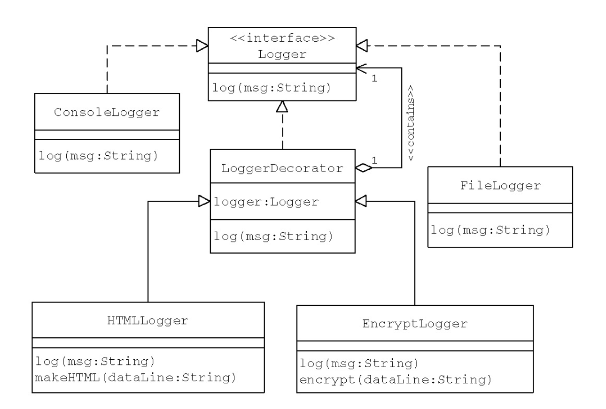
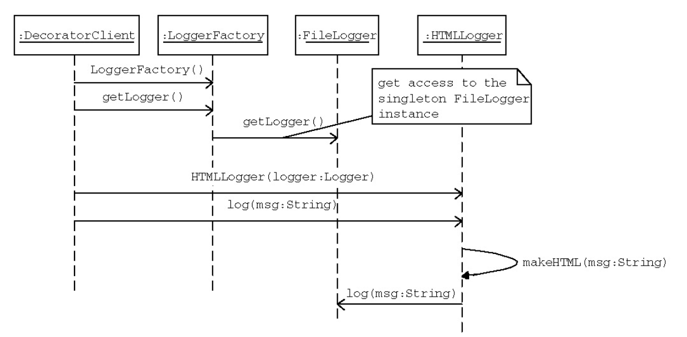

<h1>Decorator</h1>




```java
public class LoggerDecorator implements Logger {
   Logger logger;
   public LoggerDecorator(Logger inp_logger) {
     logger = inp_logger;
   }
   public void log(String DataLine) {
     /*
      Default implementation
      to be overriden by subclasses.
     */
     logger.log(DataLine);
   }
}//end of class
```

2. EncryptLogger

```java
public class EncryptLogger extends LoggerDecorator {
   public EncryptLogger(Logger inp_logger) {
     super(inp_logger);
   }
   public void log(String DataLine) {
     /*
       Added functionality
     */
      DataLine = encrypt(DataLine);
      /*
       Now forward the encrypted text to the FileLogger
       for storage
      */
      logger.log(DataLine);
   }
   public String encrypt(String DataLine) {
     /*
      Apply simple encryption by Transposition…
      Shift all characters by one position.
     */
     DataLine = DataLine.substring(DataLine.length() - 1) +
                DataLine.substring(0, DataLine.length() - 1);
     return DataLine;
   }
}//end of classes
```

3. HTMLLogger

```java
public class HTMLLogger extends LoggerDecorator {
   public HTMLLogger(Logger inp_logger) {
     super(inp_logger);
   }
   public void log(String DataLine) {
     /*
      Added functionality
     */
      DataLine = makeHTML(DataLine);
     /*
       Now forward the encrypted text to the FileLogger
     for storage
     */
     logger.log(DataLine);
    }
    public String makeHTML(String DataLine) {
      /*
       Make it into an HTML document.
     */
     DataLine = "<HTML><BODY>" + "<b>" + DataLine +
       "</b>" + "</BODY></HTML>";
     return DataLine;
    }
}//end of class
```



4. Client

```java
class DecoratorClient {
   public static void main(String[] args) {
     LoggerFactory factory = new LoggerFactory();
     Logger logger = factory.getLogger();
     HTMLLogger hLogger = new HTMLLogger(logger);
     //the decorator object provides the same interface.
     hLogger.log("A Message to Log");
     EncryptLogger eLogger = new EncryptLogger(logger);
     eLogger.log("A Message to Log");
  }
}//End of class
```