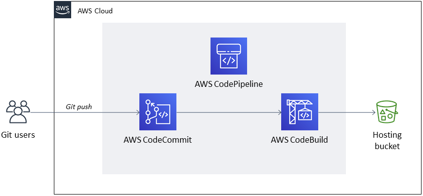

# Hugo
1. [Building a CI/CD pipeline for Hugo websites by Shivansh Singh](https://aws.amazon.com/blogs/infrastructure-and-automation/building-a-ci-cd-pipeline-for-hugo-websites/)
- [hugo-cicd.template](./templates/hugo-cicd.template.yaml)

